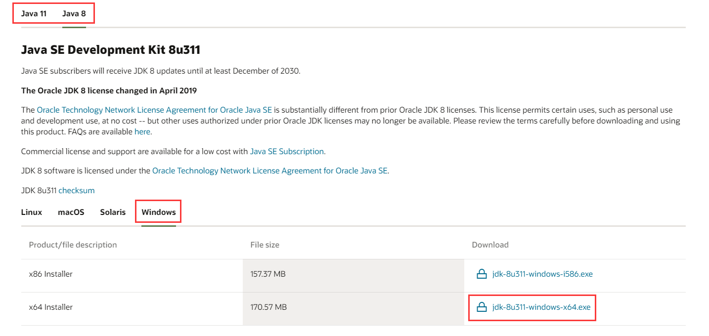
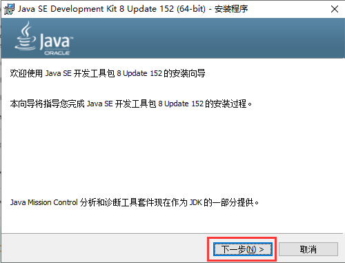
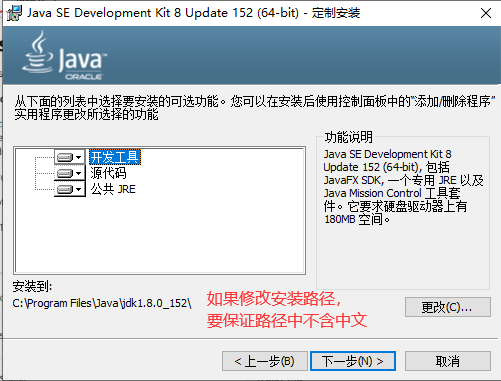
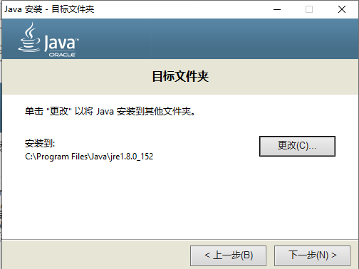
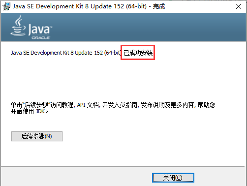
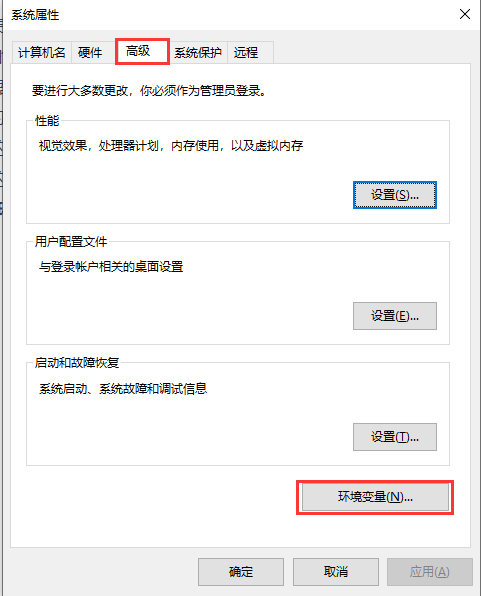
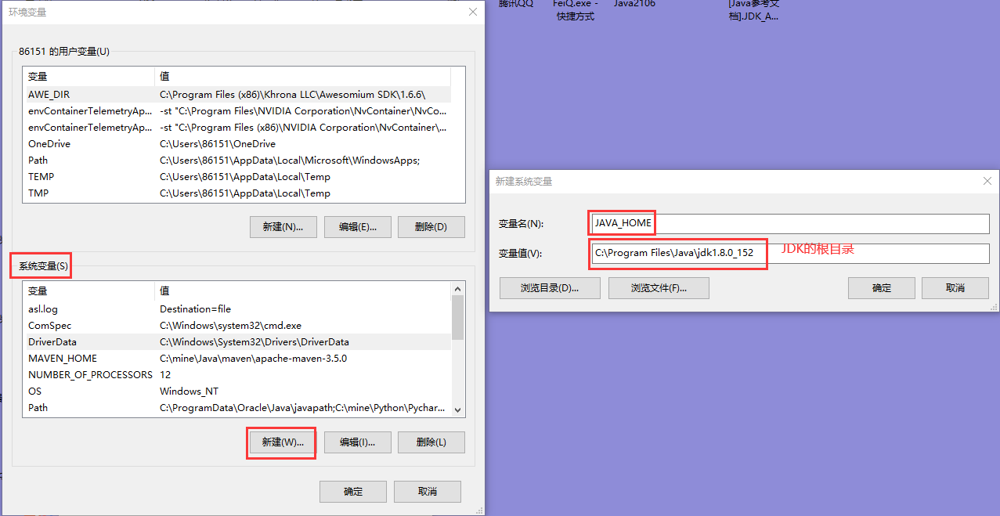
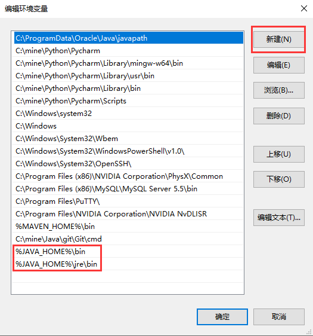
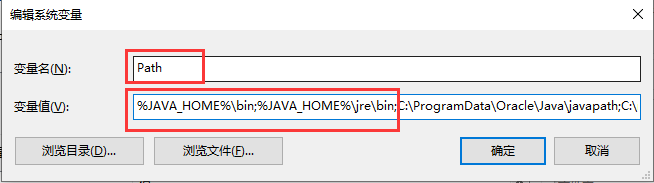
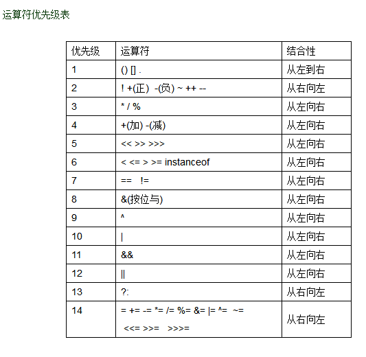

### 一，概念

#### 1.1 什么是程序，什么是程序开发

> 程序是为了解决生活中的实际问题使用计算机语言所编写的一系列指令的集合。
>
> Java语言能干什么？
>
> 答：1.移动端的应用 2.桌面端的应用 3.web端的应用
>
> 程序开发：使用计算机语言去制作软件

#### 1.2 Java的历史

> Java之父：高斯林
>
> 1995年由SUN开发的
>
> 2004年发布Java1.5，Java被Oracle收购
>
> 2014年发布Java1.8
>
> Java的分类：
>
> 1. JavaME：小型版
> 2. JavaSE：标准版
> 3. JavaEE：企业版

#### 1.3 Java语言的特点

> 1. 跨平台性：跨操作系统，一次编写，到处运行
> 2. 健壮性
> 3. 安全性

### 二，环境的搭建

#### 2.1 JDK的概念

> JDK：Java Development Kit，Java开发工具
>
> JRE：Java Runtime Enviroment，Java运行环境
>
> JVM：Java Virtual Machine，Java虚拟机
>
> 注：JDK中包含JRE，JRE中包含JVM

#### 2.2 JDK的安装和卸载

> 卸载：控制面板中卸载即可
>
> 下载：https://www.oracle.com/java/technologies/downloads/
>
> 
>
> 安装：
>
> 
>
> 
>
> 
>
> 

#### 2.3 配置环境变量

> 步骤：
>
> 0. 右键“此电脑”，选择“属性”
>
> 1. 找到“高级系统设置”，在“高级”标签页中，点击“环境变量”
>
>    
>
> 2. 在“系统变量”中，点击“新建”，在“变量名”中输入`JAVA_HOME`，在“变量值”中输入JDK的根目录
>
>    
>
> 3. 编辑“系统变量”中的“path”，新建如下内容：
>
>    
>
>    

### 三，第一个Java程序

> 准备工作：按住 win + r 打开运行，输入 cmd，回车

#### 3.1 编写代码              

> 输入一句话：hello java!
>
> ```java
> public class HelloWorld{
> 	public static void main(String[] args){
> 		System.out.println("hello java!");
> 	}
> }
> ```
>
> 将该文件的扩展名改成`.java`

#### 3.2 编译代码

> 需要使用`javac`指令对java文件进行编译，编译后会生成对应的`.class`（二进制字节码）文件
>
> 步骤：
>
> 1. 打开命令提示符
> 2. 切换目录：输入`cd 文件所在的文件夹`
> 3. 编译代码：`javac 文件名.java`

#### 3.3 运行代码

> 需要使用`java`指令来运行程序
>
> 运行代码：`java 文件名`

> 总结：
>
> 1. 开发流程：`编写->编译javac->运行java`，先编译后运行
> 2. 源代码修改后，必须重新编译
>
> 注意事项：
>
> 1. Java中的所有括号必须成对出现
>
> 2. Java代码的结尾是`;`或者`{}`
>
> 3. Java中所有格式上的符号必须是英文
>
> 4. 任何一个程序都必须有一个主函数，主函数就是程序的入口，它必须是如下格式的：
>
>    ```java
>    public static void main(String[] args){}
>    ```
>
> 5. 一个Java文件中只能有一个类被`public`修饰，并且被`public`修饰的类名必须和文件名一致

### 四，基础语法

#### 4.1 关键字

> 在Java中已经预定义好的具有特殊含义的单词
>
> 例如：`public、class、static、void`

#### 4.2 标识符

> 自定义类、方法、变量等内容的名字
>
> 规则：
>
> 1. 可以由数字、大小写字母、下划线、美元符组成
> 2. 不能以数字开头
> 3. 不能与关键字重名
> 4. 标识符区分大小写
>
> 规范：
>
> 1. 变量名和方法名：首字母小写，多个单词组成时从第二个单词起，每个单词的首字母大写（小驼峰）
> 2. 类名：所有单词的首字母大写（大驼峰）
> 3. 常量：所有字母大写，多个单词组成时，单词之间用下划线连接

#### 4.3 注释

> 对代码进行解释说明的文字
>
> 格式：
>
> 1. 单行注释：`// 注释内容`，只能对当前行进行注释
> 2. 多行注释：`/* 注释内容 */`，可以对整个结构中的所有内容进行注释
> 3. 文档注释：`/** 注释内容 */`
>
> 特点：注释的内容不会参与程序的运行

#### 4.4 转义字符

> 转义字符：`\`
>
> 常见的转义：
>
> 1. `\'`
> 2. `\"`
> 3. `\\`
> 4. `\t`
> 5. `\n`

### 五，数据类型

> Java中数据类型分为：
>
> 1. 基本数据类型
> 2. 引用数据类型

#### 5.1 基本数据类型（四类八型）

> 整数类型：
>
> `byte`：字节型，1个字节，范围：`-128~127`
>
> `short`：短整型，2个字节，范围：`-32768~32767`
>
> `int`：整型，默认的整数类型，4个字节，范围：`-2147483648~2147483647`
>
> `long`：长整型，8个字节，范围：`-9223372036854775808~9223372036854775807`
>
> 注：int表示的数据如果超过了int范围，需要在末尾加上`L`或者`l`

> 浮点类型：
>
> `float`：单精度浮点类型，4个字节
>
> `double`：双精度浮点类型，8个字节，默认的浮点类型            
>
> 注：对float赋值小数时，需要在末尾加上`F`或者`f`

> 字符类型：
>
> `char`：2个字节，表示单个字符，要用一对单引号括起来
>
> 注：
>
> 1. 只能存储一个字符
> 2. 不能存储空字符

> 布尔类型：
>
> `boolean`：只有两个值，`true`和`false`，表示逻辑值

#### 5.2 引用数据类型

> 字符串定义：String
>
> ```java
> // 1.先定义后赋值
> String name;
> name = "张三";
> // 2.定义的同时赋值
> String address = "上海市宝山区同济支路199号";
> ```

### 六，常量

> 分类：
>
> 1. 整型常量：所有整数
>
> 2. 浮点型常量：所有小数
>
> 3. 字符型常量：所有字符
>
> 4. 布尔常量：只有`true`和`false`
>
> 5. 字符串常量：所有字符串
>
>    注：字符串是引用数据类型，`String`，字符串值用一对双引号括起来，字符串的长度是任意的
>
> 6. 空常量：只有一个值`null`

### 七，变量

> 计算机内存中的一块存储空间，是存储数据的基本单元

#### 7.1 变量的定义

> 方式一：先定义后赋值
>
> ```java
> 数据类型 变量名;
> 变量名 = 值;
> ```
>
> ```java
> // 定义一个int类型的变量age
> int age;
> // 为age变量赋值为42岁
> age = 42;
> ```
>
> 方式二：定义的同时赋值
>
> ```java
> 数据类型 变量名 = 值;
> ```
>
> ```java
> // 定义了一个double类型的变量salary并赋值为11111.11
> double salary = 11111.11;
> ```
>
> 方式三：同时定义多个相同类型的变量并赋值
>
> ```java
> 数据类型 变量名1 = 值,变量名2,变量名3 = 值,变量名4,...;
> ```

#### 7.2 注意事项

> 1. 常量不能被赋值
> 2. 变量在使用前必须先赋值 
> 3. 变量名不能重复
> 4. 变量可以被多次赋值，赋值后新的值会替换旧的值
> 5. 赋给变量的值不能超过指定数据类型的范围
> 6. 变量只能在定义它的代码块中使用，一旦出了定义它的代码块，它就被释放了

### 八，运算符

#### 8.1 算术运算符

> `+`：求和运算，如果参与运算的数据中有字符串，那么`+`就是拼接的功能，并且拼接后的结果也是一个字符串
>
> `-`：求差运算
>
> `*`：求积运算
>
> `/`：求商运算
>
> ​	注：
>
> 1. 整数之间的除法可能会有精度损失，如果要保证除法的结果有小数，必须先保证参与运算的数据中有小数类型的值
> 2. `0`不能作为除数，如果0是除数了，会发生`ArithmeticException`算术异常
>
> `%`：取模运算，求余数
>
> 注：
>
> 1. `0`不能作为除数，如果`0`是除数了，会发生`ArithmeticException`算术异常
> 2. 如果能整除，结果是`0`
> 3. `x % y`，结果的正负与x的正负一致，`x % y`本质上是在执行`x - (x / y) * y`
> 4. `x % y`，如果 `y > x`，结果都是`x`
> 5. `x % y`，结果的范围：`[0,y-1]`
>
> `++`：自增`1`
>
> `--`：自减`1`
>
> 注：
>
> 1. 常量不能自增、自减
> 2. `++、--`可以前置也可以后置；前置：符号写在变量前，后置：符号写在变量后
>    1. 前置和后置在单独运算时没有区别
>    2. 自增自减的同时还执行了其他操作，前置和后置就会有区别：
>       1. 前置：先执行`++、--`，再执行其他操作
>       2. 后置：先执行其他操作，再执行`++、--`

#### 8.2 赋值运算符

> `=`
>
> `+=`
>
> `-=`
>
> `*=`
>
> `/=`
>
> `%=`
>
> `a x= b; 等价于 a = a x b;` x 是 + 、 - 、 * 、 / 、 % 
>
> 注：赋值运算符（除了`=`）都自带强制类型转换

#### 8.3 关系（比较）运算符

> `>、<、>=、<=`
>
> `==`：判断两个值是否相等
>
> `!=`：判断两个值是否不相等
>
> 关系运算表达式运算的结果一定是布尔值
>
> 注：`==`在比较基本数据类型时，比较的是值；`==`在比较引用数据类型时，比较的是地址值

#### 8.4 逻辑运算符

> 逻辑运算表达式的结果一定是布尔值，参与逻辑运算的值也必须是布尔值
>
> `&`：与运算符，并且，表达式中只要有false，整个表达式的结果就是false
>
> `|`：或运算符，或者，表达式中只要有true，整个表达式的结果就是true
>
> `!`：非运算符，取反
>
> `^`：异或，表达式两边同为true或者false，结果为false；表达式两边不同，结果为true
>
> 注：无论参与逻辑运算表达式的内容有多少，都遵循上述规律，但是要参照优先级

> 短路与`&&`：如果表达式左边为false，表达式右边不再运算，整个表达式的结果就是false
>
> 短路或`||`：如果表达式左边为true，表达式右边不再运算，，整个表达式的结果就是true

#### 8.5 三元运算符

> `?:`
>
> 三元运算表达式格式：
>
> ```java
> 表达式1 ? 表达式2 : 表达式3
> ```
>
> 执行步骤：先判断表达式1的结果，结果为true，执行表达式2，反之，执行表达式3
>
> 注：
>
> 1. 表达式1必须是一个条件（逻辑）表达式
> 2. 表达式2和表达式3可以是变量、常量、表达式

#### 8.6 位运算

> `&、|、^`
>
> 运算步骤：
>
> 1. 将两个十进制数转换成对应的二进制数
> 2. 将0视为false，将1视为true
> 3. 按位进行`&、|、^`的计算
> 4. 再将计算后的布尔值转换回0或者1
> 5. 将计算的结果转换成十进制数

> `<<、>>`
>
> `a << b`：等价于 a 乘以 2 的 b 次方
>
> `a >> b`：等价于  a 除以 2 的 b 次方

#### 8.7 二进制

> 二进制：包含`0、1`

#### 8.8 运算符优先级

> 

### 九，数据类型转换

> 问：不同数据类型的值是否可以一起运行？
>
> 答：可以，但是需要遵循一些规则

#### 9.1 自动类型转换

> 范围小的数据与范围大的数据运行时，结果会自动转换成范围大的数据类型
>
> 范围大小的规则：`double > float > long > int > short > byte`
>
> 注：
>
> 1. 布尔值不能和其他基本数据类型的值一起运行
> 2. 字符类型的值可以和其他基本数据类型的值一起运行，遵循ASCII码表
> 3. float占用的字节数比long要小，但是float可以表示的数据范围却比long的大，因为占用空间的大小与能表示数据的范围无关

> char的自动类型转换：
>
> 1. 将一个常量值赋值给char变量，系统会先判断这个常量值是否在char的范围内，如果在，则编译通过；如果不在，则编译失败；char所能接收的整数范围是`[0,65535]`
>
>    在编译通过的情况下，赋值给char变量的整数会遵循ASCII码实现自动的转换
>
> 2. 将一个（除了char类型的）变量赋值给char类型的变量，编译失败
>
> 3. short、byte不能接收字符值，其他基本数据类型（除了布尔类型）都可以直接接收字符值
>
> 'A'~'Z'：65~90
>
> 'a'~'z'：97~122
>
> '0'~'9'：48~57  

#### 9.2 强制类型转换

> 格式：
>
> ```java
> 范围小的数据类型 变量名 = (范围小的数据类型)范围大的数据类型的值;
> ```
>
> 注：
>
> 1. byte和byte、byte和short、short和short在运算时，结果会自动转换成int类型
> 2. 表达式的结果在强制类型转换时，需要用`()`将整个表达式的结果括起来进行强转
> 3. `++、--`自带强制类型转换
> 4. `+=、-=、...`自带强制类型转换
> 5. 字符和整数可以通过强转来查看转换后的数据


