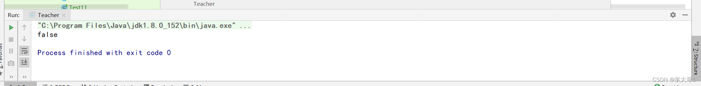

### 一，反射

#### 1.1 概念

> 在程序运行期间，对于任何一个类都可以动态的创建该类对象，对于任何一个对象都可以动态的调用它的属性和方法这种动态创建对象，调用属性和方法的行为就称为反射。

#### 1.2 获取字节码文件对象

> 要通过反射创建对象，调用对象的属性和方法必须先了解一个类的内部结构。
>
> 要了解一个类的内部结构，就需要先获取这个类的字节码文件对象
>
> 在Java中将java文件编译后得到的class文件进行了封装形成了一种数据类型`Class`类，这个类的对象就是字节码文件对象。
>
> 注：同一个字节码文件的对象是唯一的（字节码文件对象的都是单例的）

> 获取方式：
>
> ```java
> // 1.通过对象的getClass()获取
> Emp e = new Emp();
> Class c1 = e.getClass();
> 
> // 2.通过类的静态属性class获取
> Class c2 = Emp.class;
> 
> // 3.通过Class类的静态方法forName()获取
> Class c3 = Class.forName("com.qf.test.Emp");
> ```

#### 1.3 获取构造函数并创建对象

##### 1.3.1 获取构造函数的方法：

> 1. getConstructors()：获取类中所有公共的构造器对象组成的数组
> 2. getDeclaredConstructors()：获取类中所有构造器对象组成的数组
> 3. getConstructor(Class...c)：获取类中指定参数的公共的构造器对象
> 4. getDeclaredConstructor(Class...c)：获取类中指定参数的构造器对象
>
> ```java
> package construct;
> 
> import java.lang.reflect.Constructor;
> import java.lang.reflect.Modifier;
> import java.util.ResourceBundle;
> 
> public class Demo7 {
> 
>     public static void main(String[] args) throws Exception{
>         //资源绑定器
>         String path = ResourceBundle.getBundle("classInfo").getString("className");
>         Class c = Class.forName(path);
>         Object obj = c.newInstance();
>         //获取构造函数数组
>         Constructor[] constructors = c.getDeclaredConstructors();
>         //遍历构造函数对象
>         for (Constructor constructor : constructors) {
>             //获取构造函数的修饰符
>             System.out.print(Modifier.toString(constructor.getModifiers()) + " ");
>             //获取构造函数的类名
>             System.out.print(c.getSimpleName() + "(");
>             //获取构造函数实参类型所组成的数组
>             Class[] parameterTypes = constructor.getParameterTypes();
>             for (Class parameterType : parameterTypes) {
>                 //输出实参类型
>                 System.out.print(parameterType.getSimpleName() + "* ");
>             }
>             System.out.println("){}\n");
> 
>         }
>     }
> }
> ```
>
> 以反射的方式调用构造函数创建实例
>
> ```java
> package construct;
> 
> import java.lang.reflect.Constructor;
> import java.util.ResourceBundle;
> 
> public class Demo8 {
>     public static void main(String[] args) throws Exception {
>         //资源绑定器
>         String path = ResourceBundle.getBundle("classInfo").getString("className");
>         Class c = Class.forName(path);
>         //以字节码的方式创建实例（默认调用无参构造函数方式）
>         Object obj1 = c.newInstance();
>         //调用有参构造函数创建实例
>         //Constructor constructor = c.getConstructor();无参方式创建实例
>         Constructor constructor = c.getDeclaredConstructor(String.class,Integer.class,Double.class,Boolean.class);
>         Object obj2 = constructor.newInstance("张三" , 20 , 80.0 , true);
>         System.out.println(obj2);
>     }
> }
> ```
>
> 注：
>
> 1. 如果指定的构造器不存在会发生`NoSuchMethodException`没有这个方法异常
> 2. 参数类型不存在自动装拆箱

##### 1.3.2使用构造器对象创建指定类型的对象：`newInstance(Object...o)`

> 注：
>
> 1. 创建对象时，如果参数列表和指定构造器的参数列表不匹配，会发生`IllegalArgumentsException`非法参数异常，`arguments type mismatch`、`wrong number of arguments`
>
> 2. 如果使用私有构造器创建对象会发生`IllegalAccessException`非法访问异常，可以通过构造器对象是`setAccessible(true)`来设置私有构造函数可以使用（暴力反射）
>
> 3. 字节码文件对象也有`newInstance()`方法可以用来创建指定类的对象，但是这个方法无参，只能使用它来调用无参构造函数创建对象，此时必须保证类中有无参构造函数，否则会发生`NoSuchMethodException`
>
>    ```java
>     Class c = Class.forName("com.qf.test2.Emp");
>    Object o4 = c.newInstance();
>    ```

>```java
>package test;
>
>import java.io.FileReader;
>import java.util.Properties;
>
>public class Demo1 {
>    public static void main(String[] args) throws Exception{
>        //通过IO流读取classInfo.properties文件
>        /**
>         * 注意：src是类的根路径
>         * Thread.currentThread() 当前线程对象
>         * getContextClassLoader() 获取当前线程的类加载器对象
>         * getResource("classInfo.properties") 【获取资源】————类加载器对象的方法，当前类加载器默认从类的根目录加载资源
>         * getPath() 获取绝对路径
>         */
>//        String path = Thread.currentThread().getContextClassLoader().getResource("classInfo.properties").getPath();
>        String path = Thread.currentThread().getContextClassLoader().getResource("test/classInfo2.properties").getPath();
>
>        FileReader reader = new FileReader(path);
>        //创建Mao集合Properties
>        Properties properties = new Properties();
>        //加载
>        properties.load(reader);
>        //关闭流
>        reader.close();
>        //通过key获取value
>        String className = properties.getProperty("className");
>        //通过反射机制实例化对象
>        Class c = Class.forName(className);
>        Object obj = c.newInstance();
>        System.out.println(obj);
>
>    }
>}
>```
>
>补充点:
>
>​	当classForname("完整类名")执行时，会加载类，类中的`静态代码块会执行`，其他代码不执行

##### 1.3.3资源绑定器

> java.util包下提供了资源绑定器，用于获取属性配置文件的内容，但属性配置文件必须位于类路径下
>
> 资源绑定器只可用于绑定xxx.properties文件，且在写属性配置文件名时，不可将后缀一并填写
>
> ```java
> package test;
> 
> import java.util.ResourceBundle;
> 
> public class Demo2 {
>        public static void main(String[] args) throws Exception{
>            /*
>         以资源绑定器的方式来反射
>          */
>            ResourceBundle bundle = ResourceBundle.getBundle("classInfo");
>            String path = bundle.getString("className");
>            //通过反射机制实例化对象
>            Class c = Class.forName(path);
>            Object obj = c.newInstance();
>            System.out.println(obj);
>        }
> }
> ```

##### 1.3.4calssLoder(类加载器)

> 

##### 1.3.5双亲委派机制

> **1、什么是双亲委派机制**
> 	双亲委派机制（Parent Delegation Mechanism）是Java中的一种类加载机制。在Java中，类加载器负责加载类的字节码并创建对应的Class对象。双亲委派机制是指当一个类加载器收到类加载请求时，它会先将该请求委派给它的父类加载器去尝试加载。只有当父类加载器无法加载该类时，子类加载器才会尝试加载。
>
> ​	这种机制的设计目的是为了保证类的加载是有序的，避免重复加载同一个类。Java中的类加载器形成了一个层次结构，`根加载器（Bootstrap ClassLoader）`位于最顶层，它负责加载Java核心类库。其他加载器如`扩展类加载器（Extension ClassLoader）`和`应用程序类加载器（Application ClassLoader）`都有各自的加载范围和职责。通过双亲委派机制，可以确保类在被加载时，`先从上层的加载器开始查找，逐级向下，直到找到所需的类或者无法找到为止。`
>
> ​	这种机制的好处是可以避免类的重复加载，提高了类加载的效率和安全性。同时，它也为Java提供了一种扩展机制，允许开发人员自定义类加载器，实现特定的加载策略。
>
> 
>
> 2、**双亲委派机制的优缺点**
> 优点：
>
> - 避免重复加载：通过委派给父类加载器，可以避免同一个类被多次加载，提高了加载效率。
> - 安全性：通过双亲委派机制，核心类库由根加载器加载，可以确保核心类库的安全性，防止恶意代码替换核心类。
> - 扩展性：开发人员可以自定义类加载器，实现特定的加载策略，从而扩展Java的类加载机制。
>
> 
>
> 缺点：
>
> - 灵活性受限：双亲委派机制对于某些特殊的类加载需求可能过于严格，限制了加载器的灵活性。
> - 破坏隔离性：如果自定义类加载器不遵循双亲委派机制，可能会破坏类加载的隔离性，导致类冲突或安全性问题。
> - 不适合动态更新：由于类加载器在加载类时会先检查父加载器是否已加载，因此在动态更新类时可能会出现问题，需要额外的处理。
>
> 总体而言，双亲委派机制通过层次结构和委派机制提供了一种有序、安全的类加载方式，但也存在一些限制和不适用的情况。
>
> 
>
> 3、**双亲委派机制的应用场景**
> 双亲委派机制在Java中有多种应用场景。一些常见的应用场景包括：
>
> ​	`类加载`：双亲委派机制主要用于Java中的类加载。它确保类以层次结构方式加载，从引导类加载器开始，然后是扩展类加载器，最后是应用程序类加载器。这样可以高效且一致地加载类，跨类加载器层次结构。
>
> 安全性：双亲委派机制在确保Java应用程序的安全性方面起着重要作用。通过委派类加载给父加载器，它可以防止未经授权或恶意代码的加载和执行。这有助于维护Java运行时环境的完整性和安全性。
>
> ​	`类库`：双亲委派机制对于加载和管理类库非常有用。引导类加载器位于层次结构的顶部，负责加载核心Java类。扩展类加载器负责从Java扩展目录加载类。应用程序类加载器负责从应用程序的类路径加载类。这种分离允许高效组织和管理类库。
>
> ​	`自定义类加载`：开发人员可以利用双亲委派机制实现具有特定加载行为的自定义类加载器。通过扩展现有的类加载器并重写类加载过程，开发人员可以引入自定义逻辑，从非标准位置加载类或对加载的类应用自定义转换。
>
> 双亲委派机制在Java中广泛应用于类加载、安全性强制执行和类库管理等方面，为Java应用程序提供了结构化和安全的环境。
>
> 4、双亲委派机制的原理
> 	双亲委派机制是Java中的一种`类加载机制`。其原理如下：
>
> 1. ​	当Java程序需要加载一个类时，首先会委托给当前类加载器的父类加载器进行加载。父类加载器会按照相同的方式尝试加载该类。如果父类加载器能够成功加载该类，则加载过程结束。
>2. ​	如果父类加载器无法加载该类，则会将加载请求再次委托给它的父类加载器，直到达到顶层的引导类加载器。
> 3. ​	引导类加载器是Java虚拟机内置的类加载器，它负责加载核心类库，如java.lang包下的类。
>4. ​	如果引导类加载器也无法加载该类，则会回到初始的类加载器，尝试使用自身的加载机制加载该类。
> 5. ​	如果自身的加载机制仍然无法加载该类，则会抛出`ClassNotFoundException`异常。
>6. ​	通过这种双亲委派的机制，Java实现了类加载的层次结构。它可以确保`类的加载是有序的`，避免了`重复加载和类的冲突`。同时，它也提供了一种安全机制，`防止恶意代码的加载和执行。`

#### 1.4 获取成员变量并赋值

> 获取成员变量的方法：
>
> 1. getFields()
>    - 返回一个数组，其中包含 Field 反映此 Class 对象所表示的类或接口的所有可访问公共字段的对象。
>    - 返回的数组中的元素未排序，并且不按任何特定顺序排列。         
> 2. getDeclaredFields()
>    - 返回一个对象数 Field 组，该数组反映了由此 Class 对象表示的类或接口声明的所有字段。这包括 public、protected、default （package） access 和 private 字段，但不包括继承的字段。
>    - 返回的数组中的元素未排序，并且不按任何特定顺序排列。
> 3. getField(String name) 
>    - 返回一个 Field 对象，该对象反映此 Class 对象所表示的类或接口的指定公共成员字段。该 name 参数是 String 指定所需字段的简单名称。
> 4. getDeclaredField(String name)
> 5. getModifiers()
>    - 以整数形式返回此 Field 对象所表示的字段的 Java 语言修饰符。该 Modifier 类应用于解码修饰符。
> 6. Modifier.toString(int *) 一般和5方法联用
>    - 返回一个字符串，描述指定修饰符中的访问修饰符标志。例如：
>                public final synchronized strictfp
>
> 注：如果获取指定成员变量时，成员变量的名字不存在，会发生`NoSuchFieldException`

> 代码演示：
>
> ```java
> package test;
> 
> 
> import java.lang.reflect.Field;
> import java.lang.reflect.Modifier;
> 
> public class Demo3 {
>     public static void main(String[] args) throws Exception{
>         //获取整个类
>         Class students = Class.forName("test.dao.Student");
>         //获取类中的所有的field
>         Field[] fields1 = students.getFields();
>         //输出数组的长度
>         System.out.println("容器大小：" + fields1.length);
>         //遍历数组并输出
>         show(fields1);
>         System.out.println("------------");
>         //获取类中的所有的field
>         Field[] fields2 = students.getDeclaredFields();
>         //输出数组的长度
>         System.out.println("容器大小：" + fields2.length);
>         //遍历数组并输出
>         show(fields2);
>         System.out.println("------------");
>         System.out.println("简类名" + students.getSimpleName());
>         System.out.println("完整类名" + students.getName());
>     }
> 
>     private static void show(Field[] fields) {
>         for (Field field : fields) {
>             //java.lang.String:	name
> //            System.out.println(field.getType().getName() + ":\t" + field.getName());
>             //获取属性类型和属性名 ： String:	name
>             System.out.println("修饰该属性的修饰词: " + "\t" + Modifier.toString(field.getModifiers()));
>             System.out.println(field.getType().getSimpleName() + ":\t" + field.getName());
>         }
>     }
> }
> 
> ```

> 反射一个类中的属性(练习)
>
> ```java
> package test.dao;
> 
> import java.lang.reflect.Field;
> import java.lang.reflect.Modifier;
> import java.util.ResourceBundle;
> 
> //反编译
> public class Decompiler {
>     public static void main(String[] args) throws ClassNotFoundException {
>         //资源绑定器绑定类
>         ResourceBundle bundle = ResourceBundle.getBundle("classInfo");
>         String className = bundle.getString("className");
>         Class c = Class.forName(className);
> //        c = Class.forName("java.lang.String");
> 
>         //字符串拼接
>         StringBuilder s = new StringBuilder();
>         s.append(Modifier.toString(c.getModifiers()) + " class" + " " + c.getSimpleName() + " {\n");
>         //将类中属性拼接功能封装在方法中
>         addField(s , c);
>         s.append("}");
>         System.out.println(s);
>     }
> 
>     private static void addField(StringBuilder s, Class c) {
>         //获取所有的属性
>         Field[] declaredFields = c.getDeclaredFields();
>         for (Field declaredField : declaredFields) {
>             s.append("    ");
>             if (declaredField.getModifiers() != 0)
>                 //获取属性修饰符
>                 s.append(Modifier.toString(declaredField.getModifiers()) + " ");
>             //获取属性类型
>             s.append(declaredField.getType().getSimpleName() + " ");
>             //获取属性名字
>             s.append(declaredField.getName());
>             s.append(";\n");
>         }
>     }
> }
> ```
>
> 

> 给 对象的属性赋值：`set(Object o,Object value)`

#### 1.5 获取成员方法并调用

> 获取成员方法的方法：
>
> 1. getMethods()
>    - 返回一个数组，其中包含 Method 反映此 Class 对象所表示的类或接口的所有公共方法的对象，包括由类或接口声明的方法以及从超类和超接口继承的方法。
> 2. getDeclaredMethods()
>    - 获取所有方法对象组成的数组（不包含继承下来的）
> 3. getMethod(String name，Class...c)
>    - 返回一个 Method 对象，该对象反映此 Class 对象所表示的类或接口的指定公共成员方法
> 4. getDeclaredMethod(String name，Class...c)
>    - 返回一个 Method 对象，该对象反映此 Class 对象所表示的类或接口的指定声明方法。
>    - 参数 name 是指定所需方法的简单名称的 a String ， parameterTypes 参数是按声明顺序标识方法的形式参数类型的对象数组 Class 。
> 5. Modifier.toString(method.getModifiers())
>    - 获取方法修饰符	
> 6. getReturnType()
>    - 获取方法返回类型
> 7. getName()
>    - 获取方法名
> 8. Class<?>[] parameterTypes = method.getParameterTypes();
>    - 返回一个对象数 Class 数组，这些对象按声明顺序表示此对象所表示的可执行文件的形式参数类型。
>
> 注：如果指定的成员方法不存在，会发生`NoSuchMethodException`
>
> 代码演示
>
> ```java
> package method;
> 
> import java.lang.reflect.Method;
> import java.lang.reflect.Modifier;
> import java.util.ResourceBundle;
> 
> public class Demo5 {
>     public static void main(String[] args) throws Exception{
>         //资源绑定器绑定字节码文件
>         ResourceBundle bundle = ResourceBundle.getBundle("classInfo");
>         String path = bundle.getString("className");
>         Class c = Class.forName(path);
> 
>         //获取所有方法对象
>         Method[] methods = c.getDeclaredMethods();
>         //遍历方法数组
>         for (Method method : methods) {
>             //获取方法修饰符
>             System.out.print(Modifier.toString(method.getModifiers()) + "——");
>             //获取方法返回类型
>             System.out.print(method.getReturnType() + "——");
>             //获取方法名
>             System.out.println(method.getName());
>             //返回一个对象数 Class 数组，这些对象按声明顺序表示此对象所表示的可执行文件的形式参数类型。
>             Class<?>[] parameterTypes = method.getParameterTypes();
>             for (Class<?> parameterType : parameterTypes) {
>                 System.out.println(parameterType.getSimpleName());
>             }
>         }
>     }
> }
> 
> ```
>
> 

> 调用指定的方法：`invoke(Object obj, Object...value)`
>
> ```java
> package method;
> 
> import java.lang.reflect.Method;
> import java.util.ResourceBundle;
> 
> public class Demo6 {
>     public static void main(String[] args) throws Exception{
>         String path = ResourceBundle.getBundle("classInfo").getString("className");
>         Class c = Class.forName(path);
>         Object obj = c.newInstance();
> 
>         //调用无参方法
>         //Method method = c.getDeclaredMethod("show");
>         //调用有参方法
>         Method method = c.getDeclaredMethod("login",String.class,String.class);
>         //强制访问：将该方法设置为可访问的
>         method.setAccessible(true);
>         //Object invoke = method.invoke(obj);
>         Object invoke = method.invoke(obj,"admin","123");
>         System.out.println(invoke);
> 
>     }
> }
> ```
>
> 
>
> 注：如果调用方法时传递的参数与指定方法的参数不匹配会发生`IllegalArgumentsException`非法参数异常，`arguments type mismatch`、`wrong number of arguments`

### 二，java8新特性

#### 1. Lambda

##### 1.1 概述

> ​	Lambda表达式（也称为闭包）是整个Java 8发行版中最受期待的在Java语言层面上的改变，Lambda允许把函数 作为一个方法的参数（函数作为参数传递进方法中），或者把代码看成数据。
>
> ​	Lambda表达式用于简化JAVA 中接口式的匿名内部类。被称为函数式接口的概念。函数式接口就是一个具有一个方法的普通接口。像这样 的接口，可以被隐式转换为lambda表达式。 

##### 1.2 Lambda表达式的使用前提：

> 1. 必须要有一个方法，这个方法的参数中要有一个接口
> 2. 这个接口必须是一个函数式接口（函数式接口：有且只有一个抽象方法的接口）
>
> 注：使用`@FunctionalInterface`注解可以校验该接口是否是一个函数式接口
>
> 语法格式：
>
> ```java
> @FunctionalInterface
> public interface IntBinaryOperator {
> 
>     /**
>      * Applies this operator to the given operands.
>      *
>      * @param left the first operand
>      * @param right the second operand
>      * @return the operator result
>      */
>     int applyAsInt(int left, int right);
> }
> ```
>
> 代码演示
>
> ```java
> public class Demo1 {
>     public static void main(String[] args) {
> 
>         //匿名写法
>         new Thread(new Runnable() {
>             @Override
>             public void run() {
>                 for (int i = 0; i < 100; i++) {
>                     System.out.println(Thread.currentThread() + ":  " + i);
>                 }
>             }
>         }).start();
> 
>         //lambda写法
>         new Thread(() ->{
>             for (int i = 0; i < 100; i++) {
>                 System.out.println(Thread.currentThread() + ":  " + i);
>             }
>         }).start();
>     }
> }
> ```
>
> 
>
> 格式说明：
>
> 1. `()`：表示实现类实现接口时重写方法的参数列表（形参）
> 2. `->`：表示将`()`中参数接收到的数据传递给`{}`中的代码
> 3. `{}`：表示重写方法的方法体
>
> Lambda表达中可以省略的部分：
>
> 1. 参数列表的类型可以省略
> 2. 如果参数列表中的参数只有一个，那么`()`可以省略，此时参数的类型必须省略
> 3. 如果重写的方法体中只有一条语句
>    1. 重写的方法没有返回值，`{}`可以省略，此时该语句的`;`必须一起省略
>    2. 重写的方法有返回值，`{}`可以省略，此时`return`和`;`必须一起省略

##### 1.3 System.out::print 与 System.out.print的区别

> System.out::print ：是方法引用
>
> 方法引用是当你想把一个方法当作一个“函数指针”传给别的方法用时有用的。
>
> 例如说，我有个ArrayList想把里面每个元素都打印出来，每个元素一行。
> 那么Java 8之前会这样写：
>
> ```java
> for (ElementType e : list) {
> 	System.out.println(e);
> }
> ```
>
> 从Java 8开始，使用ArrayList的新API加上 lambda 表达式我们可以这样写：
>
> ```csharp
>   list.forEach(e -> System.out.println(e));
> ```
>
> 而这里的lambda表达式的内容其实只不过就是把参数传给了println()方法，而没有做任何别的事情，所以可以进一步简写为：
>
> ```php
>   list.forEach(System.out::println);
> ```
>
> 仅此而已。
>
> 重点：
>
> - System.out是一个PrintStream实例的引用；System.out::println 是对一个实例方法的引用
>   - 该引用同时指定了对实例（System.out）的引用以及对方法（PrintStream::println）的引用
> - System.out::println 不是 System.out.println 的等价物；前者是一个方法引用表达式，而后者不能单独作为一个表达式，而必须在后面跟上由圆括号包围的参数列表来构成方法调用表达式。
> - System.out::println 可以看作 lambda表达式 e -> System.out.println(e) 的缩写形式。

#### 2. Stream流

##### 2.1概述

> Stream是一个接口，表示流的意思，类似一个管道，数据好比流水从管道经过，用于传递数据，并不存储数据。`不会修改原本数据`
>
> Stream整体流水线包括很多操作，按阶段划分可以分为以下三个部分：
>
> `生成流`（Stream.of）
> `中间操作`（过滤、转大写、排序等等，每个操作处理完数据完成后，将结果交给下一个操作，一般存在return语句）
> `终结操作`（结束整个流水线，一个流只有一个终结操作，只要执行终结操作，就触发整个流的执行，
>
> ​      `不执行终结操作，中间操作也不会执行`，一般不存在return语句）
>
> `注：`在Java 8中，Stream是`惰性求值`的，即只有在终止操作（如forEach、count、sum等）被调用时才会执行中间操作（如filter、map、reduce等）来产生结果。`一旦流执行终止操作后，它就无法再次使用该流执行任何操作。`

##### 2.2 功能的基本演示

> ```java
> package test;
> 
> import dao.Author;
> import dao.Book;
> 
> import java.util.ArrayList;
> import java.util.Arrays;
> import java.util.List;
> import java.util.stream.Stream;
> 
> /**
>  * 代码功能演示
>  */
> public class Demo1 {
> 
>     public static void main(String[] args) {
>         List<Author> authors = getAuthors(Object.class);
> 
>         authors.forEach(author -> System.out.println(author));
>         //把集合转换成流
>         Stream<Author> stream = authors.stream();
>         stream.distinct()//去重
>                 .filter((author) -> author.getAge() <= 33)//条件满足才能储存
>             	//一定要有终结操作，否则功能不会执行
>                 .forEach((author) -> System.out.println("\n" + author));//遍历
>     }
> 
>     private static List<Author> getAuthors(Object obj) {
>         //数据初始化
>         Author author1 = new Author(1L, "蒙多", 33, "祖安人", null);
>         Author author2 = new Author(2L, "亚索", 18, "E中人", null);
>         Author author3 = new Author(3L, "易", 14, "高原血统", null);
>         Author author4 = new Author(3L, "易", 14, "高原血统", null);
>         //书籍列表
>         List<Book> books1 = new ArrayList<>();
>         List<Book> books2 = new ArrayList<>();
>         List<Book> books3 = new ArrayList<>();
> 
>         books1.add(new Book(1L , "光明与黑暗" , "哲学与爱情" , 88 , "一道划分了爱恨"));
>         books1.add(new Book(2L , "不能在同一棵树上吊死" , "个人成长" , 99 , "失败中明悟"));
> 
>         books2.add(new Book(3L , "风吹不到的地方" , "哲学" , 85 , "世界尽头"));
>         books2.add(new Book(3L , "风吹不到的地方" , "哲学" , 85 , "世界尽头"));
>         books2.add(new Book(4L , "吹或不吹" , "个人传记" , 56 , "被误解是表达着的宿命"));
> 
>         books3.add(new Book(5L , "你的剑就是我的剑" , "爱情" , 56 , "宽容"));
>         books3.add(new Book(6L , "风与剑" , "个人传记" , 100 , "灵魂的碰撞"));
>         books3.add(new Book(6L , "风与剑" , "个人传记" , 100 , "灵魂的碰撞"));
> 
>         author1.setBook(books1);
>         author2.setBook(books2);
>         author3.setBook(books3);
>         author4.setBook(books3);
> 
>         List<Author> authorList = new ArrayList<>(Arrays.asList(author1,author2,author3,author4));
> 
>         return authorList;
>     }
> }
> ```
>
> 两个实例对象的属性:
>
> **Author**
>
> ```java
> package dao;
> 
> import lombok.AllArgsConstructor;
> import lombok.Data;
> import lombok.EqualsAndHashCode;
> import lombok.NoArgsConstructor;
> 
> import java.util.List;
> 
> @Data
> @NoArgsConstructor
> @AllArgsConstructor
> @EqualsAndHashCode//用于后期去重
> public class Author {
>     private Long id;
>     private String name;
>     private Integer age;
>     //简介
>     private String intro;
>     //作品
>     private List<Book> book;
> }
> 
> ```
>
>  **Book**
>
> ```java
> package dao;
> 
> import lombok.AllArgsConstructor;
> import lombok.Data;
> import lombok.EqualsAndHashCode;
> import lombok.NoArgsConstructor;
> 
> @Data
> @NoArgsConstructor
> @AllArgsConstructor
> @EqualsAndHashCode//用于后期去重
> public class Book {
>     private Long id;
>     private String name;
>     //分类
>     private String category;
>     //评分
>     private Integer score;
>     //简介
>     private String intro;
> }
> 
> ```
>
> **xml配置**
>
> ```xml
> <?xml version="1.0" encoding="UTF-8"?>
> <project xmlns="http://maven.apache.org/POM/4.0.0"
>          xmlns:xsi="http://www.w3.org/2001/XMLSchema-instance"
>          xsi:schemaLocation="http://maven.apache.org/POM/4.0.0 http://maven.apache.org/xsd/maven-4.0.0.xsd">
>     <modelVersion>4.0.0</modelVersion>
> 
>     <groupId>org.example</groupId>
>     <artifactId>Stream</artifactId>
>     <version>1.0-SNAPSHOT</version>
> 
>     <properties>
>         <maven.compiler.source>17</maven.compiler.source>
>         <maven.compiler.target>17</maven.compiler.target>
>     </properties>
> 
>     <dependencies>
>         <dependency>
>             <groupId>org.projectlombok</groupId>
>             <artifactId>lombok</artifactId>
>             <version>1.18.24</version>
>         </dependency>
>     </dependencies>
> 
> </project>
> ```

##### 2.3 流创建操作

> **生成流的方式主要有五种**
>
> 1、集合创建（应用中最常用的一种）
>
> ```java
> List<Author> authors = getAuthors();
>         //方式一,集合创建
>         Stream<Author> stream_1 = authors.stream();
>         //双列集合先转单列集合
>         Map<String , String> map = new HashMap();
>         map.put("1" , "张三");
>         map.put("2" , "李四");
>         map.put("3" , "王五");
>         Set<Map.Entry<String, String>> entries = map.entrySet();
>         Stream<Map.Entry<String, String>> stream = entries.stream();
> ```
>
> 2、Stream创建
>
> ```java
>  //方式三,流创建
>         Stream<Integer> stream_3 = Stream.of(nums);
>         Stream<List<Author>> stream_4 = Stream.of(authors);
> ```
>
> 3、Array数组创建
>
> ```java
> //方式二，数组创建
>         Integer[] nums = {1,2,3,4,5,6};
>         Stream<Integer> stream_2 = Arrays.stream(nums);
> ```
>
> 通过Arrays.stream方法生成流，并且该方法生成的流是数值流【即IntStream】而不是 Stream
>
> 注：
>
> 其他代码补充
>
> ```java
> //通过泛型方式遍历，提高代码复用性
> private static <T> void show(Stream<T> t) {
>         t.forEach((T) -> System.out.println(T));
>     }
> 
>     //通过反射获取Demo1中的数据
>     private static List<Author> getAuthors() {
>         Object obj = null;
>         try {
>             Class c = Class.forName("test.Demo1");
>             obj = c.newInstance();
>             Method method = c.getDeclaredMethod("getAuthors",Object.class);
>             method.setAccessible(true);
>             obj = method.invoke(obj , new Object());
>         } catch (Exception e) {
>             e.printStackTrace();
>         }
>         List<Author> authors = (List<Author>)obj;
>         return authors;
>     }
> ```
>
> 使用数值流可以避免计算过程中拆箱装箱，提高性能。
>
> Stream API提供了mapToInt、mapToDouble、mapToLong三种方式将对象流【即Stream 】转换成对应的数值流，同时提供了boxed方法将数值流转换为对象流

##### 2.4 中间操作

###### filter

> `filter`可以对流中的元素进行条件`过滤`，符合条件的才能保存
>
> 示例：
>
> ```java
> public static void main(String[] args) {
>      List<Author> authors = getAuthors();
>      authors.stream()
>              //当名字长度>1的作业存在时，显示他的信息
>              .filter(author -> author.getName().length() > 1)
>              .forEach(System.out::println);
>  }
> 
>  //通过反射获取Demo1中的数据
>  private static List<Author> getAuthors() {
>         Object obj = null;
>         try {
>             Class c = Class.forName("test.Demo1");
>             obj = c.newInstance();
>             Method method = c.getDeclaredMethod("getAuthors",Object.class);
>             method.setAccessible(true);
>             obj = method.invoke(obj , new Object());
>      } catch (Exception e) {
>             e.printStackTrace();
>         }
>         List<Author> authors = (List<Author>)obj;
>         return authors;
>     }
>    ```

###### map

> 对流中的元素进行计算和删除
>
> 例如打印所有作家的姓名，在不修改原数据的情况下进行计算和数据类型转换
>
> ```java
>  public static void main(String[] args) {
>         List<Author> authors = GetAuthors.getAuthors();
>         authors.stream()
>                 .map(author -> author.getAge())
>                 //给所有作家的年龄进行加减,不会对原数据进行修改
>                 .map(age -> age + 10)
>                 .forEach(System.out::println);
>         //验证原数据是否被修改
>         GetAuthors.show(authors.stream());
>            
>         System.out.println();
>         
>         //打印所有作家名字
>         authors.stream()
>                 .map(author -> author.getName())
>                 .forEach(System.out::println);
>     }
> ```
> 

###### distinct

> 可以去除流中的重复元素
>
> 例如：打印所有作家的名字，并且要求不能有重复元素
>
> ```java
> /**
>      * 打印所有作家的名字，不允许有重复
>      * @param args
>      */
>     public static void main(String[] args) {
>         List<Author> authors = GetAuthors.getAuthors();
>         GetAuthors.show(authors.stream());
>         System.out.println();
>         GetAuthors.show(authors.stream().distinct());
>        }
> ```
> 
> 注：distinct方法是依赖Object的equals方法来判断是否是相同对象的，需要注意重写equas方法

###### sorted

> 可以对流中的元素进行排序
>
> 例如：让流中的元素升序排列
>
> ```java
> public static void main(String[] args) {
>      /**
>          * 对流中的内容进行排序
>          */
>         List<Author> authors = GetAuthors.getAuthors();
> 
>         //空参方法 升序排列
>         authors.stream()
>                    .sorted()
>                    .forEach(author -> System.out.println(author));
>         System.out.println();
>         //接口方法 降序排列
>         authors.stream()
>                 .sorted((Author author_1 , Author author_2) -> author_2.getAge() - author_1.getAge())
>                 .forEach(author -> System.out.println(author));
> 
>     }
> ```
> 
> 注意：如果调用空参的sorted方法，需要流中的元素实现Comparable接口

###### limit

> 可以设置流的最大长度，超出的部分将被`抛弃`
>
> 例如：对流中的元素按年龄降序排列，且不能有重复的元素，然后打印其中两个年龄最大的作家
>
> ```java
> public static void main(String[] args) {
>      /**
>          * 对流中的元素按年龄降序排列，且不能有重复的元素，然后打印其中两个年龄最大的作家
>          */
>         List<Author> authors = GetAuthors.getAuthors();
>         authors.stream()
>                 .sorted((author_1 , author_2) -> author_2.getAge() - author_1.getAge())
>                 .distinct()
>                    .limit(2)
>                    .forEach(author -> System.out.println(author.getName()));
>     }
> ```
> 
> 如果流的最大长度超过或等于流中的元素，则不影响

###### skip

> 跳过流中的前n个元素，返回剩余元素
>
> 例如：
>
> ```java
>   public static void main(String[] args) {
>      /**
>          * 打印除了年纪最大的作家以外的所有作家，且按年龄降序排列
>          */
>         List<Author> authors = GetAuthors.getAuthors();
>         authors.stream()
>                 .sorted((author_1 , author_2) -> author_2.getAge() - author_1.getAge())
>                 .distinct()
>                    .skip(1)
>                    .forEach(author -> System.out.println(author));
>     }
> ```

###### flatmap

> map只能把一个对象转换为另一个对象作为流中的元素，
>
> 而flatmap可以将一个对象转换为多个对象最为流中的元素
>
> **What is flatMap()?**
>
> ```java
> Stream<String[]>
> Stream<Stream<String>>
> String[][]
> [
>   [1, 2],
>   [3, 4],
>   [5, 6]
> ]
> 它由一个 2 级 Stream 或一个二维数组组成 。
> ```
>
> 在 Java 8 中，我们可以使用 flatMap 将上述 2 级 Stream 转换为一级 Stream 或将 二维数组转换为 一维数组。
>
> ```java
> Stream<String>
> 
> **String[]**
> 
> [1, 2, 3, 4, 5, 6]
> ```
>
> 简言之, `flatmap方法让你把一个流中的每个值都换成另一个流，然后把所有的流连接`
> 起来成为一个流。
>
> 看一个简单的例子： 使用flatMap找出单词列表中各不相同的字符
>
> 
>
> ```java
> public static void main(String[] args) {
>      /**
>          * 打印所有书籍的分类且去重
>          */
>         List<Author> authors = GetAuthors.getAuthors();
>         authors.stream()
>                 //获取集合的流
>                 .flatMap(author -> author.getBooks().stream())
>                 //给书籍去重
>                    .distinct()
>                    //获取书名分类的流
>                 .flatMap(book -> Arrays.stream(book.getCategory().split(",")))
>                 //给分类去重
>                 .distinct()
>                 .forEach(System.out::println);
>     }
> ```

##### 2.5 终结操作

###### foreach

> 对流中的内容进行遍历，具体遍历看操作
>
> ```java
>  public static void main(String[] args) {
>      //输出所有作家的名字
>      List<Author> authors = GetAuthors.getAuthors();
>      authors.stream()
>              .map(author -> author.getName())
>              .distinct()
>              .forEach(System.out::println);
>  }
>    ```

###### count

> 获取当前流中元素的个数
>
> ```java
>  public static void main(String[] args) {
>      /**
>          * 打印所有作家共撰写的作品总数
>          */
>         List<Author> authors = GetAuthors.getAuthors();
>         System.out.println(authors.stream()
>                 .flatMap(author -> author.getBooks().stream())
>                 .distinct()
>                    .count());
>        }
> ```

###### max and min

> 用来获取流中的最值
>
> ```java
>  public static void main(String[] args) {
>      List<Author> authors = GetAuthors.getAuthors();
>      System.out.println(authors.stream()
>              .flatMap(author -> author.getBooks().stream())
>              .distinct()
>              .map(book -> book.getScore())
>              .max((score1, score2) -> score1 - score2));
> 
>      System.out.println(authors.stream()
>                 .flatMap(author -> author.getBooks().stream())
>                 .distinct()
>                 .map(book -> book.getScore())
>                 .min((score1, score2) -> score1 - score2));
>     }
>    ```

###### collect

> 将当前流转换为集合
>
> ```java
> 
>     public static void main(String[] args) {
>         List<Author> authors = GetAuthors.getAuthors();
> 
>         //List集合演示:获取所有作家名字
>         authors.stream()
>                 .map(author -> author.getName())
>                 .collect(Collectors.toList())
>                 .forEach(System.out::println);
> 
>         System.out.println();
> 
>         //Set集合演示:获取所有书名
>         authors.stream()
>                 .flatMap(author -> author.getBooks().stream())
>                 .map(book -> book.getName())
>                 .collect(Collectors.toSet())
>                 .forEach(System.out::println);
> 
>         //获取一个Map集合，map的key为作者名，value为List<Book>
>         Map<String , List<Book> > map = authors.stream()
>                 .distinct()
>                 //有两个返回值，分别返回key和value
>                 .collect(Collectors.toMap(author -> author.getName() , author -> author.getBooks()));
> 
>         Set<String> strings = map.keySet();
>         for (String string : strings) {
>             System.out.println(string + "的作品:");
>             map.get(string).stream()
>                     //给集合去重
>                     .distinct()
>                     .map(book -> book.getName())
>                     .forEach(System.out::println);
>             System.out.println();
>         }
> 
>     }
> ```

###### anyMacth

> ```java
> public static void main(String[] args) {
>         /**
>          * 判断作家中是否有年龄超过指定岁数的人
>          */
>         List<Author> authors = GetAuthors.getAuthors();
>         //有一个符合返回true
>         boolean b = authors.stream()
>                 .anyMatch(author -> author.getAge() > 25);
>         //所有符合返回true
>         boolean bb = authors.stream()
>                 .allMatch(author -> author.getAge() > 25);
>         //所有都不符合条件返回true
>         boolean bbb = authors.stream()
>                 .noneMatch(author -> author.getAge() < 14);
>         System.out.println(b);
>         System.out.println(bb);
>         System.out.println(bbb);
>     }
> ```

###### reduce归并

> 对流中的数据按自定义的计算方式计算并返回
>
> reduce的作用是把流中的元素组合，传入一个初始值，依次拿流中的元素和初始值进行计算
>
> `俩个参数内部重载的计算方式`
>
> ```java
> T result = identity;
> for (T element : this stream)
> result = accumulator.apply(result, element)
> return result;
> ```
>
> `注：`参数传进去的是什么类型，返回的就是什么类型，如果不是按原类型返回，搭配map使用方法
>
> 
>
> `一个参数内部重载的计算方式`
>
> ```java
> boolean foundAny = false;
> T result = null;
> for (T element : this stream) {
>     if (!foundAny) {
>         foundAny = true;
>         result = element;
>     }else{
>          result = accumulator.apply(result, element);
>     }
> }
> return foundAny ? Optional.of(result) : Optional.empty();
> ```
>

#### 3. Optional

##### 3.1 概述

> 到目前为止，臭名昭著的`空指针异常`是导致Java应用程序失败的最常见原因。以前，为了解决空指针异常，Google公司著名的Guava项目引入了Optional类，Guava通过使用`检查空值的方式`来防止代码污染，它鼓励程序员写更干净的代码。受到Google Guava的启发，Optional类已经成为`Java 8`类库的一部分。

##### 3.2 Optional是什么

> Optional类是什么？
> Optional 类(java.util.Optional) 是一个容器类，它可以保存类型T的值，代表这个值存在。或者仅仅保存null，表示这个值不存在。原来用 null 表示一个值不存在，现在 Optional 可以更好的表达这个概念。并且可以避免空指针异常。

##### **3.3创建Optional类对象的方法：**

> - `Optional.of(T t)` : 
>   - 创建一个 Optional 实例，t必须非空；
> - `Optional.empty()` : 
>   - 创建一个空的 Optional 实例
> - `Optional.ofNullable(T t)`：
>   - t可以为null
> - `Optional.ifPresent(Consumer<? super T> action)`：
>   - 如果存在值，则使用该值执行给定的操作，否则不执行任何操作。
>         形参:
>         action – 要执行的操作（如果存在值）
>         抛出:
>         NullPointerException – 如果值存在并且给定的操作是 null
>
> ```java
> public static void main(String[] args) {
>         Author author1 = getAuthor();
> //        此方法的使用，必须保证参数不为空
> //        Optional<Author> author11 = Optional.of(author1);
>         //此方法不受参数为null值影响
>         Optional<Author> optionalAuthor = Optional.ofNullable(author1);
>         optionalAuthor.ifPresent(author2 -> System.out.println(author2.getName()));
>     }
> 
>     private static Author getAuthor() {
>         return new Author(1L, "蒙多", 33, "祖安人", null);
>     }
> ```

##### 3.4 Optional类用法

> Optional类的Javadoc描述如下：这是一个可以为null的容器对象。
> 如果值存在则isPresent()方法会返回true，调用get()方法会返回该对象。
> 如果值不存在则isPresent()方法会返回false，调用get()方法会NPE。

##### 3.5 获取Optional容器的对象

> `T get(): `如果调用对象包含值，返回该值，否则抛异常
> `T orElse(T other) ：`如果有值则将其返回，否则返回指定的other对象。
> `T orElseGet(Supplier<? extends T> other) ：`如果有值则将其返回，否则返回由Supplier接口实现提供的对象。
> `T orElseThrow(Supplier<? extends X> exceptionSupplier) ：`如果有值则将其返回，否则抛出由Supplier接口实现提供的==异常==。
>
> ```java
> //GetAuthors类的方法
> public static Optional<Author> getAuthor() {
>   Author author = new Author(1L, "蒙多", 33, "祖安人", null);
> //        return Optional.ofNullable(author);
>   return Optional.ofNullable(new Author()/* 此时为null */);
> }
> 
> public static void main(String[] args) {
>   //如果获取到的 optionalAuthor 为null，get方法会报错
>   /*optionalAuthor = null;
>   Author author1 = optionalAuthor.get();*/
>   Optional<Author> optionalAuthor = GetAuthors.getAuthor();
> 	//orElseGet() 如果optionalAuthor的内容为null ，则返回以设置好的Author默认值
>  //否则返回Optional<T> 的 T 对象
>   Author author = optionalAuthor.orElseGet(() -> new Author());
>   System.out.println(author);
> }
> ```

##### 3.6 **过滤：**

> `Optional<T> filter(Predicate<? super <T> predicate)`：如果值存在，并且这个值匹配给定的 predicate，返回一个Optional用以描述这个值，否则返回一个空的Optional
>
> 进入filter方法
>
> 
>
> 
>
> 查看emty() 方法
>
> 
>
> 

#### 4. 函数式接口

##### 4.1 概述

> 就是一个只能有一个抽象方法（且必须有一个抽象方法，有且仅有），可以有多个非抽象方法的接口。
> 函数式接口可以被隐式转换为 lambda 表达式。函数式接口对现有的函数友好地支持 lambda，让代码看上去更简洁清晰。
> 在JAVA 8 以前一般使用匿名类来表示一个接口的实现，现在可以通过函数式接口，然后使用Lambda表达式来标识该接口的一个具体实现。

##### 4.2 常见的函数式接口：

> 1. Consumer<T>：消费型接口
>
>    ```java
>    接收一个参数进行消费，无返回结果 （因为没有返回值，接口里面执行内容和调用方没什么关联 – 解耦）
>    void accept(T t)：它是一个用于操作指定类型数据的方法
>    ```
>
> 2. Predicate<T>
>
>    ```java
>    boolean test(T t)：它是一个针对指定类型的数据进行判断的方法
>    ```
>
> 3. Supplier<T>：生产型接口
>
>    ```java
>    T get()：它是一个用于获取指定类型结果的方法
>    ```
>
> 4. Function<T,R>
>
>    ```java
>    R apply(T t)：它是一个用于将指定类型的数据转换成另一种指定类型结果的方法
>    ```

#### 5. 方法引用

> 我们在使用lambda时，如果方法体中只有一个方法的调用的话（包括构造方法），可以进一步简化代码

##### 5.1 基本格式

> `类名`/`对象名`：：方法名

###### 5.1.1 引用静态方法

> 使用前提：
>
> ​	如果我们在重写方法的时候，方法体中只有一行代码，并且这行代码调用了**某个类的静态方法**，我们要把重写的抽象方法的**所有参数依次传入**这个静态方法中，才可以使用这个类的静态方法
>
> 例如：
>
> ```java
> public static void main(String[] args) {
>     List<Author> authors = GetAuthors.getAuthors();
>     authors.stream()
>             .map(author -> author.getAge())
>             .map(age -> String.valueOf(age));
> }
> ```
>
> 简化后
>
> ```java
> public static void main(String[] args) {
>     List<Author> authors = GetAuthors.getAuthors();
>     authors.stream()
>             .map(author -> author.getAge())
>             .map(String::valueOf);
> }
> ```

###### 5.1.2 引用对象的实例方法

> 使用前提
>
> 
>
> 例如
>
> ```java
> public static void main(String[] args) {
>     List<Author> authors = GetAuthors.getAuthors();
>     StringBuilder str = new StringBuilder();
>     authors.stream()
>             .map(author -> author.getName())
>             .forEach(name -> str.append(name));
> 
> }
> ```
>
> 简化后
>
> ```java
> public static void main(String[] args) {
>     List<Author> authors = GetAuthors.getAuthors();
>     StringBuilder str = new StringBuilder();
>     authors.stream()
>             .map(Author::getName)
>             .forEach(str::append);
> }
> ```

###### 5.1.3 引用类的实例方法

> 使用前提
>
> 
>
> 和上面静态方法引用运行结果一样。实例方法引用就是在进行方法引用之前需要创建实例，通过实例对象名去引用方法。
>
> dao:Student
>
> ```java
> package dao;
> 
> import lombok.AllArgsConstructor;
> import lombok.Data;
> import lombok.NoArgsConstructor;
> 
> @Data
> @NoArgsConstructor
> @AllArgsConstructor
> public class Student {
>     private String name;
>     private Integer score;
> 
>     public int compareStudentByName(Student student) {
>         return 0;
>     }
> }
> ```
>
> 测试类中的示例代码
>
> ```java
> public static void main(String[] args) {
>     Student student1 = new Student("周明",75);
>     Student student2 = new Student("赵凯",83);
>     Student student3 = new Student("李强",97);
>     Student student4 = new Student("孙国",62);
> 
>     List<Student> students = Arrays.asList(student1,student2,student3,student4);
> 
>     //简化写法
>     students.sort(Student::compareStudentByName);
>     students.forEach(student -> System.out.println(student.getName()));
> }
> ```

###### 5.1.4 构造器的引用

> 格式：==类名::new==
>
> 使用前提：
>
> 
>
> 例如
>
> ```java
> public static void main(String[] args) {
>     List<Author> authors = GetAuthors.getAuthors();
>     authors.stream()
>             .map(Author::getName)
>             .map(StringBuilder::new)
>             .forEach(System.out::println);
> }
> ```
>
> 

##### 5.2 基本数据类型优化

> 

#### 6. 并行流

##### 6.1 概述

> ​    在Java 8中，Stream提供了顺序流（Sequential Stream）和并行流（Parallel Stream）两种数据流处理方式。
>
> ​    并行流就是将数据分成多个部分来进行处理，每个部分可以交给不同的线程来并发处理，以达到提高处理速度的效果。在`数据量较大且处理操作相对比较耗时`的场景下，使用并行流能够显著提高程序运行的效率。
>
> ​    相对于顺序流而言，并行流在执行某些中间操作时，f会自动将数据分成若干个小块，并在多个线程中进行处理，最终将结果合并起来。开发人员可以通过调用parallel()方法将顺序流转换为并行流。

##### 6.2 如何使用并行流提高性能

> 使用并行流可以通过利用多线程并行处理数据，从而提高程序的执行性能。下面是一些使用并行流提高性能的常见方法：
>
> 创建并行流：要创建一个并行流，只需在普通流上调用 parallel() 方法。
>
> ```java
> List<Integer> numbers = Arrays.asList(1, 2, 3, 4, 5); 
> Stream<Integer> parallelStream = numbers.parallelStream();
> ```
>
>
> 利用任务并行性：并行流会将数据分成多个小块，并在多个线程上并行处理这些小块。这样可以充分利用多核处理器的优势。
>
> ```java
> List<Integer> numbers = Arrays.asList(1, 2, 3, 4, 5); 
> numbers.parallelStream() .map(n -> compute(n)) // 在多个线程上并行处理计算 
> .forEach(System.out::println);
> ```
>
>
> 在这个示例中，使用 map 方法对流中的每个元素进行计算。由于并行流的特性，计算操作会在多个线程上并行执行，提高了计算的效率。
>
> 避免共享可变状态：在并行流中，多个线程会同时操作数据。如果共享可变状态（如全局变量）可能导致数据竞争和不确定的结果。因此，避免在并行流中使用共享可变状态，或者采取适当的同步措施来确保线程安全。
>
> 使用合适的操作：一些操作在并行流中的性能表现更好，而另一些操作则可能导致性能下降。一般来说，在并行流中使用基于聚合的操作（如 reduce、collect）和无状态转换操作（如 map、filter）的性能较好，而有状态转换操作（如 sorted）可能会导致性能下降。
>
> ```java
> List<Integer> numbers = Arrays.asList(1, 2, 3, 4, 5);
> 
> // good performance
> int sum = numbers.parallelStream()
>               .reduce(0, Integer::sum);
> 
> // good performance
> List<Integer> evenNumbers = numbers.parallelStream()
>                                 .filter(n -> n % 2 == 0)
>                                 .collect(Collectors.toList());
> 
> // potential performance degradation
> List<Integer> sortedNumbers = numbers.parallelStream()
>                                   .sorted()
>                                   .collect(Collectors.toList());
> ```
>
>
> 在这个示例中，reduce 和 filter 的操作在并行流中具有良好的性能，而 sorted 操作可能导致性能下降。
>
> 除了上述方法，还应根据具体情况进行评估和测试，并行流是否能够提高性能。有时候，并行流的开销（如线程的创建和销毁、数据切割和合并等）可能超过了其带来的性能提升。因此，在选择使用并行流时，应该根据数据量和操作复杂度等因素进行综合考虑，以确保获得最佳的性能提升。
>
> ```java
> public static void main(String[] args) {
>     //串行流
>     Stream<Integer> integerStream = Stream.of(1, 2, 5, 6, 7, 8, 9 ,3, 4);
>     Optional<Integer> reduce = integerStream
>             .sorted()
>             .filter(num -> num >= 5)
>             .reduce(Integer::sum);
>     System.out.println(reduce);
> 
> 
>     Stream<Integer> integerStream_2 = Stream.of(1, 2, 5, 6, 7, 8, 9 ,3, 4);
>     //并行流 ： .parallel()     大数据流量时，加快效率
>     Optional<Integer> reduce_2 = integerStream_2.parallel()
>             /**
>              * 返回由此流的元素组成的流，并在从结果流中消费元素时对每个元素执行所提供的操作。
>              * 这是一个中间操作。
>              * 对于并行流管道，可以在任何时间、在任何线程中调用上游操作提供的元素。如果该操作修改共享状态，则负责提供所需的同步。
>              */
>             .peek(new Stream.Builder<Integer>() {
>                 @Override
>                 public void accept(Integer integer) {
>                     //输出该元素被那条线程负责运算
>                     System.out.println(Thread.currentThread().getName());
>                 }
>                 @Override
>                 public Stream<Integer> build() {
>                     return null;
>                 }
>             })
>             .sorted()
>             .filter(num -> num >= 5)
>             .reduce(Integer::sum);
>     System.out.println(reduce_2);
> }
> ```

### 三，注解

#### 1. 什么是JAVA注解

> java注解又叫java标注，是jdk1.5引入的一种注释机制；
> java语言的类、方法、属性、参数、包都可以被标注，与javadoc不同，java的注解，在编译时候可以嵌入到字节码文件中，注解可以被JVM虚拟机可以保存，被JVM虚拟机读取。

#### 2 JAVA注解的分类

> java内置注解一个有10个

##### 2.1 代码注解——标注在代码里面的注解,称为代码注解

> | 注解             | 描述                                           |
> | ---------------- | ---------------------------------------------- |
> | **override**     | 标记在子类中重写了父类的方法，如果不是则会报错 |
> | deprecated       | 标记此方法已经过时了                           |
> | suppressWarnings | 忽略注解声明的警告                             |

##### 2.2 元注解

> 元注解可以理解为注解的注解（如果不能理解可以去看下元数据）
>
> | 注解       | 描述                                    |
> | ---------- | --------------------------------------- |
> | Retention  | 标记注解怎么保存                        |
> | Documented | 使用此注解可以让注解保存到javadoc文档中 |
> | Target     | 标记注解的作用域                        |
> | Inherirted | 标记注解有继承性                        |

##### 2.3 新增的注解

> | 注解               | 描述                                         |
> | ------------------ | -------------------------------------------- |
> | SafavarArgs        | 忽略方法或者构造方法的参数为泛型所产生的警告 |
> | FuntionalInterface | 标注一个函数性接口                           |
> | repeatable         | 标识某注解可以在同一个声明上使用多次         |

##### 2.4 自定义注解

> **注解属性类型**
>
> 注解属性 ( 接口方法 ) 返回值类型要求 :
>
> ① 基本数据类型 : `byte` , `short` , `int` , `long` , `float `, `double `, `char `, `boolean `;
>
> ② 字符串类型 : `String `;
>
> ③ 枚举类型 : `enum `;
>
> ④ 注解类型 ;
>
> ⑤ 以上类型的`数组形式` ;
>
> 注解属性返回值必须是以上的类型 , 不能设置其它类型返回值 , 否则会报错 ;
>
> 注：`如果数组中只需要填入一个元素，大括号可以省略`
>
> **注解应用需要三个步骤：**
>
>  （1）编写注解
>
>  （2）在类上应用注解
>
>  （3）对应用了注解的类进行反射操作的类 自定义Annotation的语法如下：
>
>  访问控制权限 @interface{}
>
> 在Annotation中定义属性
>
> ```java
> public @interface MyAnnotation { 
>     public String name(); 
>     public String info(); 
> }
> ```
>
> 定义变量后，在调用此Annotation时必须设置属性值。 
>
> ```java
> @MyAnnotation(name = “vince", info = “hello") 
> public class Demo { } 
> ```
>
> 通过default指定属性默认值， 有了默认值在使用时可以不设值 
>
> ```java
> public @interface MyAnnotation { 
>     public String name() default “vince"; 
>     public String info() default “hello"; 
> }
> ```
>
> 注意：当注解有且只有一个属性的名字为`value`，注解括号里的可以直接写值，及value = 可以省略

#### 3 JAVA注解三大类

> 每一个annotation都有多个elementType和唯一的一个retentionPolicy（可能这个大家不是很理解，往下看）

##### 3.1 Annotation接口

> ```java
> package java.lang.annotation;
> 
> public interface Annotation {
>     boolean equals(Object obj);
> 
>     int hashCode();
> 
>     String toString();
> 
>     Class<? extends Annotation> annotationType();
> }
> ```

##### 3.2 ElementType枚举

> ```java
> public enum ElementType {
>     TYPE, //在接口、类、枚举上声明注解
>     METHOD,//在方法上声明注解
>     FIELD,//在字段上声明注解
>     PARAMETER,//在参数上声明注解
>     LOCAL_VARIABLE,//在局部变量上声明注解
>     PACKET,//在包上声明注解
>     CONSTRUCTOR,//在构造方法上声明注解
>     ANNOTATIONTYPE,//在注解类型上声明注解
> }
> ```

##### 3.3 RtentionPolicy枚举

> ```java
> public enum RtentionPolicy {
>     SOURCE,         //注解信息存在代码的编译过程,编译结束，注解结束
>     CLASS,          //注解信息保存在字节码文件中
>     RUNTIME         //注解信息保存在字节码文件中，并可以被JVM虚拟机读取
> }
> ```

#### 4 举例SuppressWarnings详解

> ```java
> @Doucumented
> @Target({TYPE, FIELD, METHOD, PARAMETER, CONSTRUCTOR, LOCAL_VARIABLE})
> @Retention(RetentionPolicy.SOURCE)
> public @interface SuppressWarnings {
>     String[] value();
> }
> ```
>
> - @Doucumented代表的是SuppressWarnings注解可以保存javadoc文档里面的
> - @Target({TYPE, FIELD, METHOD, PARAMETER, CONSTRUCTOR, LOCAL_VARIABLE}) 表示的是该注解可以作用域。
> - @Retention(RetentionPolicy.SOURCE) 表示注解仅仅在存在编译期间，编译结束则消失
> - String[] value();表示SuppressWarnings 有多个值；

##### SuppressWarnings的常用关键字

> | 关键字      | 描述                                            |
> | ----------- | ----------------------------------------------- |
> | deprecation | 忽略使用不被赞成、过时所产生的警告              |
> | unchecked   | 忽略集合中没有声明类型的所产生的警告            |
> | fallthrouth | switch程序块，忽略下一种情况没有break的情况     |
> | path        | 忽略类地址、源路径不存在的警告                  |
> | serial      | 序列化的时候，忽略类中缺少serialVersionUUid警告 |
> | finally     | 忽略finally语句块不能正常执行的的警告           |
> | all         | 忽略以上所有的警告                              |
>
> 示例1
> 注释前产生的警告
>
> 
>
> 注释后忽略此警告
>
> 
>
> 示例2
> 注释前产生的警告
>
> 
>
> 注释后忽略此警告
>
> 

#### 5 举例Inherited详解

> ```java
> @Documented
> @Retention(RetentionPolicy.RUNTIME)
> @Target(ElementType.ANNOTATION_TYPE)
> public @interface Inherited {
> }
> ```
>
> - @Doucumented代表的是Inherited注解可以保存javadoc文档里面的
> - @Target(ElementType.ANNOTATION_TYPE) 表示的是该注解可以作用域是annotation。
> - @Retention(RetentionPolicy.RUNTIME)表示注解保存在class文件中，并可以被JVM虚拟机读取
> - 被Inherited 注解的注解具有继承性

##### 示例1不被Inherited 修饰的注解

> 1、编写一个注解
>
> ```java
> package reflect;
> 
> import java.lang.annotation.Documented;
> import java.lang.annotation.Retention;
> import java.lang.annotation.Target;
> 
> import static java.lang.annotation.ElementType.*;
> import static java.lang.annotation.RetentionPolicy.RUNTIME;
> 
> //@Inherited
> @Documented
> @Retention(RUNTIME)
> @Target({TYPE,FIELD,METHOD})
> public @interface AnnnotationOne {
> }
> ```
>
> 2、编写一个父类
>
> ```java
> package reflect;
> 
> @AnnnotationOne
> public class Person {
> }
> ```
>
>
> 3、编写一个子类
>
> ```java
> package reflect;
> 
> public class Teacher extends Person {
>     public static void main(String[] args) {
>         Class<Teacher> teacherClass = Teacher.class;
>         boolean annotationPresent = teacherClass.isAnnotationPresent(AnnnotationOne.class);
>         System.out.println(annotationPresent);
>     }
> }
> ```
>
> 响应
>
> 

##### 示例2被Inherited 修饰的注解

> 1、编写一个注解
>
> ```java
> package reflect;
> 
> import java.lang.annotation.Documented;
> import java.lang.annotation.Inherited;
> import java.lang.annotation.Retention;
> import java.lang.annotation.Target;
> 
> import static java.lang.annotation.ElementType.*;
> import static java.lang.annotation.RetentionPolicy.RUNTIME;
> 
> @Inherited
> @Documented
> @Retention(RUNTIME)
> @Target({TYPE,FIELD,METHOD})
> public @interface AnnnotationOne {
> }
> ```
>
>
> 2、编写一个父类
>
> ```java
> package reflect;
> 
> @AnnnotationOne
> public class Person {
> 
> }
> ```
>
> 3、编写一个子类
>
> ```java
> package reflect;
> 
> public class Teacher extends Person {
>     public static void main(String[] args) {
>         Class<Teacher> teacherClass = Teacher.class;
>         boolean annotationPresent = teacherClass.isAnnotationPresent(AnnnotationOne.class);
>         System.out.println(annotationPresent);
> 	}
> }
> ```
>
> 从2个示例可以看出被注解Inherirte标注的注解具有继承性。

#### 6 反射注解

> ```java
> package reflect;
> 
> import java.lang.annotation.Annotation;
> 
> public class Teacher extends Person {
>     public static void main(String[] args) {
>         //获取Teacher的class对象
>         Class<Teacher> teacherClass = Teacher.class;
>         //获取父类的class对象
>          Class<? super Teacher> superclass = teacherClass.getSuperclass();
>          //获取指定的注释对象
>         AnnnotationOne Annotation = superclass.getAnnotation(AnnnotationOne.class);
>         //获取注解的值
>         String[] value = Annotation.value();
>         for (String a :value){
>             System.out.println(a);
>         }
> 
>     System.out.println("=================================");
>    Annotation[] annotations = superclass.getAnnotations();
>     for (Annotation annotation:annotations){
>         System.out.println(annotation);
>     	}
> 
> 	}
> 
> }
> ```

####  7 Java lombok 常用注解

> `@Getter` 和  `@Setter`
>
> 生成get、set方法 
>
> `@NonNull`
> 空值检测 如在字段上使用则生成的方法也进行空值检测 检测到空会抛出空指针异常
>
> `@ToString`
> 生成toString方法 可使用参数排除部分字段 `@ToString(exclude="someField")`
>
> `@EqualsAndHashCode`
> 生成equals和hashcode方法
>
> `@Data`
> 相当于同时使用了@Getter和@Setter、@ToString、@EqualsAndHashCode
>
> `@CleanUp`
> 保证资源被释放
>
> 如：
>
> ```java
> @Cleanup ByteArrayOutputStream b = new ByteArrayOutputStream();
> ```
>
>
> 则相当于
>
> ```java
> ByteArrayOutputStream b = new ByteArrayOutputStream();
> try {
> //...
> } finally {
> b.close();
> }
> ```
>
>
> `@Synchronized`
> 加锁 使用的对象为lombok创建的对象 这个注解不被建议使用
>
> ```java
> private DateFormat format = new SimpleDateFormat("MM-dd-YYYY");
> 
> @Synchronized
> public String synchronizedFormat(Date date) {
>     return format.format(date);
> }
> ```
>
> 相当于
>
> ```java
> private final java.lang.Object $lock = new java.lang.Object[0];
> private DateFormat format = new SimpleDateFormat("MM-dd-YYYY");
> 
> public String synchronizedFormat(Date date) {
>     synchronized ($lock) {
>         return format.format(date);
>     }
> }
> ```
>
> `@NoArgsConstructor` 和 `@AllArgsConstructor`
> 生成无参构造函数、生成全部参数的构造函数
>
> `@RequiredArgsConstructor  ` 
> 生成所有NoNull参数和常量的构造函数
>
> `@Builder`
> 将类变为建造者模式的类，编译时增加了一个Builder内部类和全字段的构造器。
>
> ```java
> public class User {
>     private String name;
>     private Integer age;
>     private User(String name, Integer age){
>         this.name = name;
>         this.age = age;
>     }
>     public static Builder builder() {
>         return new Builder();
>     }
>     public static class Builder{
>         private String name;
>         private Integer age;
>         private String sex;
>         Builder(){
>         }
>         public Builder name(String name){
>             this.name = name;
>             return this;
>         }
>         public Builder age(Integer age){
>             this.age = age;
>             return this;
>         }
>         public User build(){
>             return new User(this.name,this.age);
>         }
>     }
> ```
>
> 
>
> ```java
> public static void main(String[] args) {
>     User u = User.builder().name("111").age(1).build();
>     System.out.println(u.toString());
> }
> ```
> }
> @Log4j 和 @Slf4j
> 在类中生成一个日志对象方便使用
>
> ```java
> @Log
> public class T{
>     public static void main(String[] args) {
>         log.info("some message");
>     }
> }
> ```
>
> 


