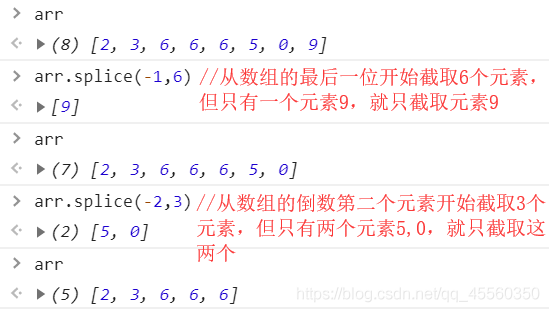
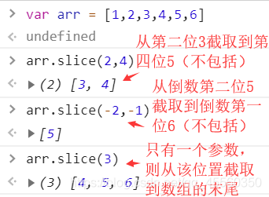

### 一，html

#### 1.1 概念

> html：超文本标记语言，hypertext markup language
>
> 特点：
>
> 1. 超文本：可以在文本中嵌入超链接，视频、图片等
> 2. 标记语言：html中的内容都是以标记（标签）的形式出现的
> 3. 由浏览器解释运行，不同浏览器的内核不同因此对同一个html页面的解析能力也不同
> 4. html文件的后缀都是`.html`或者`.htm`
> 5. html中的标签都是预定义的
>
> 标记（标签）：
>
> 1. 单标记：只有开始标记
>
>    ```html
>    <input>
>    <hr>
>    <br>
>    
>    ```
>
> 2. 双标记：由开始标记和结束标记组成
>
>    ```html
>    <p></p>
>    <a></a>
>    <table></table>
>    <ol></ol>
>    <ul></ul>
>    <button></button>
>    <font></font>
>    <tr></tr>
>    <td></td>
>    <form></form>
>    <i></i>
>    <b></b>
>    <strong></strong>
>    ```

#### 1.2 html 页面的组成

> ```html
> <!DOCTYPE html>
> ```
>
> ```html
> <head></head>：头部标签，用于配置当前页面
> ```
>
> ```html
> <body></body>：主体标签：用于显示页面数据
> ```

#### 1.4 常见标签

##### 1.4.1 注释

> ```html
> <!-- 注释内容 -->
> ```

##### 1.4.2 标题标签

> 标签名：`h`
>
> 一级标题~六级标题：`h1~h6`
>
> 特点：
>
> 1. 标题标签是块级标签。标签分为块级标签和行内标签，块级标签的特点是独占一整行，上下自动换行；行内标签的特点是可以和其他行内标签处于同一行中
> 2. 标题标签自动加粗

##### 1.4.3 字体标签

> 标签名：`font`
>
> 标签属性的格式：
>
> ```html
> <标签 属性名="属性值" 属性名="属性值">内容</标签>
> ```
>
> `font`标签的属性：
>
> 1. size：字体大小，取值范围`1~7`，7最大，1最小，默认是3
>
> 2. color：颜色
>
>    取值：
>
>    1. 颜色单词
>
>    2. #rrggbb
>
>    3. 使用css中的rgb()函数
>
>       ```css
>       style="color:#ff0000"
>       style="color:red"
>       style="color:rgb(xxx,xxx,xxx)"
>       style="color:rgba(xxx,xxx,xxx,xxx)"
>       ```

###### 字体中常见的样式属性和文本外观属性

> - font-family
> - fongt-size
> - color
> - font-style
> - font-weight
> - font-height
> - line-height
> - text-align ：定义文本对齐属性
> - text-indent ：段首缩进
> - text-decoration：下划线属性设置

##### 1.4.4 图片标签

> 标签名：`img`
>
> 属性：
>
> 1. src：设置图片的路径
>    1. 本地图片
>    2. 网络图片
> 2. width/height：宽高，单位：默认是px像素，单独设置宽或者高，图片会自动等比缩放
> 3. title：鼠标悬浮在图片上的提示内容
> 4. alt：图片无法加载时提示内容

##### 1.4.5 超链接标签

> 标签名：`a`(text-decoration去除下划线)
>
> 属性：
>
> 1. href：用于明确跳转到的目标地址
> 2. target：设置跳转页面的打开方式，取值`_self(默认)`、`_blank`

> 页面内的跳转：
>
> 实现步骤：
>
> 1. 在目标位置的标签中添加id属性值
> 2. 在起始位置添加a标签，并在a标签的href属性值中写“#目标位置的id值”
>
> 注：返回顶部，在任何一个a标签的href属性中直接写`#`
>
> ```html
> <!DOCTYPE html>
> <html lang="en">
> 
> <head>
>     <meta charset="UTF-8">
>     <meta http-equiv="X-UA-Compatible" content="IE=edge">
>     <meta name="viewport" content="width=device-width, initial-scale=1.0">
>     <title>Document</title>
>     <link rel="stylesheet" href="Demo2.css">
> </head>
> 
> <body>
>     <div class="main">
>         <a href="https://weibo.com/ttarticle/p/show?id=2309404864000067502303" target="_blank">
>                              src="https://ts1.cn.mm.bing.net/th/id/R-C.06f51a93ebdfbf4363272feeedafadc6?rik=hEHdWKYyEC3JVQ&riu=http%3a%2f%2fwww.96845.com%2fuploads%2fallimg%2f230120%2f2-230120112130U3.jpg&ehk=Yh6kMQzgk9LMpt2U3v3lsRJsCQpP51uxn%2foLDzIW1Ls%3d&risl=&pid=ImgRaw&r=0">
>         </a>
>     </div>
>     <p>
>         <a href="#max" id="min">跳转到底部</a>
>     </p>
>     <p >1</p>
>     <p>2</p>
>     <p>3</p>
>     <p>4</p>
>     <p>5</p>
>     <p>6</p>
>     <p>7</p>
>     <p>8</p>
>     <p>9</p>
>     <p>10</p>
>     <p>11</p>
>     <p>12</p>
>     <p>13</p>
>     <p>14</p>
>     <p>15</p>
>     <p id="max">
>         <a href="#min">返回顶部</a>
>     </p>
> </body>
> 
> </html>
> ```
>
> ```css
> p{
>     font-size: 60px;
>     color: rgb(91, 221, 73);
>     background-color: pink;
>     /* margin: 1px; */
> }
> .main{
>     width: 300px;
>     height: 300px;
>     top: 40%;
>     right: 0%;
>     position: fixed;
> }
> img{
>     width: 100%;
>     height: 100%;
> }
> span{
>     float: left;
> }
> ```
>
> 

##### 1.4.6 列表标签

> 标签名：`ol有序列表`、`ul无序列表`
>
> 列表项：`li`
>
> 属性：(list-style-type:取值;)
>
> **无序列表**
>
> 1. none无显示
> 2. disc实心圆
> 3. circle实心圆
> 4. square实心方块
>
> **有序列表**
>
> 1. lower-roman小写罗马数字
> 2. upper-roman大写罗马数字
> 3. decimal-leading-zero有序数字
>
> **设置项目符号的位置**：`list-style-position`:取值
>
> 1. outside：列表外部
> 2. inside：列表內部
>
> **自定义设置列表标志**：`list-style-image`:url();
>
> 1. type：表示列表项前的样式，ul（circle、square、disc）、ol（1、a、A、i、I）
> 2. start：只有ol有，表示从几开始

> 列表嵌套：将一个列表作为另一个列表的列表项中的内容

##### 1.4.7 表格标签

> 标签名：`table`
>
> 表格行：`tr`
>
> 单元格：`td`
>
> 加粗：`th`
>
> 属性：
>
> 1. border：边框厚度
> 2. width/height：宽高
> 3. cellpadding：单元格的内边距，内边距的设置会影响整个表格的宽高
> 4. cellspacing：单元格的间距
> 5. align：水平居中，取值：left、right、center
> 6. valign：垂直居中，取值：top、bottom、center

> 不规则表格：
>
> 跨列：colspan
>
> 跨行：rowspan

##### 1.4.8 表单标签

> 标签名：`form`
>
> 表单用于接收用户的数据，并提交到服务器
>
> 属性：
>
> 1. action：用于设置当前表单中的数据提交到哪里（明确由服务器中的哪个Java类来处理提交的数据）
> 2. method：用于设置当前表单的提交方式
>    1. get：默认的提交方式，提交的数据会拼接在请求地址之后
>    2. post：提交的数据不会拼接在请求地址之后，提交的数据会封装在请求体

> 输入域标签
>
> 标签名：`input`
>
> 属性：type，用来区分input的种类
>
> 取值：
>
> 1. text：默认的的种类，普通文本输入框
> 2. password：密码输入框
> 3. radio：单选框
> 4. checkbox：复选框
> 5. button：普通按钮
> 6. reset：重置按钮
> 7. submit：提交按钮

> 其他属性name、value
>
> 1. 在text和password中，value属性的值就是输入框中的内容，当点击提交按钮时，输入框中name的属性值会和value的属性值形成键值对提交到服务器
> 2. 在button、reset、submit中，value用于设置按钮上的文本
> 3. 在radio和checkbox中，name属性值和value属性值也会形成键值对提交到服务器；另外在radio中，name属性还可以让多个radio归结在同一个组中，让他们具有互斥性；

> 补充：
>
> 1. 在html5中，推出了一个新标签`button`，button在表单外，就是一个普通按钮，在表单中，它就是一个提交按钮
>
> 2. reset重置按钮，是将页面恢复到默认状态，而不是清空；并且只能重置该按钮所在的表单
>
> 3. radio和checkbox的默认勾选状态
>
>    ```html
>    <input type="checkbox" checked="checked"/>
>    <input type="checkbox" checked/>
>    <input type="checkbox" checked=""/>
>    ```
>
> 4. 点击radio和checkbox后的文本就相当于点击了标签
>
>    ```html
>    <input type="checkbox" id="do"/><label for="do">我愿意</label>
>    ```

### 二，css

#### 2.1 概念

> cascading style sheet，层叠（级联样式表）样式表，它用于对页面进行样式的设置
>
> 某些标签具有某些样式属性，而某些标签没有这些样式属性，并且同一种样式属性的设置方式对于不同的标签来说也各不相同，记忆和和使用都非常繁琐；css的出现就是为了统一所有标签的所有样式的设置方式。

#### 2.2 css的语法

##### 2.2.1 内联样式

> 将样式属性写在标签的开始标签中
>
> 格式：
>
> ```html
> style="样式名:样式值;样式名:样式值;..."
> ```

##### 2.2.2 内部样式表

> 将样式定义在head标签中的style标签内
>
> 写法：
>
> ```html
> <!-- 1.在head标签中定义style标签 -->
> <style type="text/css">
> 	<!-- 2.在style标签通过选择器找到指定的标签，并为其设置样式 -->
>     选择器{
>         样式名:样式值;
>         样式名:样式值;
>         ...
>     }
> </style>
> ```

##### 2.2.3 外部样式表

> 将样式写在css文件中，在指定的页面中引入该css文件
>
> 写法：
>
> ```html
> <!-- 1.新建css文件，在文件中写标签样式，样式的写法与内部样式表的写法相同 -->
> <!-- 2.在指定页面的head标签中使用link标签，在link标签中使用href属性引入css文件 -->
> <link rel="stylesheet" type="text/css" href="css/test.css"/>
> ```

#### 2.3 选择器

> 用于定位到指定标签的一种模式

##### 2.3.1 元素（标签）选择器

> 用于定位到指定元素（标签）
>
> 写法：
>
> ```css
> 元素名{
>      样式名:样式值;
>      样式名:样式值;
>      ...
> }
> ```

##### 2.3.2 类选择器

> 用于定位到指定class值的标签
>
> 写法：
>
> ```css
> /* 1.为指定的标签添加class属性值 */
> /* 2.通过.class值定位到指定元素 */
> .class值{
>      样式名:样式值;
>      样式名:样式值;
>      ...
> }
> ```

##### 2.3.3 id选择器

> 用于定位到指定id值的标签
>
> 写法：
>
> ```css
> /* 1.为指定的标签添加id属性值 */
> /* 2.通过#id值定位到指定元素 */
> #id值{
>     样式名:样式值;
>     样式名:样式值;
>     ...
> }
> ```

##### 2.3.4 通配符选择器

> 用于定位所有标签
>
> 写法：
>
> ```css
> *{
>     样式名:样式值;
>     样式名:样式值;
>     ...
> }
> ```

##### 2.3.5 分组选择器

> 用于定位组中的所有标签
>
> 写法：
>
> ```css
> 选择器1,选择器2,...{
>     样式名:样式值;
>     样式名:样式值;
>     ...
> }
> ```

##### 2.3.6 属性选择器

> 用于定位设置了指定的属性或者指定属性值的标签
>
> 写法1：
>
> ```css
> 选择器[属性名]{
>     样式名:样式值;
>     样式名:样式值;
>     ...
> }
> ```
>
> 写法2：
>
> ```css
> 选择器[属性名=“属性值”]{
>     样式名:样式值;
>     样式名:样式值;
>     ...
> }
> ```
>
> 写法3：
>
> ```css
> 选择器[属性名=“属性值”][属性名][属性名=“属性值”]...{
>     样式名:样式值;
>     样式名:样式值;
>     ...
> }
> ```

##### 2.3.7 后代、子代选择器

> 子代选择器：有直接继承关系才改变
>
> ```css
> 选择器1 > 选择器2{
>     样式名:样式值;
>     样式名:样式值;
>     ...
> }
> ```
>
> 后代选择器：只要是在选择器1的选择器2都改变
>
> ```css
> 选择器1 选择器2{
>     样式名:样式值;
>     样式名:样式值;
>     ...
> }
> ```

##### 2.3.8 伪类选择器

> 写法：
>
> ```css
> 选择器:模式{
> 	样式名:样式值;
> 样式名:样式值;
> ...
> }
> ```
>
> ##### **结构伪类选择器**:   A:nth-child(   	父元素中的第n个子元素	   			2n or  2n+1 (old   or   even)  			){样式设置}
>
> Demo1:
>
> ```css
> h1 p:nth-child(1){
> color: rgb(224, 18, 18);background-color: rgb(203, 240, 41);
> }
> h1 p:nth-child(2){
>  color: rgb(203, 240, 41);background-color: rgb(30, 93, 153);
> }
> h1 p:nth-child(3){
>  color: rgb(30, 93, 153);background-color: rgb(31, 179, 75);
> }
> h1 p:nth-child(4){
>  color: rgb(31, 179, 75);background-color: rgb(191, 32, 212);
> }
> h1 p:nth-child(5){
>  color: rgb(191, 32, 212);background-color: rgb(224, 18, 18);
> }
> *{
>  margin: 0%;
>  text-align: center;
>  font-size: 100px;
> }
> h1 p:hover{
>  background-color: rgb(0, 0, 0);
> }
> ```
>
> ```html
> <!DOCTYPE html>
> <html lang="en">
> 
> <head>
>  <meta charset="UTF-8">
>  <meta http-equiv="X-UA-Compatible" content="IE=edge">
>  <meta name="viewport" content="width=device-width, initial-scale=1.0">
>  <title>Document</title>
>  <link rel="stylesheet" href="Demo1.css">
> </head>
> 
> <body>
>  <h1>
>      <p>我爱你中国</p>
>      <p>我爱你春天蓬勃的秧苗</p>
>      <p>我爱你秋日金黄的硕果</p>
>      <p>我爱你青松气质</p>
>      <p>我爱你红梅品格</p>
>  </h1>
> 
> </body>
> 
> </html>
> ```
>
> Demo2:
>
> ```css
> body{
>     /* 
>     最后的参数为透明度 0完全透明 1完全不透明
>     
>     */
>     height: 100vh ;
>     background-color: rgba(245, 18, 18, 1);
>     /* 线性渐变 */
>     /* background-image: linear-gradient(90deg , red , blue , green); */
>     /* background-image: linear-gradient(to right , red , blue , green);   */
>     
>      
>     /* 镜像渐变 circle圆   ellipse椭圆         */
>     background-image: radial-gradient(ellipse at center,black , red , blue , green , yellow);
> }
> p{
>     font-size: 100px;
>     text-align: center;
>     color: white;
>     /* 透明度 */
>     opacity: 1;
> }
> ```
>
> ```html
> <!DOCTYPE html>
> <html lang="en">
> <head>
>  <meta charset="UTF-8">
>  <meta http-equiv="X-UA-Compatible" content="IE=edge">
>  <meta name="viewport" content="width=device-width, initial-scale=1.0">
>  <title>Document</title>
>  <link rel="stylesheet" href="Demo2.css">
> </head>
> <body>
>  <p>唐浩枫</p>
>  <p>唐浩枫</p>
>  <p>唐浩枫</p>
>  <p>唐浩枫</p>
>  <p>唐浩枫</p>
>  <p>唐浩枫</p>
>  <p>唐浩枫</p>
>  <p>唐浩枫</p>
>  <p>唐浩枫</p>
>  <p>唐浩枫</p>
>  <p>唐浩枫</p>
>  <p>唐浩枫</p>
>  <p>唐浩枫</p>
>  <p>唐浩枫</p>
>  <p>唐浩枫</p>
>  <p>唐浩枫</p>
>  <p>唐浩枫</p>
>  <p>唐浩枫</p>
> </body>
> </html>
> 
> <!-- 
> 	音频 
>     <audio src="" controls></audio>
> 	视频
>     <video src="" controls></video>
> -->
> ```
>
> 模式：
>
> 1. link：超链接的默认状态
> 2. visited：超链接被访问过的状态
> 3. hover：鼠标悬浮在标签上的状态
> 4. active：鼠标在标签上按住的状态

#### 2.4 盒子模型

> 研究边框以及内外边距

##### 2.4.1 内边距

> padding
>
> 用法：
>
> ```css
> padding:npx 设置上下左右四个方向的内边距都是n像素
> padding-left/right/top/bottom:npx 设置左/右/上/下的内边距为n像素
> padding:apx bpx 设置上下内边距为a像素，左右内边距为b像素
> padding:apx bpx cpx dpx 设置上右下左的内边距分别为a像素b像素c像素d像素
> ```
>
> 注：设置内边距会改变整个标签的大小

##### 2.4.2 外边距

> margin
>
> 用法：
>
> ```css
> margin:npx 设置上下左右四个方向的外边距都是n像素
> margin-left/right/top/bottom:npx 设置左/右/上/下的外边距为n像素
> margin:apx bpx 设置上下内边距为a像素，左右外边距为b像素
> margin:apx bpx cpx dpx 设置上右下左的外边距分别为a像素b像素c像素d像素
> ```
>
> 注：
>
> 1. 上下外边距取较大值
> 2. 左右外边距相加

##### 2.4.3 边框

> border
>
> 用法：
>
> ```css
> border:粗细 颜色 类型;
> ```
>
> 注：
>
> 1. 粗细 颜色 类型的先后顺序任意
> 2. 类型的取值：
>    1. solid实线
>    2. dashed虚线
>    3. dotted点划线
>    4. double双划线

> 圆角边框：border-radius:npx，使用一个指定半径的圆去内切标签
>
> ​				   border-radius:npx,npx,npx,npx;左上顺时针

#### 2.5 定位

画布：整个网页的大小

视口：浏览器所能观察到的面积

> position
>
> 属性值的取值：
>
> 1. static：默认位置：不受left , right , top , buttom影响，且处于文档流中
> 2. relative：相对定位，不脱离文档流，相对于**自身**的默认位置（初始位置）进行移动，且原有位置不被其他样式占据
> 3. absolute：绝对定位：
>    1. 脱离文档流，原有位置会被填补；
>    2. 以已有定位的最近的父元素进行移动，若父元素和祖先元素都没有定位，则以整个body进行移动
> 4. fixed：固定定位，与absolute相同都是相对于整个body进行移动的，区别是fixed定位不会随着页面位置的变化而变化：当画布滚动时，改样式的位置不会发生变化
>
> 注：
>
> 1. position属性在使用时除了取值是static外，其他的必须结合left、right、top、bottom
> 2. 如果在一个父标签中，要控制子标签在父标签中的位置，要遵循口诀`父相子绝`

#### 2.6过渡变形动画

##### 	**2.6.1 transition:过渡效果**

> 1. transition-property:设置参与过渡的属性；
>
>    - none：表示没有属性参与过渡效果；
>
>    - all：表示所有属性都参与过渡效果；
>
>    - property：定义应用过渡效果的 CSS 属性名称列表，多个属性名称之间使用逗号,进行分隔。
>
>      ```css
>     	   div {
>                  width: 100px;
>                  height: 100px;
>                  border: 3px solid black;
>                  margin: 0 auto;
>                  transition-property: width, background;
>              }
>              div:hover {
>                  width: 200px;
>                  background-color: blue;
>              }
>      ```
> 
>      
>
> 2. transition-duration:射中元素过渡的时间;
>
> 3. transition-timing-funtion:设置元素过渡动画类型；
>
>    - 
>
>    - | 值                       | 描述                                                         |
>     | ------------------------ | ------------------------------------------------------------ |
>      | linear                   | 以始终相同的速度完成整个过渡过程，等同于 cubic-bezier(0,0,1,1) |
>      | ease(默认值)             | 以慢速开始，然后变快，然后慢速结束的顺序来完成过渡过程，等同于 cubic-bezier(0.25,0.1,0.25,1) |
>      | ease-in                  | 以慢速开始过渡的过程，等同于 cubic-bezier(0.42,0,1,1)        |
>      | ease-out                 | 以慢速结束过渡的过程，等同于 cubic-bezier(0,0,0.58,1)        |
>      | ease-in-out              | 以慢速开始，并以慢速结束的过渡效果，等同于 cubic-bezier(0.42,0,0.58,1) |
>      | cubic-bezier(n, n, n, n) | 使用 cubic-bezier() 函数来定义自己的值，每个参数的取值范围在 0 到 1 之间 |
> 
> 4. transition-delay:设置过渡效果延迟的时间，默认值为零；
>
> 5. transition：简写属性，用于同时设置上面的四个过渡属性。
>
> ##### 演示代码
>
> ```html
><!DOCTYPE html>
> <html lang="en">
> <head>
>     <meta charset="UTF-8">
>     <meta http-equiv="X-UA-Compatible" content="IE=edge">
>     <meta name="viewport" content="width=device-width, initial-scale=1.0">
>     <title>Document</title>
>     <link rel="stylesheet" href="Demo1.css">
> </head>
> <body>
>     <div class="main">
>     </div>
> </body>
> </html>
> ```
> 
> ```css	
>.main{
>     width: 200px;
>     height: 200px;
>     border: 3px black solid;
>     background-color: blanchedalmond;
>     position: relative;
>     left: 0;
> }
> 
> .main:active{
>     transition-property: left , width , height , background-color ,border-radius;
>     transition-duration: 1s;
>     transition-timing-function: cubic-bezier(0.02,0.5,0.1,0.1);
>     transition-delay: 1s;
>     background-color: rgb(31, 62, 201);
>     width: 400px;
>     height: 800px;
>     border-radius: 200px;
>     left: 500px;
> }
> ```
> 
> 
>
> ##### **要成功实现过渡效果，必须定义以下两项内容：**
>
> - 元素中参数与过渡效果的属性；
>- 过渡效果持续的时间。

##### 2.6.2 变形

###### transfrom:二D变形

> transform是CSS3中具有颠覆性的特征之一，可以实现元素的位移、旋转、倾斜、缩放，甚至支持矩阵方式，配合过渡和即将学习的动画知识，可以取代大量之前只能靠Flash才可以实现的效果。
>
> 1. #### 移动 translate(x, y)：水平方向和垂直方向上分别移动 
>
>    ```css
>     translate(x,y)水平方向和垂直方向同时移动（也就是X轴和Y轴同时移动）
>     translateX(x)仅水平方向移动（X轴移动）
>     translateY(Y)仅垂直方向移动（Y轴移动）
>    ```
>
>    
>
> 2. #### 缩放 scale(x, y)
>
>    ```css
>    scale(X,Y)使元素水平方向和垂直方向同时缩放（也就是X轴和Y轴同时缩放）
>    scaleX(x)元素仅水平方向缩放（X轴缩放）
>    scaleY(y)元素仅垂直方向缩放（Y轴缩放）
>    ```
>
> 3. #### 旋转 rotate(deg)
>
>    ```css
>    可以对元素进行旋转，正值为顺时针，负值为逆时针；
>    ```
>
> 4. #### transform-origin可以调整元素转换变形的原点（初始原点为盒子的左上角）
>
>    ```css
>    div{transform-origin: left top;transform: rotate(45deg); }  /* 改变元素原点到左上角，然后进行顺时旋转45度 */    
>    如果是4个角，可以用 left top这些，如果想要精确的位置， 可以用 px 像素。
>    div{transform-origin: 10px 10px;transform: rotate(45deg); }  /* 改变元素原点到x 为10  y 为10，然后进行顺时旋转45度 */ 
>    ```
>
>    
>
> 5. #### 倾斜 skew(deg, deg)
>
>    ```css
>    transform:skew(30deg,0deg);
>    该实例通过skew方法把元素水平方向上倾斜30度，处置方向保持不变。
>    可以使元素按一定的角度进行倾斜，可为负值，第二个参数不写默认为0。
>    ```
>
> 6. ```css
>    .main{
>        position: relative;
>        left: 400px;
>        top: 100px;
>        width: 400px;
>        height: 400px;
>        background-color: brown;
>        transition-property: transform;
>        transition-duration: 1s;
>        border-radius: 100px;
>    }
>    
>    
>    .main:active{
>        transition-property: background-color , transform , transform-origin , opacity;
>        transition-duration: 1s;
>        background-color:blueviolet;
>        transform: skew(30deg , 30deg) scale(0.5,0.5) rotate(-360deg) translate(150% , 150%);
>        transform-origin:400px 400px;
>        opacity: 0;
>        /* 缩小至垂直水平居中 */
>        /* transform: scale(0.5,0.5) rotate(180deg) ; */
>        /* transform:  */
>    }
>    ```
>

#### 2.7动画

> 创建动画序列，需要使用 **animation** 属性或其子属性，该属性允许配置动画时间、时长以及其他动画细节，但该属性不能配置动画的实际表现，动画的实际表现是由 **@keyframes** 规则实现
>
> 属性	描述
> animation-name	指定由 @keyframes 描述的关键帧名称
> animation-duration	设置动画一个周期的时长
> animation-delay	设置延时，即从元素加载完成之后到动画序列开始执行的这段时间
> animation-direction	设置动画在每次运行完后是反向运行还是重新回到开始位置重复运行
> animation-iteration-count	设置动画重复次数， 可以指定 infinite 无限次重复动画
> animation-play-state	允许暂停和恢复动画
> animation-timing-function	设置动画速度， 即通过建立加速度曲线，设置动画在关键帧之间是如何变化
> animation-fill-mode	规定元素在不播放动画时的样式（在开始前、结束后，或两者同时）
> keyframes 规则的设定 
> 使用百分比
>
> ```css
> @keyframes test {
>   0% {
>     opacity: 1;
>   }
>   100% {
>     opacity: 0;
>   }
> }
> ```
>
> 使用 from 及 to
> @keyframes test {
>
> ```css
>   from {
>     opacity: 1;
>   }
>   to {
>     opacity: 0;
>   }
> }
> ```
>
> 

### 标签属性

#### select 下拉框

> ​	**属性**：
>
> ```tex
> 1.size   显示几个元素
> 2.multiple   可以多选元素
> ```
>
> option属性:默认选中项
>
> ```html
> <!-- 第一种书写方式 -->
>         <select>
>             <optgroup label="北京（组名)">
>                 <option>东城区</option>
>                 <option>东城区</option>
>             </optgroup>
>             <optgroup label="青岛">
>                 <option>李沧区</option>
>                 <option>李沧区</option>
>             </optgroup>
>         </select>
>         
> <!-- 第二种书写方式 -->
>         <select>
>                 <option>东城区</option>
>                 <option>东城区</option>
>                 <option>李沧区</option>
>                 <option>李沧区</option>
>         </select>
>         
> <!-- 第三种书写方式 -->
>         <select>
>             <optgroup label="北京（组名)">
>                 <option value="123"></option>
>                 <option>东城区</option>
>             </optgroup>
>             <optgroup label="青岛">
>                 <option>李沧区</option>
>                 <option>李沧区</option>
>             </optgroup>
>         </select>
> ```

#### datalist 输入下拉框

> ​	`datalist具有模糊查询的作用`
>
> ```html
> <!-- 第一种书写方式 -->
> 	<input type="text" list="mylist1">
>     <datalist id="mylist1">
>         <option value="电路原理">
>         <option value="数字电路">
>         <option value="模拟电路">
>         <option value="计算机原理">
>     </datalist>
>     
> <!-- 第二种书写方式 -->
>     <input type="text" list="mylist1">
>     <datalist id="mylist1">
>         <option >电路原理</option>
>         <option >数字电路</option>
>         <option >模拟电路</option>
>         <option >计算机原理</option>
>     </datalist>
> <!-- 第三种书写方式 --> 
> 	 <input type='text' name='capital' list='capitals' />
>      <datalist id='capitals'>
>             <option value='bj'>北京</option>
>             <option value='sd'>山东</option>
>             <option value='hn'>河南</option>
>         </datalist>
> ```
>
> 

#### float:  浮动

> **浮动-float属性**
> 	left 元素向左浮动 float:left
> 	right 元素向右浮动 float:right
> 	none 默认值，元素不浮动 float:none
>
> **消除浮动属性**:**clean**（由于浮动会影响周边的元素发生许多不能避免的问题，所以必要时要消除浮动）
> 	left:左侧不允许浮动元素
> 	right:右侧不允许浮动元素
> 	both:左右都不允许
> 	none:默认值。允许浮动元素出现在两侧
>
> **缺陷**
>
> ​	如若父元素被支撑起，子元素的浮动会导致父元素高度的塌陷，失去原有的高度，从而导致父元素高度为零或小于原有的高度
>
> **解决方案**
>
> ​	为父元素末尾设置`伪元素`样式并设置clean:both,高度设置为零，内容为空，为块级元素
>
> ​	这样做的优点
>
> - 不会影响隐藏显示
> - 不会影响查找元素
> - 不会有新的浮动问题

#### flex  

> 1. ​	flex:数字    将容器空间按比例分配
>
>    ```css
>    flex:1;(1/6)%
>    flex:2;(1/3)%
>    flex:3;50%
>    ```
>
>    

#### align 对齐方式

> ##### 	相关属性 
>
> ```css
> //交叉轴对齐
> //拉伸：当项目未设置高度或为auto时，自动调整大小的元素将等量增大，以填满容器，同时这些元素仍然保持其宽高比例的约束。为默认值
> align-items: stretch;
> //将元素与容器的主轴起点或交叉轴起点对齐
> align-items: start;
> //flex 元素的外边距框在交叉轴上居中对齐。如果元素的交叉轴尺寸大于 flex 容器，它将在两个方向上等距溢出。
> align-items:center; 	
> //将元素与容器的主轴末端或交叉轴末端对齐。	
> align-items: end;	
> ```
>
>  

#### border  设置边框

> #### 1.border边框属性 可以设置一到四个值（上边框，右边框，下边框，左边框）
>
> ```css
> border-top: 10px solid black;    //上 实线
> border-right: 10px double red;   //右 双横线
> border-bottom: 10px dotted blueviolet;  //下 点线
> border-left: 10px dashed coral;  //左 虚线
> ```
>
> #### 2.内外边框
>
> ​	有时候外边框会占据一定的空间 当处理细节的时候 外边框占据的那部分空间可能会造成些许的影响 这时候就可以使用box-sizing属性来处理
>
> ```css
> box-sizing: content-box; /*外边框/默认外边框*/
> box-sizing: border-box; /*内边框*/
> ```
>
> #### 3.边框样式
>
> ```css
> dotted - 定义点线边框
> dashed - 定义虚线边框
> solid - 定义实线边框
> double - 定义双边框
> groove - 定义 3D 坡口边框。效果取决于 border-color 值
> ridge - 定义 3D 脊线边框。效果取决于 border-color 值
> inset - 定义 3D inset 边框。效果取决于 border-color 值
> outset - 定义 3D outset 边框。效果取决于 border-color 值
> none - 定义无边框
> hidden - 定义隐藏边框 
> ```
>
> #### 圆角边框
>
> ```css
> * 几何图形圆角 */
>      border-radius: 50% 20%; 
>      background-image: url(); //背景图片
> ```
>
> #### 透明属性的应用
>
> ```css
> div{
>     /* line-height: 500px; */
>     /* 长宽为零时 设置边框某一方位染色  占 */
>     width: 00px;
>     height: 00px;
>     /* transparent border的透明属性 */
>     border: 500px transparent solid;
>     border-top: 100px red solid;
>     border-bottom: 100px red solid;
> }
> ```
>

#### 定位后的堆叠层级：z-index

> **属性**
>
> 1. auto():堆叠属性与父级相同
> 
> 2. number(int类型数字):数字越大优先级越高
> 
> 3. inherit继承父元素的层级
> 
>   ```html
>    <!DOCTYPE html>
>   <html lang="en">
>    <head>
>       <meta charset="UTF-8">
>        <meta http-equiv="X-UA-Compatible" content="IE=edge">
>        <meta name="viewport" content="width=device-width, initial-scale=1.0">
>        <title>Document</title>
>        <link rel="stylesheet" href="Demo1.css">
>   </head>
>    <body>
>       <div class="demo">
>            <div class="demo1">
>    
>            </div>
>            <div class="demo2">
>    
>            </div>
>        </div>
>    </body>
>    </html>
>   ```
> 
>    
>
>    ```css
>   div{
>        width: 500px;
>        height: 500px;
>    }
>    .demo{
>        width: 1000px;
>       height: 1000px;
>        background-color: black;
>       position: relative;
>    }
>    .demo1{
>        background-color: red;
>        position: absolute;
>        bottom: 200px;
>        z-index: 1;
>    }
>    .demo2{
>        background-color: pink;
>        position:absolute;
>    }
>    ```
>
>    

#### display 布局设置

> ##### 	了解display前的知识铺垫----------块级盒子与内联盒子的行为：
>
> **块级盒子会表现出以下行为：**
> 1、盒子会在内联的方向上扩展并占据父容器在该方向上的所有可用空间，在绝大数情况下意味着盒子会和父容器一样宽
> 2、每个盒子都会换行
> 3、width和height属性可以发挥作用
> 4、内边距（padding）, 外边距（margin） 和 边框（border） 会将其他元素从当前盒子周围“推开”
> 5、除非特殊指定，诸如标题(<h1>等)和段落(<p>)默认情况下都是块级的盒子。
>
> **内联盒子会出现以下行为：**
> 1、盒子不会产生换行。
> 2、width和height属性将不起作用。
> 3、垂直方向的内边距、外边距以及边框会被应用但是不会把其他处于inline状态的盒子推开。
> 4、水平方向的内边距、外边距以及边框会被应用且会把其他处于inline状态的盒子推开。
> 5、用做链接的<a>元素、<span>以及<strong>都是默认处于inline状态的。

> ​	**属性**
>
> 1. dislpay：flex
>
>    1. 该属性会将元素变为弹性盒子（或内联的弹性盒子），它能够扩展和收缩容器内的元素，以最大限度地填充可用空间
>    2. 与Flexbox 是一个更强大的方式，主要表现在：
>       1. 在不同方向排列元素
>       2. 重新排列元素的显示顺序
>       3. 更改元素的对齐方式
>       4. 动态地将元素装入容器
>
>    
>
> 2. display：block;（转换为块元素）
>
>    1. 可以设置宽高，遵循盒子模型
>    2. 带有 `display: block;` 的行内元素不允许在其中包含其他块元素。
>
> 3. display：inline;（转换为行内元素）`一行显示多个元素，不能设置宽高，margin不生效`
>
> 4. display：inline-block;（转换为行内块元素）
>
>    1. 不占有独立的区域，仅仅依靠自己的字体大小或者是图像大小来支撑结构。 
>    2. 一般不可以设置宽度，高度以及对齐等属性。 
>    3. 常见的行内元素有：<a >,<strong>,<b>,<em>,<del>,<span >等
>       默认的宽度就是它本身的宽度 。元素之间默认有间距
>
> 5.  display：none;（使元素不再显示，其对布局不会有影响（文档渲染得好像这个元素并不存在）。**所有的后代元素也不会再显示**。）
>
> 6. display: grid;：行为类似块级元素并且根据网格模型布局（Grid布局）它的内容
>
> 7. display: inline-grid：行为类似于内联元素并且它的内容根据网格盒模型布局
>
> 

### 三，js

#### 3.1 概念

> js全称：javascript
>
> 它是基于对象和事件驱动的语言
>
> 基于对象：js中提供了很多对象，可以直接调用
>
> 事件驱动：js中提供了很多事件从而提供了很多动态效果的实现
>
> 作用：提供交互效果，提高用户体验
>
> 特点：
>
> 1. 安全：不能访问用户计算机的硬盘
> 2. 跨平台：任何浏览器都有解析js的引擎
> 3. 交互性：提供了交互的效果
> 4. js是弱类型的语言：js中变量的类型由值来确定的

#### 3.2 js的写法

> 注释
>
> ```js
> 单行注释：// 注释内容
> 多行注释：/* 注释内容 */
> ```

##### 3.2.1 内嵌式

> 在head标签中，使用script标签，在script标签中编写js代码
>
> ```html
> <script type="text/javascript">
>  function f(){
> 		 alert("点击了");
> 	}
> </script>
> ```

##### 3.2.2 外联式

> 创建js文件，编写js代码，在head标签中使用script标签的src属性引入该js文件
>
> ```js
> function f(){
> 	var o = document.getElementById("p1");// 通过id获取元素对象
> 	//alert(o+"~~~");
> 	o.style.color = "red";
> 	o.style.background = "pink";
> }
> ```
>
> ```html
> <script type="text/javascript" src="js/test.js">
> </script>
> ```

#### 3.3 js 的基础语法

##### 3.3.1 变量

> 关键字：`var`
>
> 变量的定义：
>
> 1. 先定义后赋值
>
>    ```js
>    var name;
>    name = "zs";
>    ```
>
> 2. 定义的同时赋值
>
>    ```js
>    var age = 30;
>    ```
>
> 注：
>
> 1. 变量的类型由值决定
> 2. 在函数中定义变量时，如果写了var，那么这个变量就是函数中的局部变量，如果省略了var，那么这个变量就是全局变量

##### 3.3.2 数据类型

> 基本（普通）数据类型：
>
> 1. Boolean：布尔类型，只有`true`和`false`
> 2. Number：数值类型，表示所有整数和小数
> 3. String：字符串类型，用一对单引号或者双引号括起来，js中没有字符类型
> 4. Object：对象
> 5. Array：数组
> 6. RegExp：正则
> 7. Function：函数
>
> 特殊的数据类型：
>
> 1. Null：只有一个值null，当定义了一个变量后，这个变量没有任何指向时，它就是null
> 2. Undefined：只有一个值undefined，当定义了一个变量后，没有对变量赋值，它就是undefined
> 3. NaN：not a number，不是一个数字

##### 3.3.3 运算符

> 算术运算符
>
> ```js
> +、-、*、/、%、++、--
> ```

> 逻辑运算符
>
> ```js
> &&、||、!
> ```

> 关系运算符
>
> ```js
> >、<、>=、<=、==、!=
> ==:比较数据值是否相同
> ===:比较数据值和类型是否都相同
> ```

> 赋值运算符
>
> ```js
> =、+=、-=、*=、/=、%=
> ```

> 三元运算符
>
> ```js
> 条件表达式 ? 表达式1 : 表达式2
> ```

> typeof运算符
>
> 作用：返回参数的数据类型
>
> 写法：typeof(参数)
>
> 数值：number
>
> 字符串：string
>
> 布尔：boolean
>
> 函数：function
>
> 其他：object

##### 3.3.4 流程控制

> 判断结构：`if-else`
>
> 分支结构：`switch-case`
>
> 循环结构：`while`、`do-while`、`for`

#### 3.4 函数


##### 3.4.1、函数介绍

> 函数就是将实现特定功能的代码封装起来，当我们需要实现特定功能时，直接调用函数实现即可，不需要每次都写一堆代码，实现代码的复用。
>
> 函数的作用：  
> 1、实现功能的封装，提高代码复用率  
> 2、用于构建对象的模板（构造函数）
>
> 函数实际上是对象，每个函数都是Function类型的实例，并且都与其他引用类型一样具有属性和方法，由于函数是对象，因此函数名实际上也是一个指向函数对象的指针，不会与某个函数绑定。

##### 3.4.2、函数的声明

> **语法：**
>
> ```javascript
> function 函数名(形参列表){
>     //函数体
> }
> ```
>
>
> 我们也可以写成函数表达式的形式：
>
> ```javascript
> var 函数名 = function(形参列表){
>     //函数体
> }
> ```
>
> **例子：**
>
> ```javascript
> // 函数声明
> function sum(a,b){
>   return a + b
> }
> //函数声明之后，需要调用才能执行
> // 函数调用：函数名(实参)
> console.log(sum(1,2))  //3
> ```
>
>
> 写成函数表达式的形式：
>
> ```javascript
> // 函数声明
> var sum = function(a,b){
>   return a + b
> }
> // 函数调用：函数名(实参)
> console.log(sum(1,2)) //3
> ```
>
>
> **函数声明提升**  
> 函数声明与var声明的变量类似，也存在声明提升。
>
> ```javascript
> sum(1,2) //在此处调用函数不会报错，因为存在函数声明提升
> function sum(a,b){
>   return a + b
> }
> ```
>
> 注意：使用函数表达式声明函数时，不可以把函数调用写在函数声明前面，因为变量赋值不存在提升。

##### 3.4.3、函数内部属性

> 函数内部属性只能在函数内部才能访问
>
> ### arguments
>
> arguments是一个类数组对象，包含着传入函数中的所有参数。arguments主要用途是保存函数参数。
>
> ```javascript
> function foo(){
>   console.log(arguments) // [Arguments] { '0': 1, '1': 2, '2': 3, '3': 4 }
>   console.log(arguments[1]) // 2
> }
> // 当传递的实参个数超过形参的个数的时候不会报错,所有的实参都会保存在arguments里
> foo(1,2,3,4) 
> ```
>
>
> 注意：arguments 中存的是实参，而不会存形参
>
> ```javascript
> function foo(a,b = 2,c = 3){
>   console.log(arguments) // [Arguments] { '0': 1 }
>   console.log(b) //2
>   console.log(c) //3
> }
> //只传了一个实参，那么arguments中就只有一个值
> foo(1) 
> ```
>
>
> ##### callee 属性
>
> arguments 对象有一个名为callee的属性，该属性是一个指针，指向拥有这个arguments对象的函数。
>
> `arguments.callee` 实际上就是函数名。
>
> ```javascript
> // 递归求n的阶乘
> function factorial(n) {
>   if (n == 1) {
>     return 1
>   }
>   return arguments.callee(n - 1) * n //arguments.callee 相当于函数名factorial
> }
> console.log(factorial(10));
> ```
>
>
> ##### length 属性
>
> arguments 对象的 length 属性返回实参个数。
>
> ```javascript
> function foo(){
>   console.log(arguments.length) //5
> }
> foo(1,2,3,4,5) 
> ```
>

##### 3.4.4、关于this指向

> this：执行环境上下文对象，它指向谁取决于什么时候调用、被谁调用。
>
> *   在方法中，this 表示该方法所属的对象。
> *   如果单独使用，this 表示全局对象。
> *   在函数中，this 表示全局对象。
> *   在事件中，this 表示接收事件的元素。
> *   在显式函数绑定时，我们可以自己决定this的指向
>
> ### 1、方法中的 this
>
> 在对象方法中， this 指向调用它所在方法的对象，也就是说谁调用这个方法，this就指向谁。
>
> ```javascript
> var person = {
>   name:'叶子yes',
>   sayName: function () {
>     console.log(this.name); 
>   }
> }
> //person对象调用了该方法，因此this指向person
> person.sayName() // '叶子yes'
> ```
>
>
> ```javascript
> var name = 'hello'
>     var person = {
>       name: '叶子yes',
>       sayName: function () {
>         console.log(this.name);
>       }
>     }
> var a = person.sayName
> //这里是全局对象调用了sayName方法，因此this指向全局对象window，结果为'hello'
> //注意：在node环境下执行时，结果为undefined
> a()
> ```
>
>
> ### 2、单独使用this
>
> 单独使用 this，则它指向全局对象。
>
> *   在浏览器中，window 就是该全局对象
> *   在node中，指向的是一个{}
>
> 浏览器环境下：  
>   
> node环境下：
>
> ```javascript
> console.log(this) // {}
> ```
>
>
> ### 3、函数中使用this
>
> 在函数中，函数的所属者默认绑定到 this 上。
>
> *   在浏览器中，指向的是window
> *   在node中，指向的就是global对象
>
> 浏览器环境下：  
>   
> node环境下：
>
> ```javascript
> function foo(){
>   return this
> }
> console.log(foo())
> ```
>
>
> 输出结果：  
> 
>
> ### 4、事件中的this
>
> 在 HTML 事件句柄中，this 指向了接收事件的 HTML 元素：
>
> ```javascript
> <button onclick="this.style.display='none'"> 点我后我就消失了 </button> //this指向button
> ```
>
>
> ### 5、显示函数绑定
>
> 在 JavaScript 中函数也是对象，对象则有方法，apply 和 call 就是函数对象的方法。这两个方法异常强大，他们允许切换函数执行的上下文环境（context），即 this 绑定的对象。（后面还会讲到这两个方法）
>
> 在下面例子中，当我们使用 person2 作为参数来调用 person1.sayName 方法时, **this** 将指向 person2, 即便它是 person1 的方法：
>
> ```javascript
> var person1 = {
>   name: 'zhangsan',
>   sayName: function () {
>     console.log(this.name);
>   }
> }
> var person2 = {
>   name:'叶子yes'
> }
> //this指向person2
> person1.sayName.call(person2) //叶子yes
> ```
>

##### 3.4.5、立即执行函数 IIFE

> IIFE: Immediately Invoked Function Expression，意为立即调用的函数表达式，也就是说，声明函数的同时立即调用这个函数。
>
> **作用**  
> 1、页面加载完成后只执行一次的设置函数。  
> 2、将设置函数中的变量包裹在局部作用域中，不会泄露成全局变量。
>
> **写法：**
>
> ```javascript
> (function(形参){
> 	函数体内容
> })(实参);
> ```
>
>
> 或者：
>
> ```javascript
> (function(形参){
> 	函数体内容
> }(实参));
> ```
>
>
> **例子：**
>
> ```javascript
> (function (a) {
>   console.log(123 + a); //124
> })(1)
> ```
>
>
> ```javascript
> (function (a) {
>   console.log(123 + a); //124
> }(1))
> ```
>
>
> 如果我们写了普通函数，又写了立即执行函数，要注意加分号隔开，否则 js 编译器会把它们解析成一条语句，就会报错：
>
> ```javascript
> // 普通函数
> function foo() {
>   console.log(123);
> }
> foo();
> // 如果后面跟的是立即执行函数，前面的结束语句必须要加分号
> // 立即执行函数
> (function (a) {
>   console.log(123 + a);
> })(123)
> ```
>
>**使用：**  
> 1、就像其它任何函数一样，一个立即执行函数也能返回值并且可以赋值给其它变量：
> 
>```javascript
> let sum = (function (a,b) {
> return a + b;
>   }(1,2))
> console.log(sum); //3
> ```
> 
>
>2、可以在立即执行函数前面添加！、+ 等对返回值进行类型转换：
> 
>```javascript
> //1、返回布尔值
> !function(形参){
> 	return true
> }(实参)
> 
> //2、返回数字类型的值
> +function(形参){
> 	return 123
> }(实参)
> 
> //3、对于数字返回的是相反数，非数字返回NaN
> -function(形参){
> 	return 123
> }(实参)
> 
> //4、对于数字返回的是相反数减1，非数字返回-1
> ~function(形参){
> 	return 123
> }(实参)
> 
> //5、返回undefined
> void function(形参){
> 	函数体内容
> }(实参)
> ```
> 
>
>3、面试题
> 
>```javascript
> //下面代码输出结果是什么
> for (var i = 0; i < 6; i++) {
>     function output() {
>           console.log(i); 
>        }
>   }
> output() //输出结果是6，因为函数执行时，for循环已经结束，函数体中最终存的i值是6
> ```
> 
>
>如果我们想要输出0,1,2,3,4,5 应该怎么做？这时候我们就可以使用立即执行函数：
> 
>```javascript
> for (var i = 0; i < 6; i++) {
> (function (j) {
>    console.log(j); //0,1,2,3,4,5
>    })(i)
>   }
> /*
> 因为 JS 中调用函数传递参数都是值传递 ，所以当立即执行函数执行时，
> 首先会把参数 i 的值复制一份，然后再创建函数作用域来执行函数，
> 循环6次就会创建6个作用域，所以每个输出访问的都是不同作用域的 i 的值 。
> */
> ```
> 

##### 3.4.6、作用域

> ES5中：（ES5中没有块级作用域）
>
> **函数作用域**： 在 JavaScript函数中声明的变量，会成为函数的局部变量。  
> ​ 函数内部声明的变量，在函数外部不能访问。
>
> **全局作用域**：函数之外声明的变量，会成为全局变量。  
> ​ 函数外部声明的变量，在函数内部可以访问。  
> ​ 当函数嵌套，在这个时候，内部函数与外部函数的这个变量就组成了闭包。
>
> ```javascript
> // 全局作用域定义的变量,函数作用域里是可以获取到的
> var v1 = 10
> v3 = 30
> function foo() {
>   // 函数局部作用域里面定义的变量,外界是获取不到的
>   var v2 = 20
>   console.log(v1, v2, v3); //10 20 30
> }
> foo()
> console.log(v2); //ReferenceError: v2 is not defined
> ```
>
>
>   
> 作用域最大的用处就是隔离变量，不同作用域下同名变量不会有冲突。
>
> ##### 作用域链
>
> 首先我们先认识一下**自由变量**：  
> 如下代码中，`console.log(a)`要得到a变量，但是在当前的作用域中没有定义a（可对比一下b）。**当前作用域没有定义的变量，这成为 自由变量** 。自由变量的值如何得到 —— 要到创建这个函数的那个父级作用域寻找，如果没有就一直向上级祖先元素寻找（这就是所谓的"静态作用域"，静态作用域是指函数的作用域在函数定义时就已经确定了）
>
> ```javascript
> var a = 100
> function fn() {
>     var b = 200
>     console.log(a) // 这里的a 就是一个自由变量  // 100
>     console.log(b)
> }
> fn()
> ```
>
>
> **作用域链：**
>
> 自由变量会顺着作用域向父作用域找，如果父级也没有找到，再一层一层向上寻找，直到找到全局作用域还是没找到，就宣布放弃。这种一层一层的关系，就是作用域链 。
>
> ```javascript
> var a = 100
> function F1() {
>   var b = 200
>   function F2() {
>     var c = 300
>     console.log(a) // 自由变量，顺作用域链向父作用域找 //100
>     console.log(b) // 自由变量，顺作用域链向父作用域找 //200
>     console.log(c) // 本作用域的变量  //300
>   }
>   F2()
> }
> F1()
> ```
>
>
> 
>

##### 3.4.7、函数调用

> 函数声明好之后并不会直接运行，需要进行调用才能运行。  
> 调用函数的方式不仅限于 () 执行。
>
> **调用函数的方式：**
>
> *   函数名(实参列表);
> *   函数名.call(执行环境对象,实参列表);
> *   函数名.apply(执行环境对象,实参列表数组);
> *   函数名.bind(执行环境对象)(实参列表);
>
> 下面介绍一下call、apply、bind方法：
>
> ##### 1、call(执行环境对象,实参列表);
>
> call 方法用来改变 this 的指向，第一个参数表示 this 的指向，后面的参数表示传递的实参，可以零个、一个或多个。
>
> ```javascript
> var obj = {
>   name: '叶子yes',
>   sayName: function (a,b) {
>     console.log(this.name); // 叶子yes
>     console.log(a,b); // 1,2
>   }
> }
> var b = obj.sayName;
> b.call(obj,1,2); // this 指向 obj
> ```
>
>
> ##### 2、apply(执行环境对象,实参列表数组);
>
> apply 方法和 call 方法基本相同，也是用来改变 this 的指向，不同点在于，apply 传递实参时采用数组的形式。
>
> ```javascript
> var obj = {
>   name: '叶子yes',
>   sayName: function (a,b) {
>     console.log(this.name); // 叶子yes
>     console.log(a,b); // 1,2
>   }
> }
> var b = obj.sayName;
> b.apply(obj,[1,2]); // this 指向 obj，实参列表要写成数组的形式
> ```
>
>
> 注意：如果call和apply的第一个参数是null，那么this在node环境下指向的是global对象，在HTML中指向的是window对象
>
> ```javascript
> var obj = {
>   name: '叶子yes',
>   sayName: function (a,b) {
>     console.log(this); // window 或者 global
>   }
> }
> var b = obj.sayName;
> b.apply(null);
> ```
>
>
> ##### 3、bind(执行环境对象)(实参列表);
>
> bind 也是用来改变 this 的指向的，但是 `bind(执行环境对象)` 返回的是函数，还没有被执行，需要再使用（）执行函数。
>
> ```javascript
> var obj = {
>   name: '叶子yes',
>   sayName: function (a,b) {
>     console.log(this.name); // 叶子yes
>     console.log(a,b); // 1,2
>   }
> }
> var b = obj.sayName;
> var c = b.bind(obj) //返回函数，此时还没有执行，需要再使用()来执行
> console.log(c) //[Function: bound sayName]
> c(1,2) //执行函数
> ```
>
>
> **总结：call和apply都是改变上下文中的this并立即执行这个函数，bind方法可以让对应的函数想什么时候调就什么时候调用，并且可以将参数在执行的时候添加，这是它们的区别。**
>

##### 3.4.8、回调函数

> 回调，就是回头调用的意思。主函数的事先做完，回头再调用传进来的那个函数。
>
> 回调函数的作用：回调函数一般都用在耗时操作上面：因为主函数不用等待回调函数执行完，可以接着执行自己的代码。比如ajax请求，比如处理文件等。
>
> 下面简单模拟一下回调函数：
>
> ```javascript
> //定义主函数，回调函数作为参数
> function A(callback) {
>       callback();
>       console.log('我是主函数');
> }
> //定义回调函数
> function B() {
>       // 模仿延时操作
>       setTimeout(() => {
>            console.log('我是回调函数');
>       }, 3000);
> }
> //调用主函数，将函数B传进去
> A(B);
> ```
>
>
> ```javascript
> 输出结果为：
> 我是主函数
> 我是回调函数
> ```
>
>
> 先输出“我是主函数”，3秒后再输出“我是回调函数”
>

##### 3.4.9、闭包

> **1、什么是闭包**  
> 简单讲，闭包就是指有权访问另一个函数作用域中的变量的函数。
>
> **闭包是一种特殊的对象**。它由两部分构成：函数以及创建该函数的环境。环境由闭包创建时在作用域中的任何局部变量组成。
>
> **2、闭包形成的条件**
>
> 闭包的生成有三个必要条件：  
> 1、函数嵌套函数  
> 2、内部函数引用了外部函数中的数据（属性、函数）  
> 3、参数和变量不会被回收
>
> 这样就形成了一个不会销毁的函数空间。
>
> 下面例子中的 closure 就是一个闭包：
>
> ```javascript
> function func() {
>        var a = 1, b = 2;
> 
>        function closure() {
>            return a + b;
>        }
>        return closure;
> }
> console.log(func()()); // 3
> ```
>
>
> 闭包的作用域链包含着它自己的作用域，以及包含它的函数的作用域和全局作用域。
>
> 在Javascript语言中，只有函数内部的子函数才能读取局部变量，因此可以把闭包简单理解成 " 定义在一个函数内部的函数 " 。
>
> 所以，在本质上，闭包就是将函数内部和函数外部连接起来的一座桥梁。
>
> **3、闭包的作用**
>
> 闭包可以用在许多地方。它的最大用处有两个，一个是可以读取函数内部的变量，另一个就是让这些变量的值始终保持在内存中。
>
> ```javascript
> function f1() {
>   var n = 999;
>   nAdd = function () { 
>   	n += 1 
>   }
>   function f2() {
>     console.log(n);
>   }
>   return f2;
> }
> var result = f1();
> result(); // 999
> nAdd();
> result(); // 1000
> ```
>
>
> 在这段代码中，result 实际上就是闭包 f2函数。它一共运行了两次，第一次的值是999，第二次的值是1000。这证明了，函数f1中的局部变量n一直保存在内存中，并没有在f1调用后被自动清除。
>
> 为什么会这样呢？原因就在于f1是f2的父函数，而f2被赋给了一个全局变量，这导致f2始终在内存中，而f2的存在依赖于f1，因此f1也始终在内存中，不会在调用结束后，被垃圾回收机制（garbage collection）回收。
>
> 这段代码中另一个值得注意的地方，就是"nAdd=function(){n+=1}"这一行，首先在nAdd前面没有使用var关键字，因此nAdd是一个全局变量，而不是局部变量。其次，nAdd的值是一个匿名函数（anonymous function），而这个匿名函数本身也是一个闭包，所以nAdd相当于是一个setter，可以在函数外部对函数内部的局部变量进行操作。
>
> **4、使用闭包的注意点**
>
> （1）由于闭包会使得函数中的变量都被保存在内存中，内存消耗很大，所以不能滥用闭包，否则会造成网页的性能问题，在IE中可能导致内存泄露，这是IE的BUG。解决方法是，在退出函数之前，将不使用的局部变量全部删除。
>
> （2）闭包会在父函数外部改变父函数内部变量的值。所以，如果你把父函数当作对象（object）使用，把闭包当作它的公用方法（Public Method），把内部变量当作它的私有属性（private value），这时一定要小心，不要随便改变父函数内部变量的值。多个子函数的scope都是同时指向父级，是完全共享的。因此当父级的变量对象被修改时，所有子函数都受到影响。

#### 3.5 数组

##### 一、数组定义的两种方式

> 1. 系统自带的构造方法
>
>   `new Array(length/content);`
>
> 例：
> `var arr = new Array(1,2,3,4,5)`
> 这种写法和使用数组字面量实现的效果是一样的
> `var arr1 = new Array(10)`
> 如果只传一个参数且是整数，系统会把这个数字当作要创建的数组的长度，来创建一个没值的空数组
>
>
> 2. 数组字面量
> 该方式和第一种方式差不多，也相当于new Array()
>
> `var arr = [];`
>
> 例：
> `var arr = [1,2,3,4,5]`
> 并不是数组的每一位都必须有值，如稀松数组：
> `var arr = [1,,,,,0]
> var arr1 = [,,]`
>
> 数组能使用的所有方法都来源于`Array.prototype`

##### 二、数组的读和写

> [数组长度](https://so.csdn.net/so/search?q=数组长度&spm=1001.2101.3001.7020)为num
>
> - arr[num] //不报错 读出来是undefined
> - arr[num] = xxx; //可以溢出写
>
> 例：
> 

##### 三、数组的常用方法

> 数组能使用的所有方法都来源于Array.prototype
>
> (1) 改变原数组


###### push()方法

> 在数组的末尾添加 任意类型 任意个数 的数据，返回添加数据后的数组长度
>
> 
>
> 数组的push()方法能被重写
>
> ```js
> Array.prototype.push = function(){
>     return 'haha'
> }
> ```
>
> 重写push方法模拟原push方法
>
> ```js
> Array.prototype.push = function(){
>     for(var i = 0;i<arguments.length;i++){
>         this[this.length] = arguments[i];
>     }
>     return this.length
> }
> ```


###### pop()方法

> 将数组的最后一位元素剪切（删除+返回）出来，传或不传参数都是一样的，只会剪切最后一位
>
> 


###### shift()方法

>
> 1. 将数组的第一位元素剪切（删除+返回）出来，传或不传参数都是一样的，只会剪切第一位（和pop()方法仅操作位置不同）
>
>    
>

###### unshift()方法

> 向数组的首部添加 任意类型 任意个数 的数据，返回添加数据后的数组长度（和push()方法仅是添加位置的不同）
>
> 
>
> 重写unshift方法模拟原unshift方法
>
> ```js
> Array.prototype.unshift = function(){
>     var arr = []
>     for(var i = 0;i<arguments.length;i++){
>         arr[i]=arguments[i]
>     }
>     arr.push(...this)
>     for(var i = 0;i<arr.length;i++){
>         this[i]=arr[i]
>     }
>     return this.length
> }
> ```

###### reverse()方法

> 1. 将数组首尾倒置，对原数组进行操作，没有生成新的数组，返回的是倒置后的原数组，传参无效
>
>    
>

###### splice()方法

>
> 1. 从数组的指定位置剪切（删除+返回）并添加相应的数据或只添加数组
>
> ```java
> 格式：arr.splice(n,m[,k,....])
> -参数n：从第几位开始剪切
> -参数m：剪切的长度
> -参数k，…：在在切口处要添加的新数据
> ```
>
> 剪切并添加数据：
>
> 
>
> 
>
> 
>
> 
>
> 只添加数据：
>
> 
>
> 注意：
> 数组的方法允许使用负数的下标
>
> 计算公式：pos(数组元素下标) = pos > 0 ? 0 : 数组长度
>
> -1 -> 最后一位元素
> -2 -> 倒数第二位元素
> -3 -> 以此类推…

###### sort()方法

> (2) 不改变原数组


###### concat()方法

> arr.concat(arr1)
> 将数组arr和arr1拼接成一个新数组并返回，==原数组不变==

> ```js
> let arr = [1,2,3]
> let arr1 = [4,5,6]
> console.log(arr.concat(arr1))
> ```
>
> 

###### toString()方法

> arr.toString()
> 将数组arr以字符串的形式输出，传不传参没区别，不改变原数组
>
> 

###### slice()方法

>
> 1. 从数组的指定位置截取（不删除 只返回）数据，`不改变原数组`
>
> ```java
> 格式：arr.slice(n[,m])
> -参数n：从该位置开始截取
> -参数m：（可选）截取到该位置（不包括），没有参数m则默认截取到数组的末尾
> ```
>
> 
>

###### join()方法和split()方法

> 1. `arr.join(字符串<数字也可以，但字符串是标准语法>)`
>
> join()方法将数组按给定的参数(默认逗号)作为元素之间的连接符，返回一个字符串
>
> 
>
> join()方法可用于拼接字符串，相比栈内存的操作（原始值存储在栈内存中，先进后出）更高效
>
> ```js
> let str = 'alibaba';
> let str1 = 'baidu';
> let str2 = 'tencent';
> let str3 = 'toutiao';
> let str4 = 'aha';
> let str5 = 'ohuo';
> let strFinal = '';
> var arr = [str,str1,str2,str3,str4,str5];//数组是个散列结构，存储在堆内存中
> console.log(arr.join(''))
> console.log(arr.join())//不传参数默认逗号连接
> ```
>
> `str.split(参数)`
>
> split()方法是字符串的方法，不是数组的方法，将字符串的元素按给定的参数拆分成数组，和数组的join()方法可逆
>
> 

###### some()方法

> 用于监听数组中是否有元素满足指定条件，方法会遍历数组中的每个元素并执行逻辑，如果有一个元素满足条件，则不再继续遍历并返回true；如果没有满足条件的元素，则返回false
>
> ```js
> 格式：arr.some(func(currentVal,index,arr),thisVal)
> 参数1：遍历每个元素时的回调函数
> -----参数currentVal：当前遍历到的元素值
> -----参数index：可选，当前元素索引值
> -----参数arr：可选，当前元素所属数组对象
> 参数2：可选，可指定回调函数内部的this指向对象，如果没有传或为null，回调函数里的this指向全局window（前提是回调函数不是箭头函数的形式）
> ```
>
> some()不会对空数组进行检测
>

###### every()方法

> 用于检测数组所有元素是否都符合指定条件
> 如果数组中检测到有一个元素不满足，则整个表达式返回 false ，且剩余的元素不会再进行检测；如果所有元素都满足条件，则返回 true。
>
> every() 不会对空数组进行检测
>

###### reduce()方法

> 归并，升序遍历数组的所有项，并构建一个最终值，并返回
>
> ```js
> 格式：arr.reduce(callback,[initialValue])
> 参数1：回调函数，数组中的每一个元素都会依次执行回调函数，不包括数组中被删除或从未被赋值的元素
> -----参数previousValue ：初始值 或 上一次回调函数的返回值
> -----参数currentValue ：当前元素
> -----参数index：可选，当前元素下标
> -----参数arr：可选，当前数组
> 参数2：可选，初始值，作为第一次调用回调函数时的第一个参数
> ```
>
> ```js
> let a = [4, 2, 3, 3]
> // reduce方法不改变原数组，返回归并后的值
> let b = a.reduce((previousValue , currentValue , index, arr) => {
>     /**
>        * 如果有提供初始值，第一次循环时previousValue 值就等于初始值
>        * 如果没有提供初始值，第一次循环时previousValue 值为arr[0]
>        * 后续循环中，previousValue 为上次循环的返回值
>        */
>     console.log(previousValue , currentValue , index, arr)
>     //必须有return 否则下次循环previousValue 是undefined
>     return previousValue + currentValue ;
> }, 0)
> console.log(b)
> ```
>
> 
>
> 无初始值
>
> ```js
> let a = [4, 2, 3, 3]
> //reduce方法不改变原数组，返回归并后的值
> let b = a.reduce((previousValue , currentValue , index, arr) => 
>                  /**
>    		* 如果有提供初始值，第一次循环时previousValue 值为初始值
>     	* 果没有提供初始值，第一次循环时previousValue 值为arr[0]
>         * 后续循环中，previousValue 为上次循环的返回值
> 		 */
>                  console.log(previousValue , currentValue , index, arr)
>                  //必须有return 否则下次循环previousValue 是undefined
>                  return previousValue + currentValue ;
> 
>                  })
> console.log(b)
> ```
>
> 
>
> 可以看到比设置初始值的少了一行输出，是因为没有设初始值，在第一次循环中previousValue为arr[0]，currentValue为arr[1]，直接进行计算了
>
> 由此得出结论：如果没有提供initialValue，reduce 会从索引1的地方开始执行 回调函数，跳过第一个索引；如果提供initialValue，从索引0开始。
>

###### reduceRight()方法

> 反向归并
>
> `9`.filter()方法
> 用于过滤数组，满足条件的元素会被返回。该方法会返回一个新的数组，不会改变原数组
>
> ```js
> 格式：arr.filter((item,index,arr)=>{return ...})
> -参数item：当前元素
> -参数index：当前元素位置
> -参数arr：数组本身
> ```
>
> ```js
> let arr = [1, 2, 3, 4, 5]
> let new_arr = arr.filter(item => item > 2) 
> console.log(new_arr)
> 
> // 结果：[3, 4, 5]
> ```
>
> 可以使用filter()方法来移除数组中的undefined、null、NAN等值
>
> 可以使用filter()方法来移除数组中的undefined、null、NAN等值
>
> ```js
> let arr = [1, undefined, 2, null, 3, false, '', 4, 0]
> let new_arr = arr.filter(Boolean)
> console.log(new_arr)
> 
> // 结果：[1, 2, 3, 4]
> ```

###### filter()方法

> 定义和用法
> filter用于对数组进行过滤。
> filter() 方法创建一个新的数组，新数组中的元素是通过检查指定数组中符合条件的所有元素。
>
> 注意：
> filter() 不会对空数组进行检测；不会改变原始数组
>
> 语法
>
> ```js
> array.filter(function(currentValue,index,arr), thisValue)
> ```
>
> 
>
> 返回值：
> 返回数组，包含了符合条件的所有元素。如果没有符合条件的元素则返回空数组。

#### 3.6 对象

##### 3.6.1 对象的概念

> 什么是对象？
> 在 JavaScript 中，对象是一组无序的相关属性和方法的集合，所有的事物都是对象，例如字符串、数值、数组、函数等。 对象是由属性和方法组成的。
> 属性：事物的特征，在对象中用属性来表示（常用名词）
> 方法：事物的行为，在对象中用方法来表示（常用动词）

##### 3.6.2 创建对象的三种方式

> 利用字面量创建对象
>
> ```js
> var star = {
>        name : 'pink', 
>        age : 18, sex :
>        '男', sayHi :
>        function(){ 
>            alert('大家好啊~');
>        } 
> };
> ```
>
> 访问对象的属性
>
> ```js
> console.log(star.name) // 调用名字属性
> console.log(star['name']) // 调用名字属性
> ```
>
> 调用对象的方法
> star.sayHi(); // 调用 sayHi 方法,注意，一定不要忘记带后面的括号
> 1.2.2 利用 new Object 创建对象
> 通过内置构造函数Object创建对象，此时andy变量已经保存了创建出来的空对象
>
> 创建空对象
>
> 给空对象添加属性和方法
>
> ```js
> var andy = new Obect();
> andy{
>     name = 'pink';
>     age = 18;
>     sex = '男'; 
>     sayHi = function(){
>         alert('大家好啊~');
>     }
> ```
>
> 构造函数
> 构造函数：是一种特殊的函数，主要用来初始化对象，即为对象成员变量赋初始值，它总与 new 运算符一起使用。我们可以把对象中一些公共的属性和方法抽取出来，然后封装到这个函数里面。
> 构造函数的封装格式：
>
> ```js
> function 构造函数名(形参1,形参2,形参3) {
>     this.属性名1 = 参数1; 
>     this.属性名2 = 参数2;
>     this.属性名3 = 参数3;
>     this.方法名 = 函数体; 
> }
> ```
>
> 构造函数的调用格式
> `var obj = new 构造函数名(实参1，实参2，实参3)`
>
> 构造函数的调用格式
> `var obj = new 构造函数名(实参1，实参2，实参3)`
>
> 类
> 在 ES6 中新增加了类的概念，可以使用 class 关键字声明一个类，之后以这个类来实例化对象。类抽象了对象的公共部分，它泛指某一大类（class）对象特指某一个，通过类实例化一个具体的对象 。

##### 3.6.3 创建类

> 语法:
>
> ```js
> //步骤1 使用class关键字
> class Name {
>     // class body
> }     
> //步骤2使用定义的类创建实例  注意new关键字
> var xx = new Name();   
> ```
>
> 类创建添加属性和方法
>
> ```js
> // 1. 创建类 class  创建一个类
> class Star {
>        // 类的共有属性放到 constructor 里面 constructor是 构造器或者构造函数
>        constructor(uname, age) {
>            this.uname = uname;
>            this.age = age;
>        }//------------------------------------------->注意,方法与方法之间不需要添加逗号
>        sing(song) {
>            console.log(this.uname + '唱' + song);	
>        }
> }
> // 2. 利用类创建对象 new
> var ldh = new Star('刘德华', 18);
> console.log(ldh); // Star {uname: "刘德华", age: 18}
> ldh.sing('冰雨'); // 刘德华唱冰雨
> ```
>
> 类和构造函数的含义是基本相同的，创建方法相似。都可以用类或者构造函数创建对象。
>
> 类和构造函数的含义是基本相同的，创建方法相似。都可以用类或者构造函数创建对象。

#### 3.7 正则表达式

> 创建方式：
>
> ```js
> //1.注：正则表达式必须由一对单（双）引号括起来
> var reg = new RegExp("正则表达式");
> //2.注：正则表达式不能使用单（双）引号括起来
> var reg = /正则表达式/;
> ```
>
> 判断格式是否正确的方法：
>
> `正则表达式的对象.test(要判断的字符串)`
>
> 注：
>
> 1. 只要字符串中包含了匹配正则表达式的子串就会返回true
> 2. 标识开头：`^`，标识末尾：`$`

#### 3.8 事件

> 某个元素执行了某种操作后，触发了某些功能的执行

##### 3.7.1 点击事件

> onclick：单击事件
>
> ondblclick：双击事件

##### 3.7.2 鼠标事件

> onmouseover：鼠标移动到标签上
>
> onmouseleave：鼠标从标签上移除
>
> onmousemove：鼠标在标签上移动

##### 3.7.3 键盘事件

> onkeydown：键盘按下
>
> onkeyup：键盘松开

##### 3.7.4 焦点事件

> onfocus：获取焦点
>
> onblur：失去焦点

##### 3.7.5 页面加载事件

> onload：页面加载完毕后执行

##### 3.7.6 表单事件

> onsubmit：由点击提交按钮触发，写在form表单上
>
> 注：如果触发这个事件执行的方法返回true，则表单会执行提交的行为；反之，表单不提交
>
> 写法：`onsubmit="return 方法()"`

#### 3.9 DOM操作

> DOM：Document Object Model，文档对象模型，研究的是使用js中的document对象对元素进行操作
>
> document对象可以直接使用，本质上document是通过window来获取的，而window可以省略

> document的常见功能：
>
> 1. 获取元素对象
>
> ```js
> document.getElementById()
> // 1.返回对拥有指定id的第一个对象的引用
> document.getElementsByName()
> // 2.返回带有指定名称的对象集合
> document.getElementsByTagName()
> // 3.返回带有指定标签名的对象集合。 
> document.getElementsByClassName()
> // 4.返回文档中所有指定类名的元素集合，作为NodeList对象
> ```
>
> 2. 创建元素对象
>
> ```js
> //1.返回所创建的标签对象
> document.createElement("标签名")
> ```
> 
>3. 添加元素对象
> 
>```js
> //1.在a中添加最后一个子元素b
> a.appendChild(b)
> //2.在a中c前添加b
> a.insertBefore(b,c)
> ```
> 
>4. 删除元素对象
> 
>```js
> //1.在a中删除b
> a.removeChild(b)
> //2.删除a及其子元素
> a.remove()
> ```

#### 3.10 BOM

> BOM：Browser Object Model，浏览器对象模型

##### 3.9.1 location

> 获取方式：`window.location`
>
> 方法：reload()：重新加载页面
>
> 属性：href

> 页面跳转的方式： 
>
> 1. 超链接
> 2. 表单
> 3. location.href
>
> 注：
>
> 1. 表单跳转可以更丰富的带着数据访问指定的服务器
> 2. 表单跳转可以设置提交方式是get还是post；而超链接和location.href只能以默认的get方式进行提交

##### 3.9.2 history

> 获取方式：`window.history`
>
> 方式：
>
> 1. back()：后退一个页面
> 2. forward()：前进一个页面
> 3. go(参数)：
>    1. 参数是正整数n：表示前进n个页面
>    2. 参数是负整数n：表示后退n个页面

##### 3.9.3 window

> window对象表示整个浏览器窗口，可以直接使用window调用属性和方法，并且window在调用属性和方法时，window可以省略
>
> 常用属性：
>
> window.onload：页面加载事件
>
> 常用方法：
>
> 1. 对话框相关
>
>    1. alert()：带有一段文本和确认按钮的警告框
>    2. confirm()：带有一段文本一个确认按钮一个取消按钮的确认框,返回一个boolean值
>    3. prompt()：带有一个提示文本一个输入框一个确认按钮和一个取消按钮的对话框，点击确认返回输入的内容，点击取消返回null
>
> 2. 定时器相关
>
>    1. setTimeout(函数，时间)：设置定时器，时间的单位是毫秒，返回一个定时器id
>
>    2. clearTimeout(定时器id)：清除定时器
>
>       定时器是当执行到了setTimeout()方法时，等待指定的时间，当时间到达后，执行一次函数
>
>    3. setInterval(函数，时间)：设置定时器，时间的单位是毫秒，返回一个定时器id
>
>    4. clearInterval(定时器id)：清除定时器
>
>       定时器是当执行到了setInterval()方法时，等待指定的时间，当时间到达后，执行一次函数，执行完毕后，继续等待指定的时间，时间到达后`再执行一次`，以此类推

