### 一，概念

> 数据库的概念
>
> 数据库就是用于存储数据的仓库
>
> 数据库可以实现数据的持久化存储
>
> 数据库的本质也是文件系统

> DBMS的概念
>
> Database Management System：数据库管理系统
>
> DBA：Database Administror，数据库管理员
>
> 常见的DBMS：
>
> 1. mysql：Oracle公司的中小型数据库，从 6 版本开始收费
> 2. Oracle：Oracle公司的大型数据库
> 3. db2：IBM公司的大型数据库
> 4. sqlserver：Microsoft公司的大型数据库
> 5. sqlit：移动端的嵌入式小型数据库
>
> 注：以上DBMS都是关系型数据库

> 数据库的结构
>
> 一个DBMS中维护管理若干个数据库
>
> 一个数据库由多张表组成
>
> 一个张表包含若干条记录
>
> 一个记录包含若干个字段
>
> 类比：
>
> | 数据库中的 | Java代码中的 |
> | ---------- | ------------ |
> | 表         | 类           |
> | 记录       | 对象         |
> | 字段       | 属性         |

### 二，mysql的安装、卸载、登录

> 卸载mysql：
>
> 1. 在控制面板中的“程序和功能”中卸载
> 2. 删除安装目录
> 3. 删除ProgramData目录下的mysql文件夹

> 安装mysql：
>
> 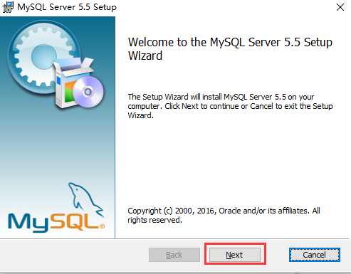
>
> 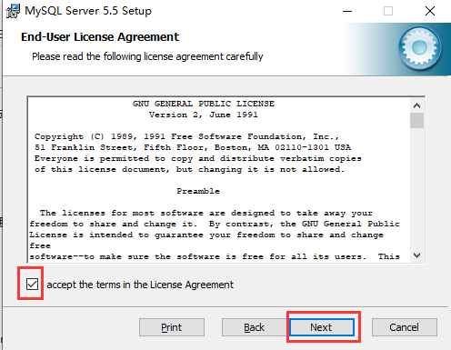
>
> 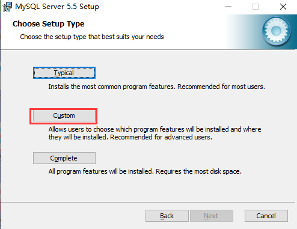
>
> 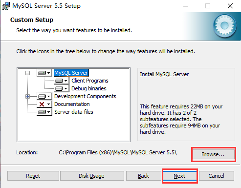
>
> 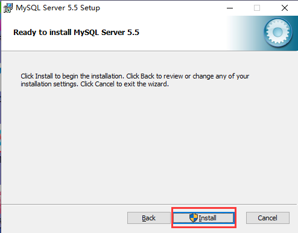
>
> 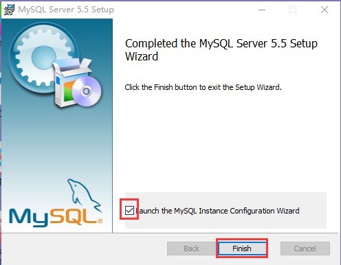
>
> 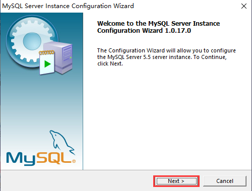
>
> 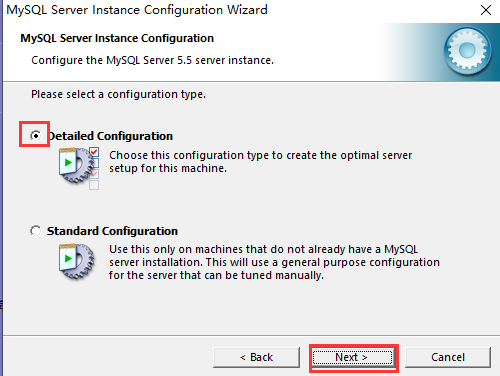
>
> 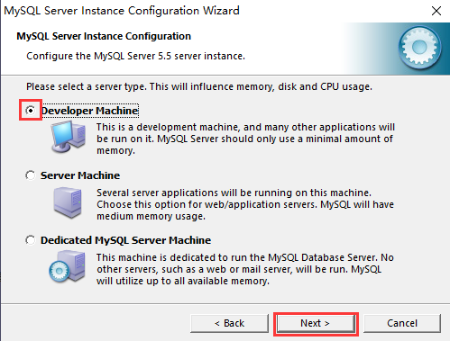
>
> 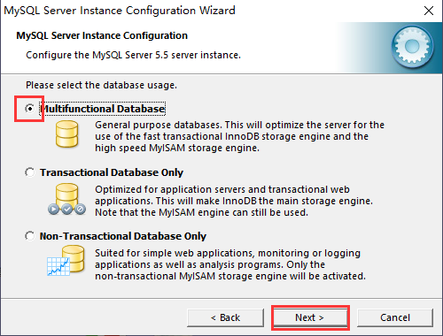
>
> 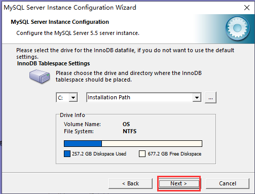;
>
> 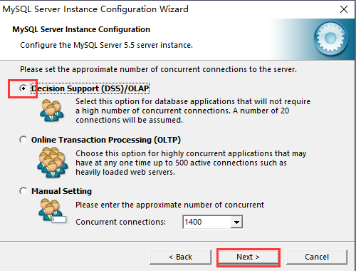
>
> 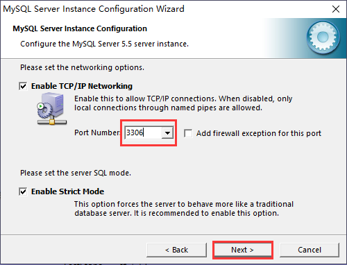
>
> 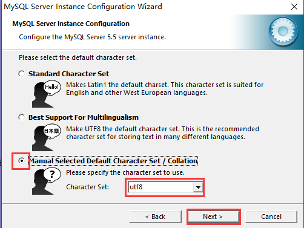
>
> 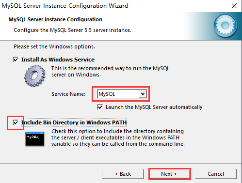
>
> 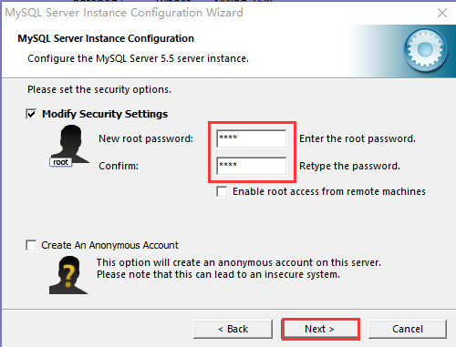
>
> 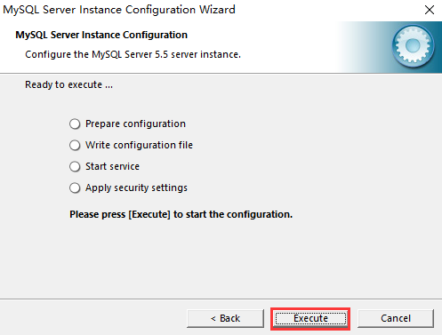
>
> 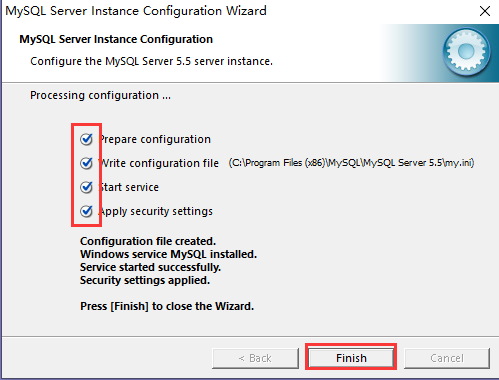
>
> 注：可以通过`C:\Program Files (x86)\MySQL\MySQL Server 5.5\bin`目录下的`MySQLInstanceConfig.exe`重新配置

> 登录mysql：
>
> 方式1：
>
> 输入：`mysql -u用户名 -p密码`
>
> 方式2：
>
> 输入：`mysql -u用户名 -p`，回车，再输入密码
>
> 方式3：
>
> 输入：`mysql -h主机名 -P端口号 -u用户名 -p密码`

> 退出sql：
>
> 方式1：点击窗口上的关闭
>
> 方式2：输入`exit`
>
> 方式3：输入`quit`
>
> 方式4：按下`ctrl+c`

### 三，sql语法

> sql语法的特点：
>
> 1. 不区分大小写
> 2. 建议关键字大写
> 3. 建议关键字独占一行
>
> sql注释
>
> 1. 单行注释：`-- 注释内容`
> 2. 单行注释：`#注释内容`
> 3. 多行注释：`/* 注释内容 */`

> SQL：Structured Query Langauge，结构化查询语言
>
> 分类：
>
> 1. DDL：数据定义语言（Data Definition Lanuage）
>
>    对数据库、表进行创建、删除、修改等
>
>    关键字：`create创建、drop删除、alter修改`
>
> 2. DML：数据操作语言（Data Manipulation Language）
>
>    对表中记录进行增、删
>
>    对记录中的字段进行改
>
>    关键字：`insert插入、delete删除、update修改`
>
> 3. DQL：数据查询语言（Data Query Language）
>
>    关键字：`select、where、on、order by、inner join、left outer join、right outer join、limit、group by、having、distinct、desc、asc、in、between and、like`
>
> 4. DCL：数据控制语言（Data Control Language）
>
>    管理数据库的安全级别和访问权限

#### 3.1 库的操作

> ```mysql
> -- 查看有哪些数据库
> show databases;
> -- 创建数据库
> create database 库名;
> -- 先判断数据库是否存在，不存在才创建
> create database if not exists 库名;
> -- 查看数据库的编码格式
> show create database 库名;
> -- 修改编码格式
> alter database 库名 character set 编码格式;
> -- 创建数据库的同时指定编码格式
> create database 库名 character set 编码格式;
> -- 先判断数据库是否存在，不存在才创建，创建的同时指定编码格式
> create database if not exists 库名 character set 编码格式;
> -- 删除数据库
> drop database 库名;
> -- 先判断数据库是否存在，存在才删除
> drop database if exists 库名;
> -- 指定使用的数据库
> use 库名;
> ```
>

#### 3.2 表的操作

> ```mysql
> -- 查看所有表
> show tables;
> -- 删除表
> drop table 表名;
> -- 先判断表是否存在，存在才删除
> drop table if exists 表名;
> -- 创建表
> create table 表名(字段名 字段类型,字段名 字段类型,...);
> -- 先判断表是否存在，不存在才创建
> create table if not exists 表名(字段名 字段类型,字段名 字段类型,...);
> -- 查看表结构
> desc 表名;
> -- 根据指定旧表的结构创建一个结构相同的新表 (复制表结构)
> create table 新表名 like 旧表名;
> -- 修改表名
> alter table 旧表名 rename to 新表名;
> ```

> 1. 查看所有表
>
>    ```sql
>    show tables;
>    ```
>
> 2. 创建表
>
>    ```sql
>    create table 表名(字段名 字段类型, 字段名 字段类型, ...);
>    ```
>
> 3. 判断表是否存在，不存在才创建
>
>    ```sql
>    create table if not exists 表名(字段名 字段类型, 字段名 字段类型, ...);
>    ```
>
> 4. 删除表
>
>    ```sql
>    drop table 表名;
>    ```
>
> 5. 判断表是否存在，存在才删除
>
>    ```sql
>    drop table if exists 表名;
>    ```
>
> 6. 查看表结构
>
>    ```sql
>    desc 表名;
>    ```
>
>    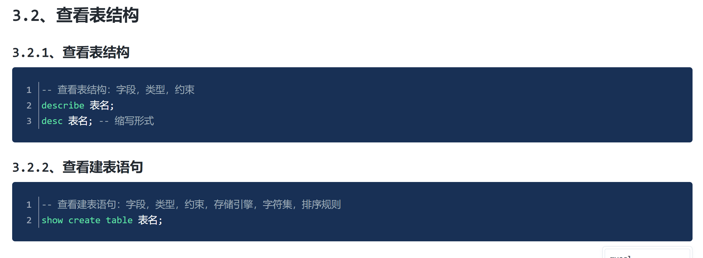
>
> 7. 根据旧表的结构创建出结构相同的新表
>
>    ```sql
>    create table 新表名 like 旧表名;
>    ```
>
> 8. 判断表是否存在，不存在再根据旧表的结构创建出结构相同的新表
>
>    ```sql
>    create table if not exists 新表名 like 旧表名;
>    ```
>
> 9. 修改表名
>
>    ```sql
>    alter table 旧表名 rename to 新表名;
>    ```

> 10. 修改表中字段
>
>     ```sql
>     #1.添加新字段
>     alter table 表名 add 新字段名 字段类型;
>     #2.删除字段
>     alter table 表名 drop 字段名;
>     #3.修改字段名 （同时修改字段类型）
>     alter table 表名 change 旧字段名 新字段名 字段类型;
>     #4.修改字段类型
>     alter table 表名 modify 字段名 字段类型;
>     ```
>     
>     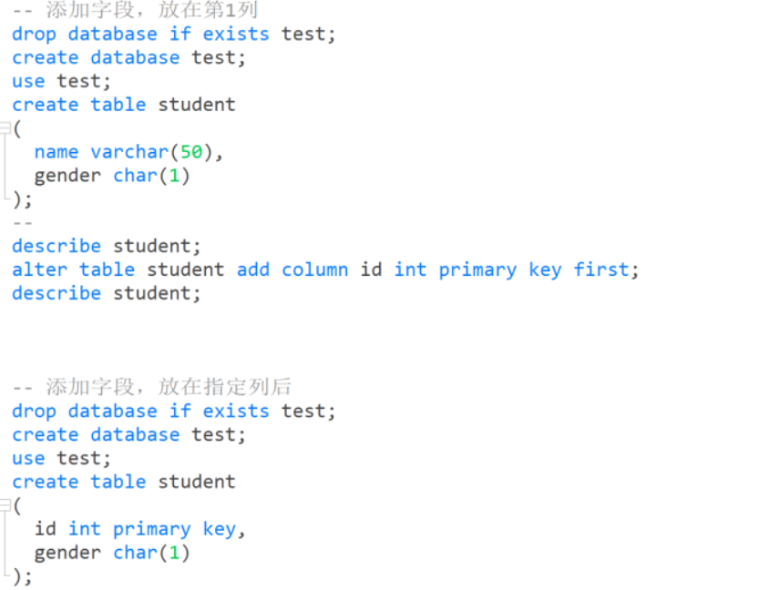

#### 3.3 记录和字段的操作

##### 3.3.1 添加记录

> ```mysql
> #1.向所有字段添加数据
> insert into 表名 values (值1,值2,值3,...);
> #2.向指定字段添加数据
> insert into 表名 (字段名1,字段名2,...) values (值1,值2,...);
> #3.向所有字段添加数据（批量添加记录）
> insert into 表名 values (值1,值2,值3,...),(值1,值2,值3,...),(值1,值2,值3,...),...;
> #4.向指定字段添加数据（批量添加记录）
> insert into 表名 (字段名1,字段名2,...) values (值1,值2,...),(值1,值2,...),(值1,值2,...),...;
> ```

##### 3.3.2 删除记录

> ```mysql
> #1.删除所有记录
> delete from 表名;
> #2.根据条件删除记录
> delete from 表名 where 条件;
> #3.删除所有记录
> truncate table 表名;
> ```
>
> 注：`delete from 表名;`本质上是对表中的记录逐行进行删除；`truncate table 表名;`将整个表删除，然后构建一个结构相同的新表

##### 3.3.3 修改记录

> ```mysql
> #1.修改所有记录的指定字段
> update 表名 set 字段名1=值 , 字段名2=值 ,...; 
> #2.修改指定记录的指定字段
> update 表名 set 字段名1=值 , 字段名2=值 ,... where 条件;
> ```
>
> 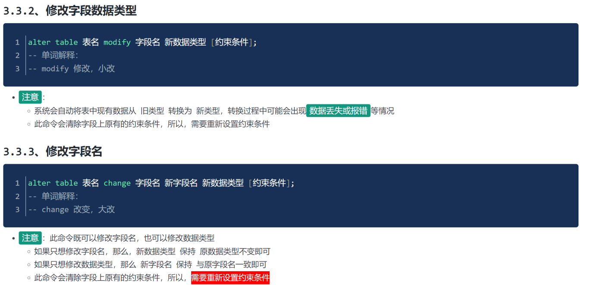

##### 3.3.4 增删改的注意事项

> 1. 添加记录时，值的数量、类型、顺序必须与字段的数量、类型、顺序一致
> 2. 除了数值类型，其他类型的值必须用单(双)引号括起来

##### 3.3.5 引擎的查看和修改

> ```mysql
> -- 查看所有引擎
> show engines;
> -- 修改tb_modify_test的存储引擎
> alter table tb_modify_test engine MyISAM;
> -- 查看表结构
> show create table tb_modify_test;
> -- 如下建表语句为表的结构信息
> CREATE TABLE `tb_modify_test` (
>   `id` int NOT NULL AUTO_INCREMENT,
>   `name` varchar(25) DEFAULT NULL,
>   `deptId` int DEFAULT NULL,
>   `salary` float DEFAULT NULL,
>   PRIMARY KEY (`id`)
> ) ENGINE=MyISAM DEFAULT CHARSET=utf8mb4 COLLATE=utf8mb4_0900_ai_ci;
> ```
>
> 

#### 3.4 查询

##### 3.4.1 基础查询

> ```mysql
> #1.查询所有记录的所有字段
> select * from 表名;
> #2.查询所有记录的指定字段
> select 字段名1,字段名2,... from 表名;
> #3.去重查询
> select distinct 字段名 from 表名;
> #4.起别名
> /*
> 为查询结果起别名，使用此别名时，就相当于在使用之前的查询结果
> 可以为字段、表起别名
> 使用as起别名，用法：as 别名
> 注：as可以省略
> */
> ```

##### 3.4.2 条件查询

> 在表名后加上`where`关键字，在`where`后跟上条件
>
> 条件查询会根据条件进行筛选，不满足条件的不会被查询到

> 1. 关系运算符
>
>    ```sql
>    >、<、>=、<=、=、!=、<>不等于
>    <=>：安全等于
>    ```
>
>    注：
>
>    1. `null值`的判断要使用`is null`或者`is not null`
>    2. `<=>`：既可以判断`null值`，也可以判断具体的数据值
>
> 2. 逻辑运算符
>
>    ```sql
>    &&：并且，等价于 and
>    ||：或者，等价于 or
>    ```

> 3. 在指定范围内
>
>    ```sql
>    between... and...
>    ```
>
>    注：包含头，包含尾
>
> 4. 在指定列表中
>
>    ```sql
>    in(值1, 值2, 值3,...);
>    not in(值1, 值2, 值3,...);
>    ```
>    
>    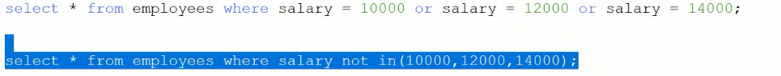

> 5. 模糊查询
>
>    关键字：`like`
>
>    占位符：
>
>    1. `_`：匹配单个任意字符
>    2. `%`：匹配任意个任意字符
>
>    注：如果模糊查询的内容是`_`或者`%`，那么需要对它们进行转义，转义字符`\`

##### 3.4.3 排序查询

> 关键字：`order by`
>
> 使用：`order by 排序字段`
>
> 排序方式：
>
> 1. 升序：`order by 字段名 asc`，升序排列时，`asc`可以省略
> 2. 降序：`order by 字段名 desc`

> 多个字段的排序
>
> ```sql
> order by 字段1 排序方式, 字段2 排序方式, ... ;
> ```
>
> 注：只有在前面的字段值相同时，才会执行后面字段的排序
>
> 例如：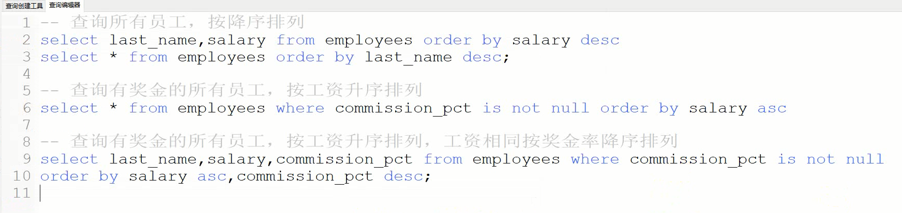

##### 3.4.4 聚合函数

> 将一列作为一个整体，进行纵向的计算
>
> 常用的聚合函数：
>
> 1. max()
> 2. min()
> 3. sum()
> 4. avg()
> 5. count()
>
> 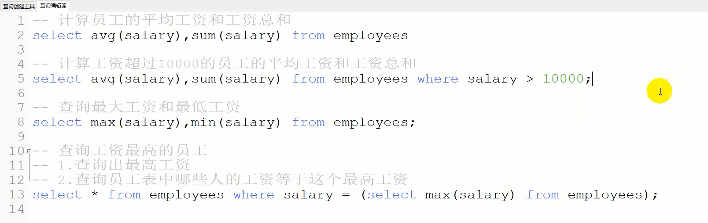
>
> 注：
>
> 1. 聚合函数不计算`null`值
> 2. `count()`的参数一般使用`*`或者`主键`
> 3. 聚合函数不能作为where后的条件

##### 3.4.5 分组查询

> 关键字：`group by`
>
> 注：
>
> 1. 分组查询的字段==只能==是：`分组字段`、`聚合函数`
> 2. 分组后再进行条件的筛选需要使用关键字`having`
>
> `where`和`having`的区别：
>
> 1. `where`只能用在分组前进行条件的筛选，不满足`where`条件的不进入分组；`having`只能用在分组后进行条件的筛选，不满足`having`条件的不会被查询到
> 2. `where`后的条件不能使用聚合函数；`having`后的条件可以使用聚合函数

##### 3.4.6 分页查询

> 关键字：`limit`
>
> 分页语句：
>
> ```sql
> limit 开始索引, 每页查询的记录数
> 注：索引从0开始
> ```
>
> 公式：`开始索引 =（页码 - 1） * 记录数` 

##### 3.4.7 查询语句的结构

> ```sql
> select 
> 	字段列表
> from 
> 	表名
> where
> 	条件列表
> group by
> 	分组字段
> having
> 	分组后的条件
> order by
> 	排序字段 排序方式
> limit
> 	开始索引，记录数
> ```

#### 3.5 约束

> 对表中字段的限定
>
> 分类：
>
> 1. 非空约束：`not null`
> 2. 唯一约束：`unique`
> 3. 主键约束：`primary key`
> 4. 外键约束：`foreign key`

##### 3.5.1 非空约束 not null

> 限定了字段值不能为空
>
> ```sql
> #1.建表时，添加非空约束
> create table 表名(字段名 字段类型 not null, 字段名 字段类型 not null, 字段名 字段类型 , ...);
> #2.建表后，添加非空约束
> alter table 表名 modify 字段名 字段类型 not null;
> 注：已存在空值的字段不能设置非空约束
> #3.删除非空约束
> alter table 表名 modify 字段名 字段类型;
> ```

##### 3.5.2 唯一约束 unique

> 限定了字段值不能重复
>
> ```sql
> #1.建表时，添加唯一约束
> create table 表名(字段名 字段类型 unique, 字段名 字段类型 , 字段名 字段类型 , ...);
> #2.建表后，添加唯一约束
> alter table 表名 modify 字段名 字段类型 unique;
> 注：已存在重复值的字段不能设置唯一约束
> #3.删除唯一约束
> alter table 表名 drop index 字段名;
> ```
>
> 注：
>
> 1. 一个字段可以同时被修饰成非空唯一的，并且非空和唯一的关键字的先后顺序任意，如果一个关键字非空且唯一了，那么它其实就是主键字段
> 2. 唯一约束的字段值可以是`null`，并且允许`null`值重复

##### 3.5.3 主键约束 primary key

> 特点：
>
> 1. 非空且唯一
> 2. 一张表中只能有一个主键字段
>
> 注：如果一个字段既是非空的又是唯一的，那么它就是一个主键字段，如果一张表的多个字段都是非空且唯一的，那么只有第一个字段是主键字段
>
> ```sql
> #1.建表时，添加主键约束
> create table 表名 (字段名 字段类型 primary key , 字段名 字段类型 , 字段名 字段类型 , ...);
> create table 表名 (字段名 字段类型 , 字段名 字段类型 , 字段名 字段类型 , ... , primary key(字段名));
> #2.删除主键约束
> alter table 表名 drop primary key;
> 注：删除主键约束后，仍有非空约束
> #3.建表后，添加主键约束
> alter table 表名 modify 字段名 字段类型 primary key;
> ```

> 主键自增长：`auto_increment`
>
> 注：
>
> 1. 只有主键字段可以自增长
> 2. 自增长的字段类型必须是数值类型的
> 3. 主键设置了自增长后，添加字段值的时候，如果值为`null`，那么会自增长
> 4. 第一条自增长的字段值是 1，自增长每次自增 1
> 5. 添加的值是`null`时，自增长的值是从存在过的最大值开始自增 1
>
> ```mysql
> #1.建表时，添加主键自增长
> create table 表名 (字段名 字段类型 primary key auto_increment, 字段名 字段类型 , 字段名 字段类型 , ...);
> #2.建表后，添加自增长 
> alter table 表名 modify 主键字段 字段类型 auto_increment;
> #3.建表后，添加主键约束的同时添加自增长
> alter table 表名 modify 字段 字段类型 primary key auto_increment;
> #4.建表后，添加新字段，设置主键约束的同时添加自增长
> alter table 表名 add 字段名 字段类型 primary key auto_increment;
> #5.删除自增长
> alter table 表名 modify 主键字段 字段类型;
> ```

##### 3.5.4 外键约束 foreign key

> 作用：保证数据的完整性

> `一对一`和`一对多`的外键：在从表中添加外键，指向主表的主键
>
> `一对一`中：主表和从表是任意的
>
> `一对多`中：`一`的一方是主表，`多`的一方是从表
>
> 注：从表外键的字段类型必须与主表主键的字段类型一致
>
> ```sql
> #1.建表时，添加外键约束
> create table 表名(字段名 字段类型, 字段名 字段类型, ... , [constraint 外键名] foreign key(外键字段) references 主表名(主表的主键字段));
> #2.删除外键约束
> alter table 从表名 drop foreign key 外键名;
> #3.建表后，添加外键约束
> alter table 从表名 add [constraint 外键名] foreign key(外键字段) references 主表名(主表的主键字段);
> #4.建表后，添加新字段的同时添加外键约束
> alter table 从表名 add 新字段名 字段类型 , add [constraint 外键名] foreign key(外键字段) references 主表名(主表的主键字段);
> ```

> 注：`如果从表中还有相关的主表中的记录，那么主表中的记录是不能删除或者更新的`
>
> 此时如果想要对主表的记录进行删除或者更新，有以下方法：
>
> 1. 删除所有从表中的相关记录
>
> 2. 删除外键约束
>
>    ```sql
>    alter table 从表名 drop foreign key 外键名;
>    ```
>
>    注：如果添加外键约束时没有定义外键名，那么系统会自动的定义一个外键名`从表名_ibfk_序号`
>
> 3. 添加级联操作
>
>    级联指的是：对主表中的记录进行删除或者修改的同时，会影响到从表中的相关记录
>
>    级联删除：`on delete cascade`
>
>    级联更新：`on update cascade`
>
>    ```sql
>    #1.建表时，添加级联操作
>    create table 表名(字段名 字段类型, 字段名 字段类型, ... , [constraint 外键名] foreign key(外键字段) references 主表名(主表的主键字段) on update cascade on delete cascade);
>    #2.建表后，添加级联操作
>    alter table 表名 add [constraint 外键名] foreign key(外键字段) references 主表名(主表的主键字段) on update cascade on delete cascade;
>    #3.建表后，添加外键约束并添加级联操作
>    alter table 表名 add [constraint 外键名] foreign key(外键字段) references 主表名(主表的主键字段) on update cascade on delete cascade;
>    #4.建表后，添加新字段并添加外键约束同时添加级联操作
>    alter table 表名 add 新字段名 字段类型 , add [constraint 外键名] foreign key(外键字段) references 主表名(主表的主键字段) on update cascade on delete cascade;
>    ```

> 多对多的外键
>
> ```sql
> create table 表名 (
>  字段1 字段类型, 
>  字段2 字段类型,
>  primary key(字段1,字段2), -- 联合（复合）主键
>  foreign key(外键字段1) references 主表1(主表1的主键字段),
>  foreign key(外键字段2) references 主表2(主表2的主键字段), 
> )
> 
> -- 例如
> create table tb_studnet_course(
> 		s_id int,
> 		c_id int,
> 		primary key (s_id , c_id),
> 		FOREIGN KEY(s_id) REFERENCES student(s_id),
> 		FOREIGN KEY(c_id) REFERENCES course(c_id)
> );
> ```
>
> 

#### 3.6 多表

##### 3.6.1 表与表之间的关系以及外键的建立

> 一对一：一张表中的一条记录对应另一张表中的一条记录
>
> 例如：人和身份证、汽车和车牌
>
> 在任意一方建立外键指向另一方的主键

> 一对多（多对一）：一张表中的一条记录对应另一张表中的多条记录
>
> 例如：部门和员工、分类和商品
>
> 在多的一方建立外键指向一的一方的主键

> 多对多：两张表中的一条记录都对应另一张表中的多条记录
>
> 例如：课程和学生、订单和商品
>
> 需要创建一张中间表（从表），这个中间表中至少包含两个字段，这两个字段作为中间表的外键，分别指向两张主表的主键。

#### 3.7 多表查询

##### 3.7.1 交叉查询

> 语法：
>
> ```sql
> select 字段列表 from 表1, 表2, 表3, ...;select 字段列表 from 表1, 表2,...;
> select * from category c,product p;
> ```
>
> 交叉查询的结果是多张表所有记录的笛卡尔积，是所有记录的组成情况
>
> 查询的结果中包含无效的记录，需要通过条件去过滤掉这些无效数据

##### 3.7.2 内连接(sql92语法，隐式内连接)

> 等值连接
>
> 连接条件是：主表的主键与从表的外键相同
>
> ```sql
> select 字段列表 from 表1, 表2,... where 连接条件;
> ```
>
> ```sql
> -- 查询所有商品以及分类
> select * from category c,product p
> where c.id = p.category_id;
> -- 查询所有价格超过10块的商品以及它的分类
> select * from category c,product p
> where c.id = p.category_id and p.price > 10;
> -- 查询每种分类的平均价格
> select avg(price),c.name from category c,product p
> where c.id = p.category_id group by c.name;
> -- 查询平均价格超过低于20块的分类
> select avg(price),c.name from category c,product p
> where c.id = p.category_id group by c.name having avg(price) < 20;
> -- 查询平均价格超过低于20块的分类，并按平均价格降序排列
> select avg(price),c.name from category c,product p
> where c.id = p.category_id group by c.name having avg(price) < 20
> order by  avg(price) desc;
> ```

> 非等值连接
>
> ```sql
> -- 查询每个员工的工资级别
> select e.name,j.level from job j,employee2 e
> where e.salary between j.min_salary and j.max_salary;
> ```

> 自连接
>
> ```sql
> -- 查询员工名以及他的上级的名字
> select e2.last_name 员工名,e1.last_name 上级名 
> from employees e1,employees e2
> where e1.employee_id = e2.manager_id;
> ```

##### 3.7.3 内连接(sql99语法，显式内连接)

> 等值连接
>
> 连接条件是：主表的主键与从表的外键相同
>
> ```sql
> select 字段列表 from 表1, 表2,... where 连接条件; -- 92语法
> select 字段列表 from 表1 inner join 表2 on 连接条件; -- 99语法
> ```
>
> ```sql
> -- 查询所有商品以及分类
> select * from category c inner join product p
> on c.id = p.category_id;
> -- 查询所有价格超过10块的商品以及它的分类
> select * from category c inner join product p
> on c.id = p.category_id
> where p.price > 10
> -- 查询每种分类的平均价格
> select c.name,avg(p.price) from category c inner join product p
> on c.id = p.category_id group by c.name; 
> -- 查询平均价格超过低于20块的分类
> select c.name,avg(p.price) a from category c inner join product p
> on c.id = p.category_id group by c.name having a < 20;
> -- 查询平均价格超过低于20块的分类，并按平均价格降序排列
> select c.name,avg(p.price) 平均价格 from category c inner join product p
> on c.id = p.category_id group by c.name having 平均价格 < 20 order by 平均价格 desc
> ```

> 非等值连接
>
> ```sql
> -- 查询每个员工的工资级别
> select e.name,j.level from employee2 e inner join job j
> on e.salary between j.min_salary and j.max_salary;
> ```

> 自连接
>
> ```sql
> -- 查询员工名以及他的上级的名字
> select e1.last_name 员工, e2.last_name 上级 from employees e1 inner join employees e2
> on e1.manager_id = e2.employee_id;
> ```

> 注：`inner`可以省略

##### 3.7.4 外连接

> ```sql
> -- 左外连接
> select 字段列表 from 表1 left outer join 表2 on 连接条件;
> -- 右外连接
> select 字段列表 from 表2 right outer join 表2 on 连接条件;
> ```
>
> 注：
>
> 1. 内连接查询的是多张表的交集
> 2. 左外连接查询的是左表的全部和两表的交集
> 3. 右外连接查询的是右表的全部和两表的交集
>
> ```sql
> -- 查询所有分类的商品个数
> select c.name,count(p.id) from category c left outer join product p
> on c.id = p.category_id group by c.name;
> -- 查询每个学生选课的数量
> select t2.sname,count(t1.sid) from tb_student_course t1 right outer join student t2
> on t1.sid = t2.sid group by t2.sname;
> ```
>
> 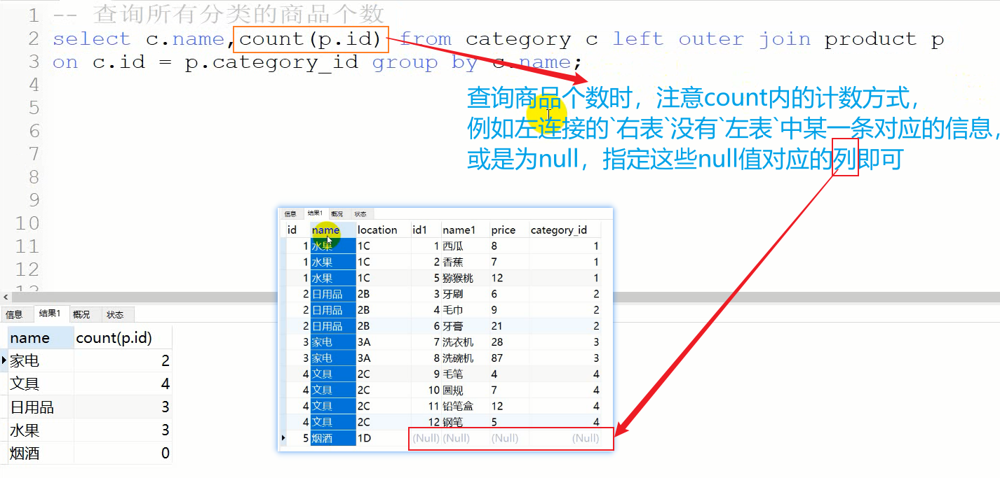

> 注：`outer`可以省略

#### 3.8 子查询

> 一条查询语句的结果在另一条查询语句中，子查询也称为内查询
>
> 外部的查询语句称为主查询或者外查询

##### 3.8.1 子查询出现在where/having后

> 注：
>
> 1. 如果子查询 查询的结果是单行单列要配合单行运算符：`>、<、>=、<=、=、!=、<>(不等于)`
> 2. 如果子查询 查询的结果是多行单列要配合多行运算符：`in`
> 3. 子查询的执行都是优先于主查询的
> 4. 子查询必须在小括号内
>
> ```sql
> -- 查询年纪比周瑜大的人
> -- 1.查询周瑜的年纪
> select sage from student where sname = "周瑜"
> -- 2.查询年纪比指定年纪大的
> select * from student 
> where sage > (select sage from student where sname = "周瑜");
> 
> -- 查询部门编号在60~100的员工名及其部门名
> select e.last_name,e.department_id,d.department_name from employees e inner join departments d 
> on e.department_id = d.department_id
> where e.department_id between 60 and 90;
> 
> -- 查询位置编号是1700或者2500的部门中的所有员工
> -- 1.查询位置编号是1700或者2500的部门
> select department_id from departments where location_id = 1700 or location_id = 2500
> -- 2.查询哪些员工在查到的这些部门中
> select last_name from employees where department_id in (
> select department_id from departments where location_id = 1700 or location_id = 2500)
> 
> -- 查询1班和2班学生选择的课程
> select * from course where cid in (
> select distinct cid from tb_student_course where sid in (
> select sid from student where sclass = 1 or sclass = 2))
> ```

##### 3.8.2 子查询出现在from后

> ```sql
> -- 1.查询商品价格最高的商品所属分类
> select t.name,t.price,c.name from category c inner join 
> (select * from product where price = (
> 	select max(price) from product
> )) t 
> on c.id = t.category_id;
> ```

### 四 InnoDB的MyISAM区别

#### 一、数据存放结构不同

> InnoDB和MyISAM是Mysql的两种存储引擎，所谓存储引擎，就是数据文件的组织方式，其最大的不同，就是数据存储的结构和方式不一样。InnoDB采用聚簇索引来存储数据，MyISAM采用非聚簇索引。
> 也就是说，InnoDB的索引和数据是关联在一起的，在B+树的根节点，而MyISAM的key-value存的是key和地址指针，其真正的文件存在于其他位置。

#### 二、InnoDB支持事务，MyISAM不支持

#### 三、InnoDB支持表级锁和行级锁，而MyISAM仅支持表级锁

> `表级锁`：开销小，加锁快；不会出现死锁；锁定粒度大，发生锁冲突的概率最高，并发度最低。
> `行级锁`：开销大，加锁慢；会出现死锁；锁定粒度最小，发生锁冲突的概率最低，并发度也最高。
> MyISAM和MEMORY存储引擎采用的是表级锁（table-level locking）；InnoDB存储引擎既支持行级锁（row-level locking），也支持表级锁，但默认情况下是采用行级锁。

##### (一)MyISAM的锁机制

> 1.读锁（共享锁）
> 对MyISAM表的读操作，不会阻塞其他用户对同一表的读请求，但会阻塞对同一表的写请求

> 2.写锁（独占锁）
> 对 MyISAM表的写操作，则会阻塞其他用户对同一表的读和写操作

##### (二)InnoDB锁机制

> InnoDB存储引擎既支持行级锁（row-level locking），也支持表级锁，但`默认情况下是采用行级锁。`
> InnoDB行锁是通过索引实现的，InnoDB这种行锁实现特点意味着：只有通过索引条件检索数据，InnoDB才使用行级锁，否则，InnoDB将使用表锁！
>
> mysql InnoDB引擎默认的修改数据语句：
> update,delete,insert都会自动给涉及到的数据加上排他锁，
> select语句默认不会加任何锁类型。

###### 共享锁与排他锁

> 数据库的增删改操作默认都会加排他锁，而查询不会加任何锁。
>
> `共享锁`：对某一资源加共享锁，自身可以读该资源，其他人也可以读该资源（也可以再继续加共享锁，即 共享锁可多个共存），但无法修改。要想修改就必须等所有共享锁都释放完之后。
>
> `排他锁`：对某一资源加排他锁，自身可以进行增删改查，其他人无法进行任何操作。
>
> //共享锁
> select * from 表名 lock in share mode
>
> //排他锁
> select * from 表名 for update
> 五、排他锁的实际应用
> 这里我们以两个操作数据库的请求为例，假设这两个请求分别为T1和T2
> 假设T1为查询请求，而T2为更新数据请求，在T1查询很长时间的时候，还没有返回结果，但是这时候T2过来请求更新了
> 这个流程应该是: T1运行加共享锁、T2运行、发现T1未完成等待其完成、T1完成、T2开始执行
> T2之所以要等待，是因为T2执行更新的时候需要给表加排他锁，但是数据库规定，不能在同一资源上同时共存这两种锁，所以T2必须等T1执行完，释放锁后，才可以正常操作
>
> ```mysql
> T1: select * from 表名 lock in share mode //假设还未返回结果
> 
> T2: update 表名 set name='autofelix'
> ```
>
> 六、共享锁的实际应用
> 如果T1和T2都是执行的查询，也就是都加共享锁
> 这时候就不用等待，可以立马执行
> 因为同一资源上可以同时存在多个共享锁，也被称为，共享锁与共享锁兼容
> 意味着共享锁不阻止其他人同时读取资源，但是阻止其他人修改资源
>
> 六、共享锁的实际应用
> 如果T1和T2都是执行的查询，也就是都加共享锁
> 这时候就不用等待，可以立马执行
> 因为同一资源上可以同时存在多个共享锁，也被称为，共享锁与共享锁兼容
> 意味着共享锁不阻止其他人同时读取资源，但是阻止其他人修改资源
>
> ```mysql
> T1: select * from table lock in share mode
> 
> T2: select * from table lock in share mode
> ```
>
> 
>


