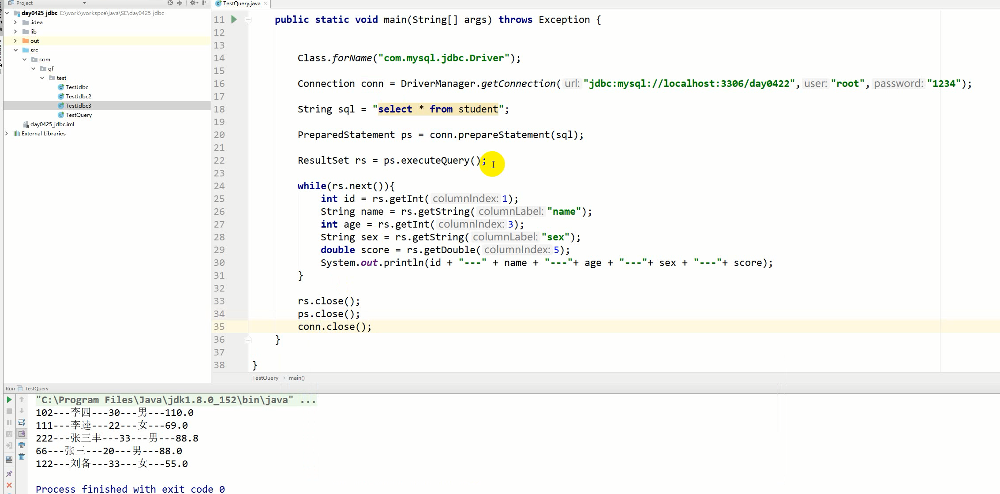

###  一，概念

> JDBC：Java Database Connectivity，Java 数据库连接
>
> JDBC的本质：它是官方提供的一套专门用于操作关系型数据库的规则（接口），各个不同的数据库厂商都要去实现这些规则（接口），并提供这些具体实现的相应jar包。

### 二，JDBC的实现步骤

> 准备工作：导入 jar 包
>
> 1. 在项目的根目录中创建lib文件夹
> 2. 将 jar 包复制到该目录下
> 3. 右键此 jar 包，点击`Add as library`，完成添加
>
> 开发步骤：
>
> 1. 注册驱动
>
>    ```java
>    Class.forName("com.mysql.jdbc.Driver");
>    ```
>
>    注：从mysql5开始，注册驱动的语句可以省略，在mysql的jar包的配置文件中已经配置了驱动类的位置
>
>    
>
> 2. 获取连接对象，连接指定的数据库
>
>    ```java
>    /*
>    参数：
>    1.url：数据库的路径
>    格式：jdbc:mysql://ip地址:端口/库名
>    注：如果访问的数据库是本地的，并且端口号是默认的3306，那么url可以写成：
>    jdbc:mysql:///库名
>    2.user：超级管理员的用户名
>    3.password：超级管理员的密码
>    */
>    Connection conn = DriverManager.getConnection("jdbc:mysql://10.11.52.80:3306/day0211","root","1234");
>    ```
>
>    配置文件
>    
>    ```properties
>    #?serverTimezone=Asia/Shanghai 东八区上海时间 jar版本超过6就需要指定地区时间
>    <dependency>
>        groupId>mysql</groupId>
>        <artifactId>mysql-connector-java</artifactId>
>        <version>8.0.22</version>
>    </dependency>
>    #url=jdbc:mysql://localhost/testdatabase?serverTimezone=Asia/Shanghai
>    url=jdbc:mysql://172.30.28.147/testdatabase?serverTimezone=Asia/Shanghai
>    user=root
>    password=root
>    ```
>    
> 3. 编写sql语句
>
> 4. 获取执行对象
>
>    ```java
>    Statement st = conn.createStatement();
>    ```
>
> 5. 执行sql语句
>
>    ```java
>    st.execute(sql)：执行增删改查，执行增删改返回false，执行查询返回true
>    st.executeUpdate(sql)：执行增删改，返回影响的记录数
>    st.executeQuery(sql)：执行查询，返回ResultSet结果集
>    ```
>
> 6. 处理返回结果
>
> 7. 关闭连接，释放资源
>
>    ```java
>    st.close();
>    conn.close();
>    ```
>    
>    代码演示
>    
>    ```java
>    public static void main(String[] args) throws Exception {
>            //注册驱动
>    //        Class.forName("com.mysql.jdbc.Driver");
>            //资源绑定器
>            ResourceBundle bundle = ResourceBundle.getBundle("jdbc");
>            //获取配置文件的信息
>            String url = bundle.getString("url");
>            String user = bundle.getString("user");
>            String password = bundle.getString("password");
>            //获取数据库连接对象
>            Connection connection = DriverManager.getConnection(url, user, password);
>            //编写sql语句
>            String sql = "insert into student values(null,?,?)";
>            //获取执行对象
>            PreparedStatement ps = connection.prepareStatement(sql);
>            ps.setString(1,"韩梅梅");
>            ps.setInt(2,1);
>            int i = ps.executeUpdate();
>            System.out.println("受影响的行数:" + i);
>            //释放资源
>            ps.close();
>            connection.close();
>        }
>    ```

> ResultSet结果集：用于封装查询后的结果
>
> 方法：
>
> 1. next()：判断是否有下一条可以遍历的记录，返回布尔值
> 2. getXxx(int columnIndex)：根据字段在查询语句中的字段列表中的顺序查询指定字段值，序号从1开始
> 3. getXxx(String columnLabel)：根据字段在查询语句中的字段列表中的字段名查询指定字段值
>
> Xxx表示字段类型
>
> 
>
> 注：ResultSet对象在使用完毕后，也需要调用close()释放资源

### 三，SQL注入问题

> 使用关键字和字符串的拼接，会造成安全隐患
>
> 例如：
>
> ```java
> String sql = "select * from users where user = '" + user + "' and pwd = '" + pwd + "'";
> 在向pwd传递字段值的时，只要传递拼接的字符串符合sql语句的语法，就能拼接成一条完整的sql语句，此时如果传递pwd中包含恒等式，就能保证查询条件永远为真。例如：传递的pwd是：333'or'abc'='abc
> ```

> 解决办法：PreparedStatement
>
> 1. 不允许通过字符串的拼接方式来传递参数。它通过占位符`?`来传递字段值
> 2. 占位符中出现的关键字，不作为关键字来使用
>
> 获取 PreparedStatement：
>
> ```java
> PreparedStatement pstmt = conn.prepareStatement(sql);
> ```
>
> 使用 PreparedStatement 执行增删改查
>
> ```java
> //用于执行返回多个结果集、多个更新计数或二者组合的语句。也可用于执行 INSERT、UPDATE 或 DELETE 语句。
> pstmt.execute()
> //单次查询
> pstmt.executeQuery();
> //单次更新
> pstmt.executeUpdate();
> ```
>
> 为占位符赋值：
>
> ```java
> pstmt.setXxx(参数1,参数2)
> 参数1：占位符的位置，从1开始
> 参数2：赋值给占位符的值
> ```

#### 注册登录功能示例

> **实体类**
>
> ```java
> package bean;
> 
> import lombok.AllArgsConstructor;
> import lombok.Data;
> import lombok.NoArgsConstructor;
> 
> @Data
> @NoArgsConstructor
> @AllArgsConstructor
> public class User {
>  private Integer id;
>  private String userName;
>  private String password;
> }
> 
> ```
>
> **工具类**
>
> ```java
> package utils;
> 
> import com.mchange.v2.c3p0.ComboPooledDataSource;
> 
> import java.sql.Connection;
> import java.sql.SQLException;
> 
> public class GetConnection {
>     static ComboPooledDataSource ds = new ComboPooledDataSource("myc3p0");
>     
>     public static Connection getConnection() throws SQLException {
> 
>         return ds.getConnection();
>     }
> }
> 
> ```
>
> **测试类**
>
> ```java
> package work;
> 
> import bean.User;
> import dao.UserDao;
> import service.UserService;
> 
> import java.util.Scanner;
> 
> public class Work1 {
> 
>     static Scanner sc = new Scanner(System.in);
> 
>     public static void main(String[] args){
>         UserDao dao = new UserDao();
>         UserService service = new UserService(dao);
>         User user = new User();
> 
>         System.out.println("1.注册 2.登录");
> 
>         switch (sc.nextLine()){
>             case "1":
>                 System.out.println("请输入用户名");
>                 user.setUserName(sc.nextLine());
>                 System.out.println("请输入密码");
>                 user.setPassword(sc.nextLine());
>                 if (service.register(user))
>                     System.out.println("注册成功");
>                 break;
>             case "2":
>                 System.out.println("请输入用户名");
>                 user.setUserName(sc.nextLine());
>                 System.out.println("请输入密码");
>                 user.setPassword(sc.nextLine());
>                 if (service.login(user))
>                     System.out.println("登陆成功");
>                 else
>                     System.out.println("用户名或密码错误");
>         }
>     }
> }
> ```
>
> **业务层**
>
> ```java
> package service;
> 
> import bean.User;
> import dao.UserDao;
> import lombok.AllArgsConstructor;
> 
> import java.sql.SQLException;
> 
> @AllArgsConstructor
> public class UserService {
>     private UserDao userDao;
> 
>     public boolean login(User user){
>         boolean b = false;
>         try {
>             b = userDao.findUser(user);
>         } catch (SQLException e) {
>             throw new RuntimeException(e);
>         }
>         return b;
>     }
> 
>     public boolean register(User user) {
>         boolean b;
>         try {
>             b = userDao.register(user);
>             if (b)
>                 return b;
>         } catch (SQLException e) {
>             throw new RuntimeException(e);
>         }
>         return false;
>     }
> }
> ```
>
> **持久层**
>
> ```java
> package dao;
> 
> import bean.User;
> import utils.GetConnection;
> 
> import java.sql.Connection;
> import java.sql.PreparedStatement;
> import java.sql.ResultSet;
> import java.sql.SQLException;
> 
> public class UserDao {
> 
>     //查找用户和密码是否正确
>     public boolean findUser(User user) throws SQLException {
>         Connection connection = GetConnection.getConnection();
>         String sql = "select * from testdatabase.user where u_name = ? && u_password = ?";
>         PreparedStatement ps = connection.prepareStatement(sql);
> 
>         ps.setString(1, user.getUserName());
>         ps.setString(2, user.getPassword());
>         ResultSet resultSet = ps.executeQuery();
>         boolean b = resultSet.next();
> 
>         resultSet.close();
>         ps.close();
>         connection.close();
>         return b;
>     }
> 
>     //注册用户
>     public boolean register(User user) throws SQLException {
>         Connection connection = GetConnection.getConnection();
>         String sql = "insert into testdatabase.user values(null,?,?)";
>         PreparedStatement ps = connection.prepareStatement(sql);
>         ps.setString(1, user.getUserName());
>         ps.setString(2, user.getPassword());
>         int row = ps.executeUpdate();
> 
>         ps.close();
>         connection.close();
>         return row == 1;
>     }
> }
> 
> ```
>
> **配置文件**
>
> ```xml
> <?xml version="1.0" encoding="UTF-8"?>
> <c3p0-config>
>     <named-config name="myc3p0">
>         <!-- 驱动包 -->
>         <property name="driverClass">com.mysql.cj.jdbc.Driver</property>
>         <!-- 数据库的地址 -->
>         <property name="jdbcUrl">jdbc:mysql:///testdatabase?serverTimezone=Asia/Shanghai</property>
>         <!-- 用户名 -->
>         <property name="user">root</property>
>         <!-- 密码 -->
>         <property name="password">root</property>
>         <!-- 初始化连接对象的数量 -->
>         <property name="initialPoolSize">3</property>
>         <!-- 最大连接对象的数量 -->
>         <property name="maxPoolSize">5</property>
>         <!-- 超时时间 -->
>         <property name="checkoutTimeout">3000</property>
>     </named-config>
> 
>     <default-config>
>         <!-- 驱动包 -->
>         <property name="driverClass">com.mysql.jdbc.Driver</property>
>         <!-- 数据库的地址 -->
>         <property name="jdbcUrl">jdbc:mysql:///testdatabase?serverTimezone=Asia/Shanghai</property>
>         <!-- 用户名 -->
>         <property name="user">root</property>
>         <!-- 密码 -->
>         <property name="password">root</property>
>         <!-- 初始化连接对象的数量 -->
>         <property name="initialPoolSize">5</property>
>         <!-- 最大连接对象的数量 -->
>         <property name="maxPoolSize">10</property>
>         <!-- 超时时间 -->
>         <property name="checkoutTimeout">3000</property>
>     </default-config>
> </c3p0-config>
> ```
>
> **pom**
>
> ```xml
> <?xml version="1.0" encoding="UTF-8"?>
> <project xmlns="http://maven.apache.org/POM/4.0.0"
>          xmlns:xsi="http://www.w3.org/2001/XMLSchema-instance"
>          xsi:schemaLocation="http://maven.apache.org/POM/4.0.0 http://maven.apache.org/xsd/maven-4.0.0.xsd">
>     <modelVersion>4.0.0</modelVersion>
> 
>     <groupId>org.example</groupId>
>     <artifactId>JDBC</artifactId>
>     <version>1.0-SNAPSHOT</version>
> 
>     <properties>
>         <maven.compiler.source>17</maven.compiler.source>
>         <maven.compiler.target>17</maven.compiler.target>
>         <project.build.sourceEncoding>UTF-8</project.build.sourceEncoding>
>     </properties>
> 
>     <dependencies>
> 
>         <dependency>
>             <groupId>mysql</groupId>
>             <artifactId>mysql-connector-java</artifactId>
>             <version>8.0.33</version>
>         </dependency>
> 
>         <dependency>
>             <groupId>org.projectlombok</groupId>
>             <artifactId>lombok</artifactId>
>             <version>1.18.30</version>
>         </dependency>
> 
>         <dependency>
>             <groupId>com.mchange</groupId>
>             <artifactId>c3p0</artifactId>
>             <version>0.9.5.5</version>
>         </dependency>
> 
>         <dependency>
>             <groupId>com.mchange</groupId>
>             <artifactId>mchange-commons-java</artifactId>
>             <version>0.2.19</version>
>         </dependency>
> 
>     </dependencies>
> </project>
> ```

### 四，ORM 

> ORM：对象关系映射，Object Relational Mapping。
>
> 它专门用于研究查询结果中记录的字段与类中属性的映射关系
>
> 将查询结果中的记录封装到对象中

### 五，数据库连接池

> 概念：数据库连接池本质是一个用于存储数据库连接对象的容器
>
> 因为在项目中可能需要多个连接对象，而连接对象的创建非常消耗资源
>
> 好处：
>
> 1. 提高了连接对象的复用性，节省资源
> 2. 提高了对数据库的访问效率
>
> 实现方式：
>
> 在`javax.sql`包中提供了数据库连接池的接口：`DataSource`，其中包含了从连接池中获取连接对象的方法`getConnection()`

#### C3P0

> 实现步骤：
>
> 1. 导入jar包：`c3p0-0.9.1.2.jar`、`mchange-commons-java-0.2.12.jar`
>
> 2. 编写配置文件
>
>    在项目的src目录下定义`c3p0-config.xml`
>
>    ```xml
>    <?xml version="1.0" encoding="UTF-8"?>
>    <c3p0-config>
>        <named-config name="myc3p0">
>            <!-- 驱动包 -->
>            <property name="driverClass">com.mysql.cj.jdbc.Driver</property>
>            <!-- 数据库的地址 -->
>            <property name="jdbcUrl">jdbc:mysql:///testdatabase?serverTimezone=Asia/Shanghai</property>
>            <!-- 用户名 -->
>            <property name="user">root</property>
>            <!-- 密码 -->
>            <property name="password">root</property>
>            <!-- 初始化连接对象的数量 -->
>            <property name="initialPoolSize">5</property>
>            <!-- 最大连接对象的数量 -->
>            <property name="maxPoolSize">10</property>
>            <!-- 超时时间 -->
>            <property name="checkoutTimeout">3000</property>
>        </named-config>
>    
>        <default-config>
>            <!-- 驱动包 -->
>            <property name="driverClass">com.mysql.jdbc.Driver</property>
>            <!-- 数据库的地址 -->
>            <property name="jdbcUrl">jdbc:mysql:///testdatabase?serverTimezone=Asia/Shanghai</property>
>            <!-- 用户名 -->
>            <property name="user">root</property>
>            <!-- 密码 -->
>            <property name="password">root</property>
>            <!-- 初始化连接对象的数量 -->
>            <property name="initialPoolSize">3</property>
>            <!-- 最大连接对象的数量 -->
>            <property name="maxPoolSize">5</property>
>            <!-- 超时时间 -->
>            <property name="checkoutTimeout">3000</property>
>        </default-config>
>    </c3p0-config>
>    ```
>
>    
>
> 3. 创建c3p0的核心类的对象：`ComboPooledDataSource`
>
>    ```java
>    // 获取数据库连接池
>    // 方式一
>    DataSource ds1 = new ComboPooledDataSource();
>    // 方式二
>    DataSource ds2 = new ComboPooledDataSource("");
>    ```
>
>    注：
>
>    1. 第一种（方式一）获取连接池对象的方法，获取到的是根据`default-config`所配置的连接池
>    2. 第二种（方式二）获取连接对象的方法，获取到的是根据`named-config`所配置的连接池，如果实参的连接名在配置文件中找不到，则会根据`default-config`的配置来获取连接池
>
> 4. 获取连接对象
>
>    ```java
>    Connection conn = ds.getConnection();
>    ```
>
> 5. 归还连接对象
>
>    ```java
>    conn.close();
>    ```
>    
>    

#### Druid

> 实现步骤：
>
> 1. 导入jar包：`druid-1.0.9.jar`
>
> 2. 编写配置文件
>
>    在src目录下创建`druid.properties`
>
>    ```properties
>    driverClassName=com.mysql.jdbc.Driver
>    url=jdbc:mysql:///day0211
>    username=root
>    password=1234
>    initialSize=3
>    maxActive=5
>    maxWait=3000
>    ```
>
> 3. 使用数据库连接池工厂创建连接池
>
>    ```java
>    Properties prop = new Properties();
>    prop.load(new FileReader("src\\druid.properties"));
>    DataSource ds1 = DruidDataSourceFactory.createDataSource(Properties prop);
>    
>    Map map = new HashMap();
>    map.put("driverClassName","com.mysql.jdbc.Driver");
>    map.put("url","jdbc:mysql://localhost/day0211");
>    map.put("username","root");
>    map.put("password","1234");
>    map.put("initalSize","3");
>    map.put("maxActive","5");
>    map.put("maxWait","3000");
>    DataSource ds2 = DruidDataSourceFactory.createDataSource(Map map);
>    ```
>
> 4. ```java
>            //创建字节流
>            FileInputStream fis = new FileInputStream("src/main/resources/druid.properties");
>            Properties properties= new Properties();
>            //读入properties配置文件信息
>            properties.load(fis);
>       
>            //根据properties内置信息创建数据库连接池并获取数据库连接对象
>            DataSource ds = DruidDataSourceFactory.createDataSource(properties);
>            Connection c1 = ds.getConnection();
>            System.out.println(c1);
>            Connection c2 = ds.getConnection();
>            System.out.println(c2);
>            Connection c3 = ds.getConnection();
>            System.out.println(c3);
>            Connection c4 = ds.getConnection();
>            System.out.println(c4);
>            Connection c5 = ds.getConnection();
>            System.out.println(c5);
>    ```
>
> 5. 获取连接对象
>
>    ```java
>    Connection conn = ds.getConnection();
>    ```
>
> 6. 归还连接对象
>
>    ```java
>    conn.close();
>    ```
>
>    

### 六，DBUtils工具类

> 概念：DBUtils是一个专门用于针对数据库以及数据库连接池提供简化操作的工具
>
> 实现步骤：
>
> 1. 导入jar包：`commons-dbutils-1.4.jar	`
>
> 2. 准备数据库连接池
>
> 3. 创建DBUtils的核心类对象：`QueryRunner`
>
>    ```java
>    //方式1.不传入连接池的这个方法，在后续执行增删改查时，必须手动传入连接对象
>    QueryRunner qr = new QueryRunner();
>    //方式2.传入连接池的这个方法，在后续执行增删改查时，不需要再手动传入连接对象，因为QueryRunner会自动从连接池中获取连接对象，并且在执行完功能后，QueryRunner会自动归还连接对象到池中
>    QueryRunner qr = new QueryRunner(JdbcUtils.getDataSource());
>    ```
>
> 4. 执行查询
>
>    ```java
>    qr.query(String sql,ResultSetHandler rsh,Object...o);
>    ```
>    
>    query方法
>    
>    ```java
>    public <T> T query(String sql, ResultSetHandler<T> rsh, Object... params) throws SQLException {
>            Connection conn = this.prepareConnection();
>    
>            return this.<T>query(conn, true, sql, rsh, params);
>    }
>    ```
>    
>    用来完成表数据的查询操作
>    
>    - ResultSetHandler 结果集的处理方式，传递ResultSetHandler接口实现类；
>    - 注意：query返回值是泛型，返回的是泛型，具体返回值随结果集处理方式变化；
>    
>    
>    
>    或者起别名
>    
>    ```java
>    private static void resultHandler(QueryRunner qr) throws SQLException {
>            String sql = "select s_id id ,s_name name , s_sex sex from testdatabase.student";
>            List<Student> students = qr.query(sql, new BeanListHandler<Student>(Student.class));
>            students.forEach(System.out::println);
>    }
>    ```
>    
>    

> ResultSetHandler接口的实现类：
>
> 1. BeanListHandler：将每一条查询结果中的每一个字段值封装到一个对象的属性中，再将这些对象封装进List集合中
>
>    - 
>
> 2. BeanHandler：将查询结果中的每一个字段值封装到一个对象的属性中
>
>    - 这两个方法通过javaBean的`无参构造函数`创建对象
>
>    - ```java
>      public Emp queryEmp(int id, String name) throws SQLException {
>          String sql = "select eid id , ename name , sex , hire hireTime , sar salary , did deptId " +
>                  "from testdatabase.emp where eid = ? and ename = ?";
>          Emp emp = qr.query(sql, new BeanHandler<Emp>(Emp.class), id, name);
>          return emp;
>      }
>      ```
>
> 3. ArrayListHandler：将每一条查询结果中的每一个字段值封装到一个数组中，再将这些数组封装进List集合中
>
> 4. ArrayHandler：将查询结果中的每一个字段值封装到一个数组中
>
> 5. MapListHandler：将每一条查询结果中的每一个字段值作为Map中的值，将字段名作为Map中的键存储到Map中，再将这些Map存储到List集合中
>
> 6. MapHandler：将查询结果中的每一个字段值作为Map中的值，将字段名作为Map中的键存储到Map中
>
> 7. ScalarHandler：查询的结果都是单行单列的，所以它用于查询聚合函数
>
>    - ```java
>      private static void query(QueryRunner qr) throws SQLException {
>              String sql = "select count(*) from testdatabase.student";
>              Object o = qr.query(sql, new ScalarHandler<Student>());
>              System.out.println(o);
>      }
>      ```


