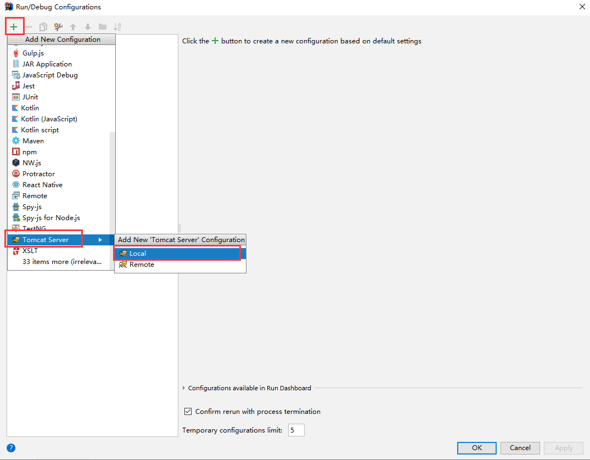
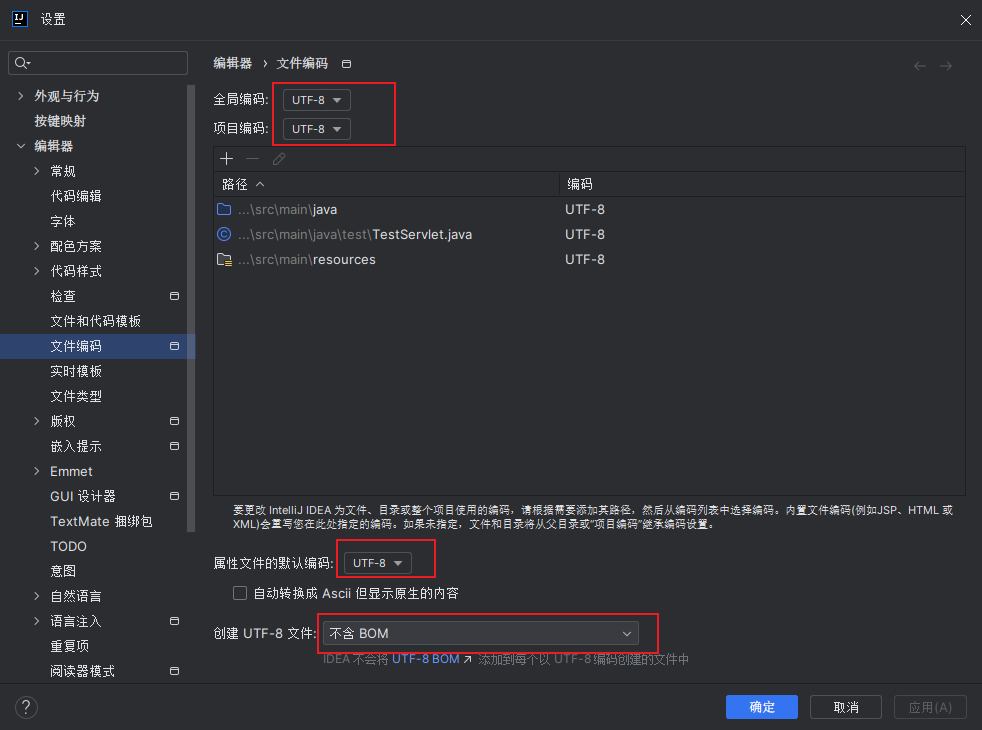

### 一，Maven

#### 1.1 Maven的概念

> 不使用Maven引入jar包（依赖）存在的问题：
>
> 1. jar包的重复引入，占用空间
> 2. jar包的版本的统一不方便
> 3. jar包的版本升级不方便
>
> 使用Maven的好处：
>
> 1. 对jar包管理进行统一
> 2. 节省了jar包占用的空间
>
> Maven中管理依赖的仓库：
>
> 1. 本地库
>    1. 本地计算机：在当前计算机中用于管理jar包的仓库
> 2. 远程库
>    1. 公共库：某些公司提供给程序员所搭建的一个管理jar包的仓库（手动配置）
>    2. 中央库：包含了所有jar包的一个仓库（默认配置）
>
> ```java
> /*
> 在项目中引入指定的依赖时，会发生
> 1. 在本地库中查看是否有该依赖
>   1.1 有该依赖，则将该依赖直接引入项目中
>   1.2 没有该依赖，就查看是否配置了公共库
>     1.2.1 配置了公共库，就在公共库中查看是否有该依赖
>       1.2.1.1 公共库中有该依赖，就将这个依赖下载到本地库中，将该依赖引入到项目中
>       1.2.1.2 公共库中没有该依赖，就去中央库中将这个依赖下载到公共库和本地库中，再将本地库的这个依赖引入到项目中
>     1.2.2 没有配置公共库，就去中央库中将这个依赖下载到本地库中，再将本地库的这个依赖引入到项目中
> */
> ```

#### 1.2 Maven的安装和配置

> 下载：https://maven.apache.org/
>
> 1. 准备工作
>    1. `apache-maven-3.5.0-bin`：Maven软件
>    2. `maven_repository`：Maven的本地库
> 2. Maven解压后即安装成功

> Maven的配置
>
> 1. 打开Maven下conf目录中的`settings.xml`文件
>
> 2. 修改 settings.xml 中的`localRepository`标签体中的内容为本地库的根目录
>
>    ```xml
>    <localRepository>C:\mine\Java\maven\maven_repository</localRepository>
>    ```
>
> 3. 配置公共库
>
>    ```xml
>    <mirrors>
>        <mirror>
>            <id>nexus-aliyun</id>
>            <mirrorOf>central</mirrorOf>
>            <name>Nexus aliyun</name>
>            <url>http://maven.aliyun.com/nexus/content/groups/public</url>
>        </mirror>
>    </mirrors>
>    ```
>
> 4. 配置 jdk
>
>    ```xml
>    <profiles>
>        <profile>
>            <id>myjdk1.9</id>
>            <activation>
>                <jdk>1.9</jdk>
>            </activation>
>        </profile>
>    
>        <profile>
>            <id>myjdk1.8</id>
>            <activation>
>                <jdk>1.8</jdk>
>            </activation>
>        </profile>
>    </profiles>
>    <activeProfiles>
>        <activeProfile>myjdk1.8</activeProfile>
>    </activeProfiles>
>    ```
>
> 5. 配置Maven的环境变量
>
>    1. 在“系统变量”中，点击“新建”，在“变量名”中输入`MAVEN_HOME`，在“变量值”中输入maven安装路径的根目录
>    2. 在path中配置`%MAVEN_HOME%\bin`
>    3. 在cmd中，输入`mvn -v`来查看maven的版本

#### 1.3 在idea中配置Maven，并引入依赖

> 
>
> 
>
> 
>
> 
>
> 
>
> 
>
> POM中引入依赖的选择：
>
> 1. Import Changes：写了要引入的依赖后需要手动刷新来引入
> 2. Enable Auto-Import：写了要引入的依赖后会自动引入
>
> 

> Maven中的项目结构：
>
> 
>
> 1. src\main\java：存放java源码
> 2. src\main\resources：存放配置文件
> 3. src\test\java：存放java测试代码
> 4. pom.xml：project object model 项目对象模型，它是maven工程的核心配置文件，它可以管理依赖，定义项目的打包方式，还可以定义项目的结构
>
> 注：将整个项目打包成jar包时，只有main目录中的内容会打成压缩包

### 二，服务器

#### 2.1 服务器的概念

> 服务器：安装了服务器软件的计算机
>
> web服务器软件
>
> 作用：接收用户从前端发出的请求，并且可以对请求作出响应
>
> 常见的web服务器软件：
>
> 1. Tomcat：apache的中小型JavaEE服务器
> 2. WebLogic：Oracle公司的大型JavaEE服务器
> 3. WebSphere：IBM公司的大型JavaEE服务器

#### 2.2 Tomcat 服务器

> 下载：https://tomcat.apache.org/
>
> 安装：解压
>
> 目录结构：
>
> 
>
> 1. bin：包含可执行文件，主要有：startup.bat、shutdown.bat
> 2. conf：包含配置文件，主要：web.xml、server.xml
> 3. lib：包含tomcat服务器运行时所依赖的jar包
> 4. logs：包含日志文件
> 5. temp：包含临时文件
> 6. webapps：包含web工程
> 7. work：包含web工程在运行时产生的临时文件，比如：jsp编译后的文件

> 启动服务器：运行bin目录下的startup.bat
>
> 注：同一个端口号的服务器不能反复开启，开启一次，端口就被占用了，再次开启会发生`BindException`
>
> 服务器启动失败的情况：
>
> 1. 报错：一是服务器重复开启，二是端口号被占用
> 2. 一闪：没有正确配置Java环境变量
>
> 关闭服务器：
>
> 1. 点x关闭窗口
> 2. ctrl+c
> 3. 运行shutdown.bat
>
> 访问服务器：
>
> 在浏览器地址栏中输入：http://localhost:8080
>
> 注：如果将server.xml中的默认端口号改成了其他的，那么访问时，端口号就要输入修改后的；如果将端口号改成了80，那么访问时，就不需要再输入端口号了

#### 2.3 在idea中搭建tomcat

> 
>
> packaging：打包方式
>
> 1. jar：JavaSE工程
> 2. war：JavaEE工程，包含了web服务器的工程
> 3. pom：聚合工程
>
> 
>
> 
>
> 
>
> 
>
> 
>
> ```xml
> <?xml version="1.0" encoding="UTF-8"?>
> <web-app id="WebApp_ID" version="3.0"
>          xmlns="http://java.sun.com/xml/ns/javaee"
>          xmlns:xsi="http://www.w3.org/2001/XMLSchema-instance"
>          xsi:schemaLocation="http://java.sun.com/xml/ns/javaee
>          http://java.sun.com/xml/ns/javaee/web-app_3_0.xsd">
> </web-app>
> ```

> 
>
> 
>
> 
>
> 
>
> 
>
> 
>
> 
>
> 

### 三，Servlet

#### 3.1 Servlet的概念

> Servlet：Server Applet，运行在服务器的程序，用于接收客户端的请求，并对客户端作出响应
>
> Servlet本质是一个接口，它定义了Java类能被服务器访问到的规则
>
> 

#### 3.2 Servlet的使用

> 准备工作：引入依赖
>
> ```xml
> <dependencies>
> 	<dependency>
>         <groupId>javax.servlet</groupId>
>          <artifactId>javax.servlet-api</artifactId>
>         <version>3.1.0</version>
>  	</dependency>
>     
>     <!-- 这个版本的也用的人多 -->
>         <dependency>
>             <groupId>javax.servlet</groupId>
>             <artifactId>javax.servlet-api</artifactId>
>             <version>4.0.0-b01</version>
>         </dependency>
> </dependencies>
> ```
>
> 使用步骤：
>
> 1. 定义类实现Servlet接口
> 2. 重写方法
> 3. 在web.xml中注册Servlet
>
> ```xml
> <servlet>
>     <servlet-name>TestServlet</servlet-name>
>     <servlet-class>com.qf.servlet.TestServlet</servlet-class>
> </servlet>
> 
> <servlet-mapping>
>     <servlet-name>TestServlet </servlet-name>
>     <url-pattern>/test</url-pattern>
> </servlet-mapping>
> ```

#### 3.3 Servlet的执行步骤、原理

> 
>
> 1. 当客户端向服务器发起请求时，tomcat会解析请求的地址
> 2. 在web.xml中查找，是否有某一个`url-pattern`标签体重的内容与请求的地址相同
>    1. 如果没有，则报404（请求的资源找不到）
>    2. 如果有，会继续查找这个`url-pattern`所在的`servlet-mapping`标签中的`servlet-name`标签体中的值是否与某一个`servlet`标签中的`servlet-name`标签体中的值相同，如果找到了就由这个`servlet`标签中的`servlet-class`标签体中的java类来处理

#### 3.4 Servlet的注解使用

> 我们可以直接通过注解的方式来对Servlet的注册进行配置
>
> ```java
> @WebServlet("/url-pattern")
> public class TestServlet implements Servlet{
>     //...
> }
> ```

#### 3.5 Servlet的生命周期

> ```java
> public interface Servlet {
>     
>     //第一次访问时执行，只执行一次
>     public void init(ServletConfig config) throws ServletException;
> 
>     public ServletConfig getServletConfig();
> 
>     //提供服务，每次访问时都会执行，该方法中提供了tomcat已经封装好了请求和响应的对象
>     public void service(ServletRequest req, ServletResponse res)
>     throws ServletException, IOException;
> 
>     public String getServletInfo();
> 
>     //在正常关闭服务器时执行
>     public void destroy();
> }
> ```

> 1. init()：第一次访问时执行，只执行一次
> 2. service()：提供服务，每次访问时都会执行，该方法中提供了tomcat已经封装好了请求和响应的对象
> 3. destroy()：在正常关闭服务器时执行

#### 3.6 Servlet的体系结构

> `HttpServlet`继承了`GenericServlet`，`GenericServlet`实现了`Servlet`接口
>
> HttpServlet的使用步骤：
>
> 1. 定义类继承HttpServlet
> 2. 重写`doGet()`和`doPost()`
>
> 注：
>
> 1. doGet()和doPost()方法分别针对get和post的提交方式来接收提交的数据
> 2. 如果指定的提交方式在Servlet中没有对应的doXxx()方法，那么报405 method not allowed

#### 3.7 欢迎页（首页）的配置

> ```xml
> <welcome-file-list>
>     <welcome-file>index.html</welcome-file>
> </welcome-file-list>
> ```
>
> 注：
>
> 1. 如果在自己的项目中，没有配置`welcome-file-list`，那么当前项目会遵循tomcat中默认欢迎页的配置
>
>    ```xml
>    <welcome-file-list>
>        <welcome-file>index.html</welcome-file>
>        <welcome-file>index.htm</welcome-file>
>        <welcome-file>index.jsp</welcome-file>
>    </welcome-file-list>
>    ```
>
> 2. 如果在自己的项目中，配置了`welcome-file-list`，那么当前项目的欢迎就根据自己的配置来显示指定的首页
>
> 3. 在`welcome-file-list`中，系统会从上到下依次查找是否存在该页面，如果存在就将该页面作为欢迎页，不存在则继续向下查找，如果一个都不存在，则报404
>
> 4. 配置成欢迎页的页面在访问时可以省略该页面地址

#### 3.8 url-pattern的配置

> 1. 完全（精准）匹配：`/xxx`
>
>    例如：配置了`/t`，那么访问时访问的地址必须是/t才能找到指定的java类
>
> 2. 目录匹配：`/xxx/*`
>
>    例如：配置了`/abc/*`，那么访问的地址只要是abc这个目录下的资源都由指定的java类来处理
>
> 3. 扩展名匹配：`*.xxx`
>
>    例如：配置了`*.jsp`，只要访问的是jsp文件都由指定java类来处理
>
> 4. 默认匹配：`/*`
>
>    例如：配置了`/*`，表示如果访问的地址在web.xml中没有配置就由指定的java类来处理
>
> 注：
>
> 1. 以上内容中的`xxx`表示任意内容
> 2. 目录匹配和扩展名匹配不能同时使用，例如：不能写成`/abc/*.jsp`
> 3. 以上配置都可以通过注解来完成
> 4. 默认匹配的优先级高于扩展名匹配

### Tomcat 及 IDEA 乱码问题解决

> 1. Tomcat配置文件
> 2. IDEA设置
>
> 首先声明IDEA ， tomcat , jdk版本，不说这些的都是耍流氓！
>
> 
>
> 

> 到tomcat安装目录，进入conf文件夹
>
> 
>
> 打开配置文件
>
> 
>
> 按照如下方式修改
>
> 1. logging.properties
>
>    1. ```properties
>       java.util.logging.ConsoleHandler.encoding = gbk
>       ```
>
>       
>
>    2. 
>
> 2. server.xml
>
>    1. ```XML
>       URIEncoding="UTF-8"
>       ```
>
>    2. 
>
> 配置部分结束

> 进入IDEA，由于英语不好，我的下载了汉化
>
> 现在开始设置
>
> 1. 先进入设置页面
> 2. 
> 3. 


> 启动服务器测试结果如下，前提是tomcat的配置正确
>
> 
>
> 提交表单
>
> 
>
> 所有信息均无误
>
> 测试代码
>
> ```java
> package test;
> 
> import javax.servlet.ServletException;
> import javax.servlet.http.HttpServlet;
> import javax.servlet.http.HttpServletRequest;
> import javax.servlet.http.HttpServletResponse;
> import java.io.IOException;
> 
> public class TestServlet extends HttpServlet {
>     @Override
>     protected void doGet(HttpServletRequest req, HttpServletResponse resp) throws ServletException, IOException {
>         System.out.println("doGet执行了");
>         doPost(req, resp);
>     }
> 
>     @Override
>     protected void doPost(HttpServletRequest req, HttpServletResponse resp) throws ServletException, IOException {
>         req.setCharacterEncoding("UTF-8");//post提交要加上
>         System.out.println("doPost执行了");
>         System.out.println("user:" + req.getParameter("user"));
>     }
> 
> }
> 
> ```


