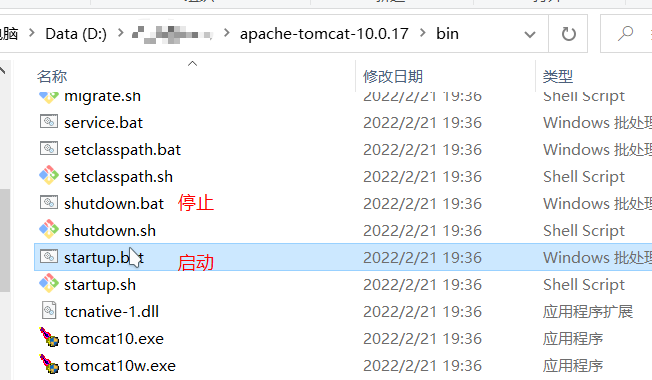
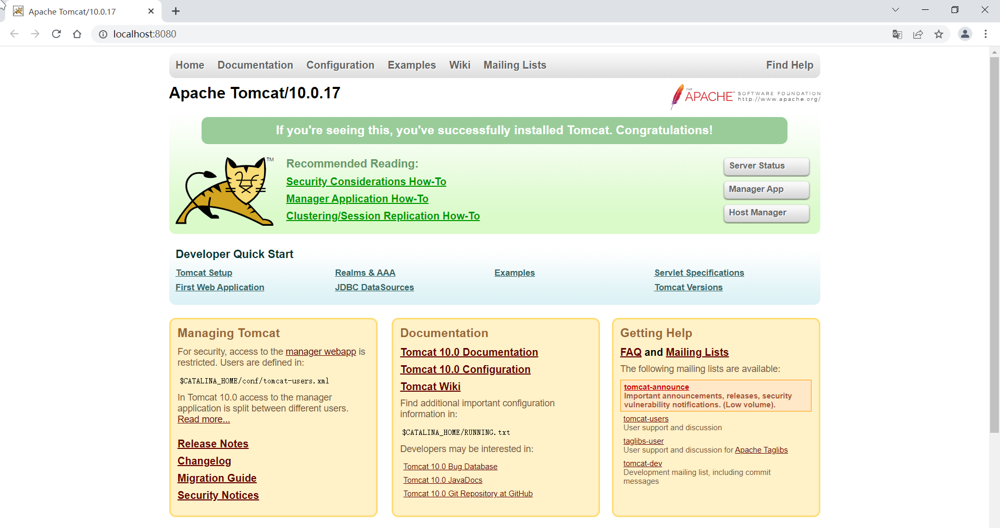
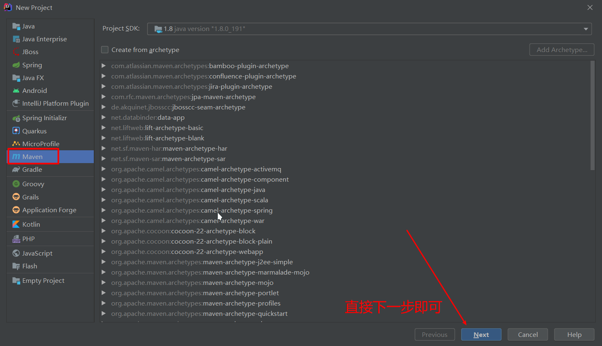
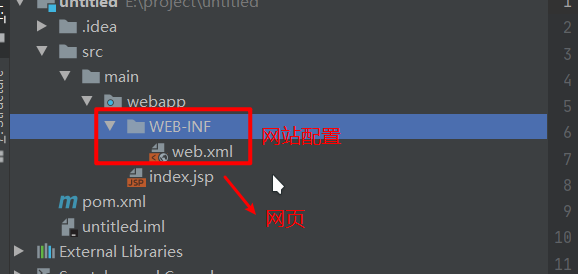
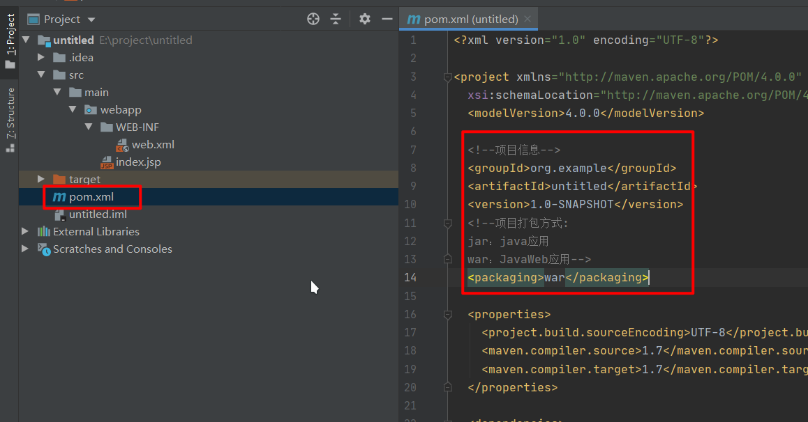
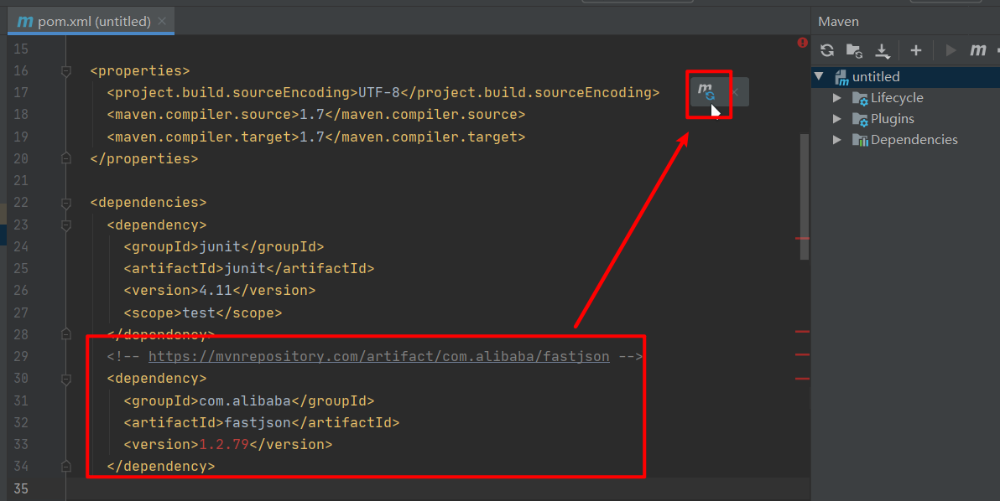
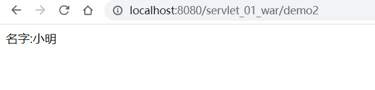

# JavaWeb学习

# 1、基本概念

- 用Java开发网页的技术统称为JavaWeb。
- web程序：可以提供浏览器访问的程序；

**web应用分两种**:

- **静态web资源**（如html 页面）：
  - 指web页面中的数据始终是不变。
  - 所有用户看到都是同一个页面。
  - 技术：HTML、CSS。
- **动态web资源**：
  - 指web页面中的浏览的数据是由服务器提供的。
  - 所有用户看到都是同一个页面。
  - 技术：JSP/Servlet、ASP、PHP等。

web应用程序编写完毕后，若想提供给外界访问：需要一个**服务器**来统一管理；

# 2、web服务器

常见的web的服务器：

- Apache、
- Nginx、
- IIS、
- WebLogic、
- WebSphere、
- **Tomcat**

Tomcat 因为技术先进、性能稳定，而且免费，因而深受Java 爱好者的喜爱并得到了部分软件开发商的认可，成为目前比较流行的Web 应用服务器。

Tomcat 服务器是一个免费的开放源代码的Web 应用服务器，属于轻量级应用服务器，在中小型系统和 并发访问用户不是很多的场合下被普遍使用，是开发和调试JSP程序的首选。对于一个Java初学web的人来说，它是最佳的选择。

# 3、Tomcat

## 3.1、安装tomcat

tomcat官网：http://tomcat.apache.org/

1、选择合适在的压缩包


2、下载压缩包并解压


## 3.2、Tomcat启动和配置


启动。关闭Tomcat



访问测试：http://localhost:8080/



可能遇到的问题：

1. Java环境变量没有配置
2. 闪退问题：需要配置兼容性
3. 乱码问题：配置文件中设置

## 3.3、配置


可以配置启动的端口号

## 3.4、发布一个web网站

将自己写的网站，放到服务器(Tomcat)中指定的web应用的文件夹（webapps）下，就可以访问了

网站应该有的结构

```
--webapps ：Tomcat服务器的web目录    
-ROOT    
-demoweb ：网站的目录名        
-WEB-INF            
-classes : java程序            
-lib：web应用所依赖的jar包            
-web.xml ：网站配置文件    
-index.html 默认的首页    
-static        
-css            
-style.css        
-js        
-img        
-.....
```

# 4、Http

## 4.1、什么是HTTP

HTTP（超文本传输协议）是一个简单的请求-响应协议，它通常运行在TCP之上。

- 文本：html，字符串，~ ….
- 超文本：图片，音乐，视频，定位，地图…….
- 端口：80

Https：安全的

- 端口：443

## 4.2、Http请求

HTTP请求的完全过程：https://blog.csdn.net/ailunlee/article/details/90600174

一个HTTP请求报文由

请求行（request line）

请求头部（headers）

空行（blank line）

请求数据（request body）4个部分组成。

### 4.2.1、请求行

访问百度为例：


```
Request URL:请求地址Request Method:请求方式，一般是GET/POSTStatus Code:状态码：200表示成功，404表示没有找到资源，500表示服务器错误....Remote Address:远程地址
```

### 4.2.2、请求头部

```
Accept：告诉浏览器，它所支持的数据类型Accept-Encoding：支持哪种编码格式 GBK UTF-8 GB2312 ISO8859-1Accept-Language：告诉浏览器，它的语言环境Cache-Control：缓存控制Connection：告诉浏览器，请求完成是断开还是保持连接HOST：主机..../.
```

## 4.3、Http响应

服务器—->响应——>客户端

```
Cache-Control:private 缓存控制Connection:Keep-Alive 连接Content-Encoding:gzip 编码Content-Type:text/html 类型
```

### 4.3.1响应体

```
Accept：告诉浏览器，它所支持的数据类型Accept-Encoding：支持哪种编码格式 GBK UTF-8 GB2312 ISO8859-1Accept-Language：告诉浏览器，它的语言环境Cache-Control：缓存控制Connection：告诉浏览器，请求完成是断开还是保持连接HOST：主机..../.Refresh：告诉客户端，多久刷新一次；Location：让网页重新定位；
```

## 4.3.2、响应状态码

200：请求响应成功

3xx：请求重定向

4xx：找不到资源 404资源不存在；

5xx：服务器代码错误

# 5、Maven

我为什么要学习这个技术？

1. 在Javaweb开发中，需要使用大量的jar包，我们手动去导入；
2. 如何能够让一个东西自动帮我导入和配置这个jar包。

由此，Maven诞生了！

## 5.1、Maven项目架构管理工具

我们目前用来就是方便导入jar包的！

Maven的核心思想：**约定大于配置**

## 5.2、下载安装Maven

官网;https://maven.apache.org/


下载完成后，解压即可；

## 5.3、配置环境变量

在系统环境变量中

配置以下配置：

1. MAVEN_HOME maven的目录
2. 在系统的path中配置 %MAVEN_HOME%\bin
3. 
4. 测试Maven是否安装成功，保证必须配置完毕！

## 5.4、配置阿里云加速镜像

使用阿里云Maven中央仓库作为下载源，速度更快更稳定。

- maven 安装目录的 `conf/settings.xml`

- 在`<mirrors></mirrors>`标签中添加 `mirror`子节点

  ```xml
  <mirror><id>aliyunmaven</id><mirrorOf>*</mirrorOf><name>阿里云公共仓库</name><url>https://maven.aliyun.com/repository/public</url></mirror>
  ```

## 5.5、本地仓库

修改本地的仓库存放位置

- maven 安装目录的 `conf/settings.xml`
- 在`<settings></settings>`标签中添加 `localRepository`子节点，按个人习惯存放。

```xml
<localRepository>D:\maven\repository</localRepository>
```

## 5.6、在IDEA中使用Maven

1、启动IDEA

2、 创建一个MavenWeb项目


3、等待项目初始化完毕


4、检查IDEA中的Maven设置


6、到这里，Maven在IDEA中的配置和使用就OK了!

## 5.7、创建一个普通的Maven项目




只有在**Web应用下才有**的项目结构



## 5.8、标记文件夹功能


## 5.9、在 IDEA中配置Tomcat

1、添加tomcat


2、相关配置


3、关联网站


访问路径加了，访问的时候，在端口后面就是加上

例如：`ip:端口/虚拟路径`


启动tomcat


## 5.10、pom文件

pom.xml 是Maven的核心配置文件.

记录了项目具体依赖的Jar包的配置版本。



maven由于它是约定大于配置，之后可以能遇到写的配置文件不生效的问题。

解决方案：

```
<!--在build中配置resources，来防止我们资源导出失败的问题--><build>    <resources>        <resource>            <directory>src/main/resources</directory>            <includes>                <include>**/*.properties</include>                <include>**/*.xml</include>            </includes>            <filtering>true</filtering>        </resource>        <resource>            <directory>src/main/java</directory>            <includes>                <include>**/*.properties</include>                <include>**/*.xml</include>            </includes>            <filtering>true</filtering>        </resource>    </resources></build>
```

## 5.12、Maven仓库的使用

地址：https://mvnrepository.com/


点击进去，可以查看到使用的人数及版本更新时间


点击对应的版本，里面有maven引用的配置信息，复制到本地的POM.xml下，重新引用一下依赖，就可以导致对应的Jar包。


查询项目的依赖就导入进来了。


# 6、Servlet

## 6.1、Servlet简介

Servlet用java语言开发动态资源网站的技术。

**把实现了Servlet接口的Java程序叫做，Servlet**

servlet生成的class文件存放在tomcat中webapps目录下。

## 6.2、HelloServlet

Serlvet接口有两个默认的实现类：`HttpServlet`，`GenericServlet`

1、构建一个普通的Maven项目，删掉里面的src目录，以后我们的学习就在这个项目里面建立 Moudel；这个空的工程就是Maven主工程；


2、 关于Maven父子工程的理解：

- 父工程会显示子工程的信息
- 子工程会继承父工程。


3、编写一个Servlet程序

3.1、在父工程引用相关的Jar包

```xml
<!-- servlet --><dependency>    <groupId>javax.servlet</groupId>    <artifactId>javax.servlet-api</artifactId>    <version>3.1.0</version>    <scope>provided</scope></dependency><!-- jsp --><dependency>    <groupId>javax.servlet.jsp</groupId>    <artifactId>javax.servlet.jsp-api</artifactId>    <version>2.3.3</version>    <scope>provided</scope></dependency>
```

3.2、普通maven转web项目

https://www.cnblogs.com/jichi/p/11356759.html

3.3、编写一个普通类，继承HttpServlet

```java
public class HelloWorld extends HttpServlet {
    @Override
    protected void doGet(HttpServletRequest req, HttpServletResponse resp) throws ServletException, IOException {
        PrintWriter writer = resp.getWriter();
        writer.print("Hello,Servlet");
    }

    @Override
    protected void doPost(HttpServletRequest req, HttpServletResponse resp) throws ServletException, IOException {
        doGet(req, resp);
    }
}
```

3.4、Servlet的映射

为什么需要映射：我们写的是JAVA程序，但是要通过浏览器访问，而浏览器需要连接web服务器， 所以我们需要再web服务中注册我们写的Servlet，让浏览器找到我们java程序的发布目录

```xml
<!--注册Servlet-->
<servlet>
    <servlet-name>hello</servlet-name>
    <servlet-class>com.kuang.servlet.HelloServlet</servlet-class>
</servlet>
<!--Servlet的请求路径-->
<servlet-mapping>
    <servlet-name>hello</servlet-name>
    <url-pattern>/hello</url-pattern>
</servlet-mapping>
```

3.5、配置Tomcat，并访问。


## 6.3、Servlet原理

Servlet是由Web服务器调用，web服务器在收到浏览器请求之后，会：

注：这个我偷懒，直接采用狂神说里的流程图


## 6.4、Servlet映射问题

1、一个Servlet可以指定一个映射路径

```xml
<servlet-mapping>  
    <servlet-name>hello</servlet-name>   
    <url-pattern>/hello</url-pattern>
</servlet-mapping>
```

2、一个Servlet可以指定多个映射路径

```xml
<servlet-mapping>  
    <servlet-name>hello</servlet-name> 
    <url-pattern>/hello</url-pattern>
</servlet-mapping><servlet-mapping>   
    <servlet-name>hello</servlet-name> 
    <url-pattern>/hello2</url-pattern>
</servlet-mapping><servlet-mapping>  
    <servlet-name>hello</servlet-name>  
    <url-pattern>/hello3</url-pattern>
</servlet-mapping><servlet-mapping>    
    <servlet-name>hello</servlet-name> 
    <url-pattern>/hello4</url-pattern>
</servlet-mapping><servlet-mapping>   
    <servlet-name>hello</servlet-name> 
    <url-pattern>/hello5</url-pattern>
</servlet-mapping>
```

3、一个Servlet可以指定通用映射路径

```xml
<servlet-mapping>  
    <servlet-name>hello</servlet-name>  
    <url-pattern>/hello/*</url-pattern>
</servlet-mapping>
```

4、默认请求路径

```xml
<servlet-mapping>
    <servlet-name>hello</servlet-name>
    <url-pattern>/*</url-pattern>
</servlet-mapping>
```

5、指定一些后缀或者前缀等等…

```xml
<!-- 注意，*前面不能加项目映射的路径-->
<servlet-mapping>   
    <servlet-name>hello</servlet-name>   
    <url-pattern>*.demo</url-pattern>
</servlet-mapping>
```

6、优先级问题
指定了固有的映射路径优先级最高，如果找不到就会走默认的处理请求；

```xml
<!--404--><servlet>
    <servlet-name>error</servlet-name> 
    <servlet-class>com.kuang.servlet.ErrorServlet</servlet-class>
</servlet><servlet-mapping>   
    <servlet-name>error</servlet-name>  
    <url-pattern>/*</url-pattern>
</servlet-mapping>
```

## 6.5、ServletContext

web容器在启动的时候，它会为每个web程序都创建一个对应的ServletContext对象，它代表了当前的 web应用；

### 1、共享数据

我在这个Servlet中保存的数据，可以在另外一个servlet中拿到；

```java
public class DemoServlet1 extends HttpServlet {
    @Override
    protected void doGet(HttpServletRequest req, HttpServletResponse resp) throws ServletException, IOException {
        //this.getInitParameter() 初始化参数        
        // this.getServletConfig() Servlet配置        
        //this.getServletContext() Servlet上下文        
        ServletContext context = this.getServletContext();
        String username = "小明"; //数据        
        context.setAttribute("username", username);
        //将一个数据保存在了ServletContext    }    
        @Override
        protected void doPost (HttpServletRequest req, HttpServletResponse resp) throws
            ServletException, IOException {
            doGet(req, resp);
        }
    }

    public class DemoServlet2 extends HttpServlet {
        @Override
        protected void doGet(HttpServletRequest req, HttpServletResponse resp) throws ServletException, IOException {
            ServletContext context = this.getServletContext();
            //从ServletContext获取username值的对象出来        
            // String username = (String) context.getAttribute("username");        
            // resp.setContentType("text/html");        
            // resp.setCharacterEncoding("utf-8");       
            // resp.getWriter().print("名字:"+username);    
            // }    
            // @Override    
            // protected void doPost(HttpServletRequest req, HttpServletResponse resp) throws ServletException, IOException {        
            // doGet(req, resp);    
        }
    }
```

```xml
<!--注册Servlet-->    
<servlet>       
    <servlet-name>hello</servlet-name>       
    <servlet-class>com.demo.servlet.HelloWorld</servlet-class>   
</servlet>   
<servlet>     
    <servlet-name>demo1</servlet-name>     
    <servlet-class>com.demo.servlet.DemoServlet1</servlet-class>    
</servlet> 
<servlet>   
    <servlet-name>demo2</servlet-name>     
    <servlet-class>com.demo.servlet.DemoServlet2</servlet-class>   
</servlet>   
<!--Servlet的请求路径-->  
<servlet-mapping>      
    <servlet-name>hello</servlet-name>        
    <url-pattern>/hello</url-pattern> 
</servlet-mapping> 
<servlet-mapping>      
    <servlet-name>demo1</servlet-name>
    <url-pattern>/demo1</url-pattern>  
</servlet-mapping>  
<servlet-mapping>      
    <servlet-name>demo2</servlet-name>    
    <url-pattern>/demo2</url-pattern>   
</servlet-mapping>
```


测试访问结果:



### 2、获取初始化参数

```xml
<!--配置初始化信息-->
<context-param>
    <param-name>url</param-name>
    <param-value>jdbc:mysql:///testdatabase?serverTimezone=Asia/Shanghai</param-value>
</context-param>
```


```java
protected void doGet(HttpServletRequest req, HttpServletResponse resp) throws  ServletException, IOException {  
    ServletContext context = this.getServletContext();   
    String url = context.getInitParameter("application-name");  
    resp.setContentType("text/html"); 
    resp.setCharacterEncoding("utf-8");   
    resp.getWriter().print(url);
}
```

### 3、请求转发


```java
@Override    
protected void doGet(HttpServletRequest req, HttpServletResponse resp) throws ServletException, IOException {   
    ServletContext context = this.getServletContext();     
    System.out.println("进入了DemoServlet4");    
    //RequestDispatcher requestDispatcher = context.getRequestDispatcher("/demo4"); //转发的请求路径
    //requestDispatcher.forward(req,resp); //调用forward实现请求转发；
    context.getRequestDispatcher("/demo3").forward(req,resp);  
}
```

### 4、读取资源文件

```java
@Override
protected void doGet(HttpServletRequest req, HttpServletResponse resp) throws ServletException, IOException {
    ServletContext context = this.getServletContext();
    InputStream asStream = context.getResourceAsStream("/WEB-INF/classes/druid.properties");
/*
getResourceAsStream(String s);
返回位于指定路径上的资源 InputStream 对象。
的数据 InputStream 可以是任何类型或长度。中给出的规则必须指定路径 getResource． 这个方法返回 零 如果指定路径上不存在资源。
*/
    Properties prop = new Properties();
    prop.load(asStream);
    Set<Object> asSet = prop.keySet();

    resp.setCharacterEncoding("UTF-8");
    for (Object o : asSet) {
        resp.getWriter().println(o + ":\t" + prop.get(o));
    }
}
```

配置文件

```properties
driverClassName=com.mysql.cj.jdbc.Driver
url=jdbc:mysql:///testdatabase?serverTimezone=Asia/Shanghai
username=root
password=root
initialSize=3
maxActive=5
maxWait=3000
```

运行结果


