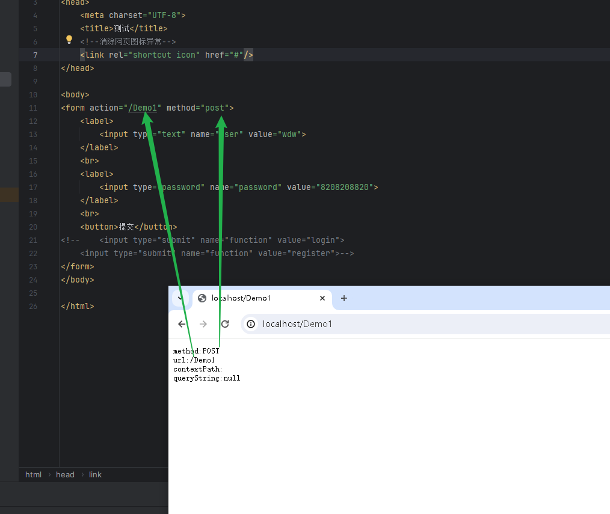
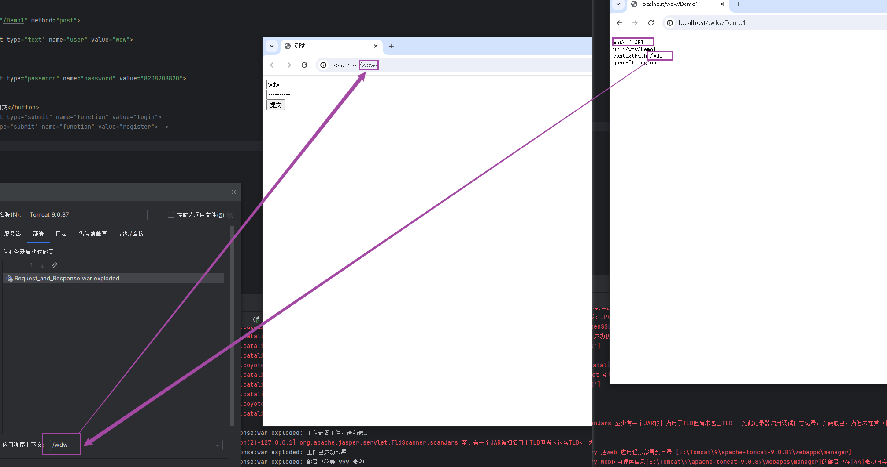
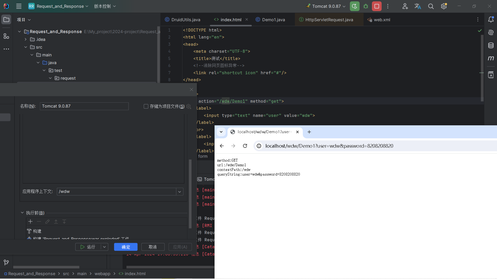
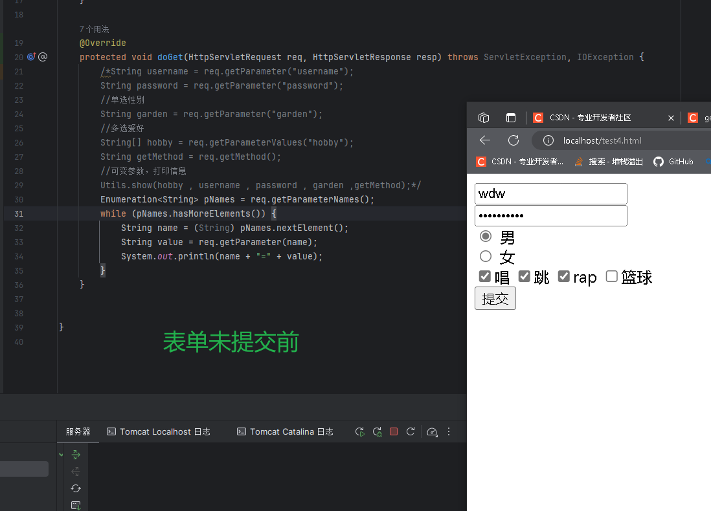
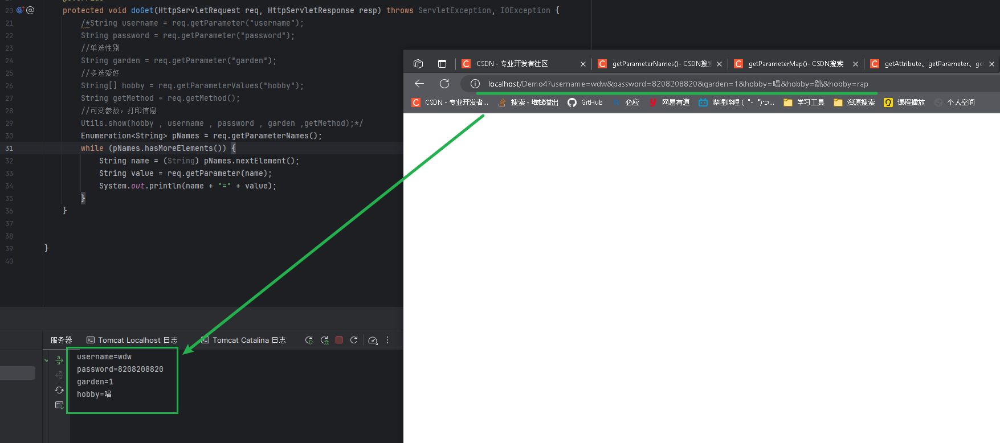

### 一，请求消息数据的格式

#### 1.1 请求行

> 包含两部分内容：
>
> 1. 请求方式：post、get
> 2. 请求的地址
>    1. 以get方式提交，请求的地址后会拼接提交的内容
>    2. 以post方式提交，请求的地址后不会拼接提交的内容

#### 1.2 请求头

> 请求头包含若干个键值对
>
> 每个键值对的格式：`请求头的名称:这个请求头的值`
>
> 请求头是客户端在向服务器发起请求时告知服务器的信息
>
> 常见的请求头：
>
> 1. user-agent：客户端告知服务器当前浏览器的版本信息，用于解决浏览器的兼容性问题
> 2. referer：客户端告知服务器当前的请求是从哪里发起的，常用于防盗链

#### 1.3 请求体

> 请求体中封装了以post方式提交的数据

### 二，HttpServletRequest

#### 2.1 获取请求消息

##### 2.1.1 获取请求行相关

> 1. getMethod()：获取请求方式
> 2. getRequestURL()：获取请求地址 
>    - 
> 3. getContextPath()：获取请求的虚拟路径
>    - 
> 4. getQueryString()：获取以get方法提交的数据
>
> 
>
> 代码示例
>
> ```java
> //提交方式
> String method = req.getMethod();
> //请求的URL
> String url = req.getRequestURI();
> //上下文路径
> String contextPath = req.getContextPath();
> //获取以get方式提交的数据
> String queryString = req.getQueryString();
> ```

##### 2.1.2 获取请求头相关

> 1. getHeader(String s)：通过请求头的名称获取对应的值
>    - 需要上一个页面，因为获取的是哪一个页面提交的请求

##### 2.1.3 获取请求体相关

> 1. getReader()
> 2. getInputStream()
>
> ```java
> @Override
> protected void doGet(HttpServletRequest req, HttpServletResponse resp) throws ServletException, IOException {
>     /*	
>     //TODO 只能获取post提交的数据
>         //字符流
>         BufferedReader reader = req.getReader();
>         StringBuilder s = new StringBuilder();
>         int len;
>         while ((len = reader.read()) != -1){
>             s.append((char)len);
>         }
>         System.out.println("获取到的数据" + s);
>         */
> 
>     //
>     InputStream is = req.getInputStream();
>     StringBuilder str = new StringBuilder();
>     byte[] bs = new byte[8];
>     int len = 0;
>     while ((len = is.read(bs)) != -1){
>         str.append(new String(bs, 0, len));
>     }
>     System.out.println(str);
> }
> ```
>
> 注：只能用于获取以post方式提交的数据

#### 2.2 获取请求参数的通用方法

> 无论是以post还是以get方式提交的数据都可以通过以下方法来获取：
>
> 1. getParameter(String name)  `根据参数名称获取参数值`
>
>    - ```java
>      String username = req.getParameter("username");
>      String password = req.getParameter("password");
>      //单选性别
>      String garden = req.getParameter("garden");
>      String getMethod = req.getMethod();
>      //可变参数，打印信息
>    Utils.show(username , password , garden ,getMethod);
>      ```
>      
>    
>2. getParameterValues(String name)  `根据参数名称获取参数值的数组`
> 
>   - ```java
>      @Override
>      protected void doGet(HttpServletRequest req, HttpServletResponse resp) throws ServletException, IOException {
>          String username = req.getParameter("username");
>          String password = req.getParameter("password");
>          //单选性别
>          String garden = req.getParameter("garden");
>          //多选爱好
>          String[] hobby = req.getParameterValues("hobby");
>          String getMethod = req.getMethod();
>          //可变参数，打印信息
>          Utils.show(hobby , username , password , garden ,getMethod);
>      }
>      ```
> 
>3. getParameterNames()  `根据参数名称获取参数值的数组`
> 
>   - 
>    - 提交后
>    - 
> 
>4. getParameterMap()  `获取所有参数的map集合`
> 
>   - ```java
>      Map<String, String[]> parameterMap = req.getParameterMap();
>      for (String s : parameterMap.keySet()) {
>          System.out.println(s + "：\t" + Arrays.toString(parameterMap.get(s)));
>      }
>      ```

> 注：中文乱码问题
>
> 原因：tomcat服务器的默认编码格式是iso8859-1，但是这种编码格式不支持中文

#### 2.3 请求转发

> 跳转servlet同时带着数据的方式有：
>
> 1. 表单
> 2. 超链接
> 3. js中location的href
>
> 跳转到页面同时带着数据的方式有：
>
> 1. 表单
> 2. 超链接
> 3. js中location的href
>
> 用以上带着数据跳转到指定资源的方式时，都只能带着字符串类型的数据

> 请求转发是一种在服务器内部实现资源跳转的方式
>
> 步骤：
>
> 1. 通过request对象获取请求转发器，同时指定要跳转到的目标地址
>
>    ```java
>    RequestDispatcher dispatcher = req.getRequestDispatcher(String path);
>    ```
>
> 2. 执行转发
>
>    ```java
>    dispatcher.forward(req,resp);
>    ```
>
> 特点：
>
> 1. 请求转发后地址不变
> 2. 请求转发只执行了一次请求
> 3. 请求转发只能访问`当前项目资源`

#### 2.4 数据共享

> 域对象可以在不同的资源之间实现数据的共享（传递）
>
> 域对象有：
>
> 1. servletContext：可以在整个项目中共享数据
> 2. session：可以在一次会话中共享数据
> 3. request：可以在`一次请求`中共享数据
> 4. pageContext：只能在当前资源中共享数据
>
> 域对象共享数据的通用方法：`存在于整个服务器开启的生命周期中，过于由于服务器资源珍贵，这种方式过于浪费资源`
>
> 1. setAttribute(String key，Object obj)
> 2. getAttribute(String key)
> 3. removeAttribute(String key)

### 三，响应消息数据的格式

#### 3.1 响应行

> 1. 协议/版本：http/1.1
>
>    http：超文本传输协议，特点：请求响应对
>
>    版本：1.1
>
> 2. 状态码：服务器告知客户端本次请求的响应状态
>
>    分类：
>
>    1. 1xx：服务器接收到了客户端的请求，但是消息处理还没结束
>    2. 2xx：表示成功，例如：200
>    3. 3xx：302表示重定向、304访问缓存
>    4. 4xx：客户端报错，例如：404找不到资源，405没有对应的doXxx()方法
>    5. 5xx：服务器报错，例如：500服务器内部发生异常

#### 3.2 响应头

> 响应头：由若干个键值对组成，服务器告知客户端的消息
>
> 键值对的格式：`响应头的名称:值`
>
> 常见的响应头：
>
> 1. content-type：服务器响应给客户端时数据的编码格式
> 2. location：重定向时明确的目标地址
> 3. set-cookie

#### 3.3 响应体

> 服务器传递给客户端的数据

### 四，HttpServletResponse

#### 4.1 设置响应消息

##### 4.1.1 设置响应行

> 设置状态码：
>
> ```java
> resp.setStatus(int code);
> ```

##### 4.1.2 设置响应头

> 设置响应头：
>
> ```java
> resp.setHeader(String name,String values);
> ```

> 重定向：是一种实现资源跳转的方式
>
> ```java
> // 设置状态码为302
> resp.setStatus(302);
> // 设置响应头
> resp.setHeader("location","目标地址");
> ```
>
> 重定向的简化形式：
>
> ```java
> resp.sendRedirect("目标地址");
> ```

> 解决响应的中文乱码问题：
>
> ```java
> resp.setHeader("content-type","text/html;charset=utf-8");
> resp.setHeader("content-type","text/html;charset=GBK");
> ```
>
> 简化形式：
>
> ```java
> resp.setContentType("text/html;charset=utf-8");
> resp.setContentType("text/html;charset=GBK");
> ```

##### 4.1.3 设置响应体

> 1. getWriter() //获取字符输出流
> 2. getOutputStream() //获取字节输出流

#### 4.2 重定向和请求转发

> 请求转发的特点：
>
> 1. 地址栏不变
> 2. 只执行了一次请求
> 3. 只能访问服务器的内部资源
>
> 重定向的特点：
>
> 1. 地址栏发生变化
> 2. 执行了两次请求
> 3. 可以访问服务器的外部资源
>
> 注：请求转发（重定向）之后不能再重定向（请求转发）

> 重定向和请求转发区别：
>
> 1. 地址
> 2. 请求次数
> 3. 访问其他服务器
> 4. 请求转发的性能高于重定向

#### **4.3 重定向与转发的区别：**

> - 转发时客户端浏览器请求一次服务器；而重定向需要客户端请求两次服务器。
> - 重定向时不管第一次请求时的方式是什么，第二次请求时方式都是GET；而转发时，两次的方式是一样的。
>
> - 当请求WEB-INF目录中的资源时，只能使用请求转发而不能使用重定向。
>
> - 重定向是无法传递数据的，要想传内容或者参数只能在url路径后面添加参数例如：url地址?参数名称=参数值;
>
> ```java
> response.sendRedirect(“url地址?参数名称=参数值”)
> ```
>
> - 请求转发结束后，浏览器地址栏保持初始的URL地址不变；而调用重定向访问过程结束后，浏览器地址栏中显示的URL会发生改变，由初始的URL地址变成重定向到的目标URL。
>
> - 请求转发的整个请求跳转过程是在服务器端实现的，客户端并不知道，即：请求转发在服务器端将请求转发给另外一个资源，浏览器只知道发出了请求并得到了响应结果，并不知道在服务器程序内部发生了转发行为；而重定向是对浏览器的请求直接做出响应，响应的结果就是告诉浏览器去重新发出对另外一个URL的访问请求。
>
>
> `RequestDispatcher.forward()`
>
> ​	方法的调用者与被调用者之间共享request对象和response对象，它们属于同一个请求和响应的过程；而`HttpServletResponse.sendRedirect()`方法调用者与被调用者使用各自的request对象和response对象，它们属于两个独立的请求和响应的过程。
>
> `RequestDispatcher.forward()`
>
> ​	只能将请求转发给同一个WEB应用中的其它资源；而HttpServletResponse.sendRedirect()还可以重定向到同一个站点上的其他应用程序中的资源，甚至是使用绝对URL重定向到其他站点的资源。
>
> - 如果创建RequestDispatcher对象时指定参数URL以"/“开头，它是相对于当前WEB应用程序的根目录。
> - 如果传递给HttpServletResponse.sendRedirect()方法的URL以”/“开头，它是相对于整个Servlet容器的根目录，而不是相对于当前WEB应用程序的根；
> - 如果不是以”/"开头，则是相对于当前请求uri的路径，比如：
>
> - response.sendRedirect(“/result.jsp”); 会被解析为：http://localhost:8080/result.jsp。
>   页面http://localhost:8080/sth/sth.jsp中response.sendRedirect(“result.jsp”);会被解析为：http://localhost:8080/
>   sth/result.jsp。
>   转发地址栏不变，重定向地址改变。
>
> - 转发可以携带request对象到目标资源，重定向未携带request对象。
>
> - 转发浏览器发送一次，重定向浏览器发送两次请求
>
> - 转发可以访问WEB-INF下资源，重定向不能直接访问WEB-INF下资源
>
> - WEB-INF属于服务器私有目录【服务器内部可以访问，浏览器不能直接访问】
>   请求转发与重定向的选择：优先选择请求转发，因为转发效率更高；
>   由于在转发之后，浏览器中URL仍然指向开始页面，此时如果重载（刷新）当前页面，开始页面将会被重新调用。
>
>   如果不想看到这样的情况，则选择重定向。
>   在同一Web应用程序的两个请求间传递数据时，在转发与重定向之间，只能通过转发实现。
>   如果需要``跳转到其它服务器上的资源，则必须使用重定向。`


