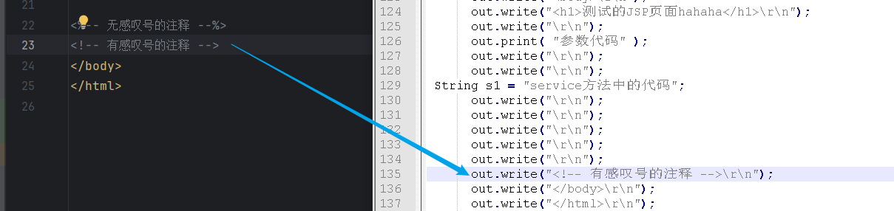

### 一，概念

> jsp：java server pages，java服务器页面
>
> jsp是一种可以在html页面中嵌入java代码的页面，以`.jsp`为结尾
>
> 作用：简化java代码的书写
>
> jsp的本质就是一个Servlet，并且jsp页面中的java代码在第一次被访问时编译运行
>
> 名叫`xxx.jsp`的文件，在第一次被访问时会生成一个名叫`xxx_jsp.java`的文件，并且这个java文件会被编译成`xxx_jsp.class`
>
> 这个`xxx_jsp.java`的文件中有一个类名叫`xxx_jsp`，这个类继承了`HttpJspBase`，`HttpJspBase`继承了`HttpServlet`，所以jsp文件本质上就是一个Servlet。
>
> 在tomcat中变编译的jsp文件保存地址为
>
> ​	以本机地址为例
>
> `C:\Users\86178\AppData\Local\JetBrains\IntelliJIdea2023.3\tomcat\962edc8e-74b8-4e43-9ccb-3aeec48d60dc\work\Catalina\localhost\ROOT\org\apache\jsp`
>
> ​	网上参考地址为：
>
> 

### 二，jsp的语法

> jsp中编写java代码的格式：
>
> **jsp中的代码**
>
> ```jsp
> <%--
>   Created by IntelliJ IDEA.
>   User: 3167918581
>   Date: 2024/4/24
>   Time: 15:17
>   To change this template use File | Settings | File Templates.
> --%>
> <%@ page contentType="text/html;charset=UTF-8" language="java" %>
> <html>
> <head>
>     <title>Title</title>
> </head>
> <body>
> <h1>测试的JSP页面hahaha</h1>
> 
> <%= "out.print()参数代码" %>
> 
> <% String s1 = "service方法中的代码"; %>
> 
> <%! String s2 = "Servlet中的成员代码"; %>
> </body>
> </html>
> ```
>
> tomcat中编译后的Jsp文件
>
> 1. `<%= java代码 %>`
>
>    java代码在service()方法中的out.print()==方法的参数==中
>
>    
>
> 2. `<% java代码 %>`
>
>    java代码在service()==方法中==
>
>    
>
> 3. `<%! java代码 %>`
>
>    java代码在jsp转换成Servlet类的成员位置
>    
>    

> jsp中的注释：`<%-- 注释内容 --%>`
>
> 注：`<!-- -->`和`<%-- --%>`都可以将页面中标签和java代码进行注释，区别是`<!-- -->`是将显示的内容注释掉从而变得不显示；`<%-- --%>`中的代码都不会被翻译成Servlet中的java代码
>
> 

### 三，jsp的内置对象

> 内置对象是由tomcat创建，不需要手动创建，可以在jsp页面中直接使用的对象（9个）
>
> | 内置对象     | 所属的类            | 作用                                                         |
> | ------------ | ------------------- | ------------------------------------------------------------ |
> | *request     | HttpServletRequest  | 获取请求行头体中的数据、请求转发、共享数据等                 |
> | *response    | HttpServletResponse | 重定向、发送Cookie                                           |
> | *session     | HttpSession         | 共享数据(会话级别)                                           |
> | *application | ServletContext      | 共享数据(存在于整个服务器中)                                 |
> | page         | Object              | 它是当前Servlet对象                                          |
> | pageContext  | PageContext         | 获取其他8个内置对象、域对象                                  |
> | out          | JspWriter           | 向页面输出内容                                               |
> | config       | ServletConfig       | 获取ServletContext对象、获取ServletName、获取当前Servlet配置中的`init-param`的值 |
> | exception    | Throwable           | 处理异常                                                     |
>
> 注：
>
> 1. 使用response向页面中输出内容的优先级高于使用out输出的优先级，原因是response和out中要输出的内容都会先保存在缓冲区中，在显示到页面时response缓冲区中的数据会先被访问，所以使用response输出要优先于使用out输出
>
> 2. pageContext作为一个域对象只能在当前jsp页面中共享数据
>
>    jsp文件中的其他对象有一部分是通过==pageContext==对象来获取的
>
>    域对象存储数据的范围：`application(ServletContext) > session(HttpSession) > request(HttpServletRequest) > pageContext(PageContet)`
>
> 3. 在jsp页面中的标签是以`out.write()`输出的，通过`<%= %>`方式是以`out.print()`输出的；`write()`是JspWriter的父类Writer中的方法，`print()`是JspWriter中的特有方法，他们功能一样都用于输出。
>
> 4. exception这个内置对象的使用前提是在jsp的page指令中配置了`isErrorPage=true`
>
>    
>
>    错误页面设置如下：
>
>    ```jsp
>    <%@ page contentType="text/html;charset=UTF-8" language="java" %>
>    <%@ page isErrorPage="true"%>
>    <html>
>    <head>
>        <title>Title</title>
>    </head>
>    <body>
>    <h1>啊欧~网络开小差了</h1>
>    <%--打印异常信息--%>
>    <-- 如果异常没有抛出，则exception为:null -->
>    <%=
>        exception.getMessage()
>    %>
>    </body>
>    </html>
>    ```
>
> 5. 使用out时需要额外引入依赖
>
>    第一种方式:
>
>    ```xml
>    <!-- https://mvnrepository.com/artifact/javax.servlet/jsp-api -->
>    <!-- jsp内置对象所需要的包 -->
>    <dependency>
>        <groupId>javax.servlet</groupId>
>        <artifactId>jsp-api</artifactId>
>        <version>2.0</version>
>    </dependency>
>    ```
>
>    第二种方式:
>
>    

> ServletContext：它是当前整个web应用的对象，每个应用有且只有一个ServletContext对象，它是一个域对象
>
> 获取：
>
> ```java
> //在Servlet中通过：
> req.getServletContext();
> this.getServletContext();
> ```

### 四，jsp的指令

> jsp指令的格式：
>
> ```jsp
> <%@ 指令名称 属性名="属性值" 属性名="属性值" ... %> 
> ```

> page指令
>
> 用于配置当前jsp页面
>
> 格式：
>
> ```jsp
> <%@ page 属性名="属性值" 属性名="属性值" ... %>
> ```
>
> 常用属性：
>
> 1. language：配置当前jsp页面中可以嵌入的语言
> 2. contentType：配置当前jsp页面响应给客户端时指定的编码格式
> 3. import：导包
> 4. session：配置当前jsp页面是否可以使用session内置对象，默认是true
> 5. isELIgnored：是否忽略当前jsp页面中的el表达式，默认是false
> 6. errorPage：用于配置如果当前页面中发生了异常，就跳转到哪个指定的页面
> 7. isErrorPage：默认值是false，配置在发生异常后跳转到的页面中，值为true则可以使用内置对象`exception`，值为false则不能使用`exception`

> include指令
>
> 在页面中嵌入其他页面
>
> 格式：
>
> ```jsp
> <%@ include file="页面资源" %>
> ```
>
> `注：`在使用include在引入页面资源时，引入的是指定页面资源的所有内容，引入指定页面资源的配置信息也会导入，`相同的配置信息属性相斥`,该冲突属性以内置对象session为例：==无法使用!!!==

> taglib指令
>
> 用于引入标签库`jstl`
>
> 格式：
>
> ```jsp
> <%@ taglib prefix="c" uri="http://java.sun.com/jsp/jstl/core" %>
> ```

### 五，EL表达式

#### 5.1 el表达式的概念和语法

> el：Expression Language ，表达式语言
>
> 作用：简化jsp中的java代码，用于`获取数据`
>
> 语法格式：
>
> ```jsp
> ${ 表达式 }
> ```
>
> 注：
>
> 1. jsp默认支持el
>
> 2. el表达式获取的结果如果是null，则显示空字符串
>
>    
>
> 3. 忽略el表达式
>
>    1. 忽略整个jsp页面中的所有el表达式，在jsp的page指令中配置`isELIgnored=true`
>
>    2. 忽略指定一条el语句
>
>       ```jsp
>       \${ 表达式 }
>       
>       结果为：页面上直接显示为：\${ 表达式 }
>       ```

#### 5.2 el表达式的运算符

> 1. `.`：访问方法(不能调用属性)
> 2. `[]`：访问数组、集合
> 3. `+、-、*、/（div）、%（mod）`
> 4. `==（eq）、!=（ne）、>（gt）、<（lt）、>=（ge）、<=（le）`
> 5. `&&（and）、||（or）、!（not）`
> 6. `empty`：判断集合和数组的内容是否为空或者对象是否为空

#### 5.3 el的隐式对象

> 1. pageScope
>
>    - 代表page域中用于保存属性的Map对象
>
> 2. requestScope
>
>    - 代表request域中用于保存属性的Map对象
>
> 3. sessionScope
>
>    - 代表session域中用于保存属性的Map对象
>
> 4. applicationScope
>
>    - 代表application域中用于保存属性的Map对象
>
>      综合演示：
>
>    ```jsp
>    <body>
>    <%
>        pageContext.setAttribute("a", 1);
>        request.setAttribute("b", 2);
>        session.setAttribute("c", 3);
>        application.setAttribute("d", 4);
>    %>
>    <%-- 写法一 --%>
>    <%--pageContext:${ pageScope.a }
>    <hr>
>    request:${ requestScope.b }
>    <hr>
>    session:${ sessionScope.c }
>    <hr>
>    application:${ applicationScope.d}
>    <hr>--%>
>    <%-- 写法二 --%>
>    pageContext:${ a }
>    <hr>
>    request:${ b }
>    <hr>
>    session:${ c }
>    <hr>
>    application:${ d }
>    <hr>
>    </body>
>    ```
>
> 5. param
>
>    - 表示一个保存了所有请求参数的Map对象
>
> 6. paramValues
>
>    - 表示一个保存了所有请求参数的Map对象，它对于某个请求参数， 返回的是一个string类型数组
>
> 7. header
>
>    - 表示一个保存了所有http请求头字段的Map对象
>
> 8. headerValues
>
>    - 表示一个保存了所有http请求头字段的Map对象，返回string类型数组
>
> 9. initParam
>
>    - 表示一个保存了所有web应用初始化参数的map对象
>
> 10. cookie
>
>     - 表示一个保存了所有cookie的Map对象
>
> 11. pageContext
>
>     - 对应于JSP页面中的pageContext对象

##### 5.3.1 获取域对象中的数据

> 1. pageScope
> 2. requestScope
> 3. sessionScope
> 4. applicationScope
>
> 格式：
>
> ```js
> ${ 域对象的名称.键 }
> 例如：要获取session域对象中键为age的值
> ${ sessionScope.age }
> ```
>
> 注：在获取域对象中的值时，可以直接简化成`${ 键 }`，会根据`从小到大的范围`进行查找，一旦找到了就返回结果不再继续查找
> 

> 获取域对象中对象的属性值：
>
> 格式：
>
> ```js
> ${ 域对象的名称.键.属性 }
> ```
>
> 注：获取对象属性值的本质是在调用对象的`getXxx()`方法，`getXxx()`方法必须有返回值。当我们调用属性时，系统会判断当前对象所属的类中石油存在一个`getXxx()`方法，将`get`删除，将剩下内容的首字母变小写与这个属性名是一直的，如果有就调用该`getXxx()`方法并返回结果

> 获取域对象中List集合/数组中对象的属性：
>
> 格式：
>
> ```js
> ${ 域对象的名称.键[索引] }:获取集合中指定索引的对象
> ${ 域对象的名称.键[索引].属性 }：获取集合中指定索引对象的属性
> ```

> 获取域对象中Map集合中对象的属性
>
> 1. 获取域对象中Map集合中的对象
>
>    ```js
>    ${ 域对象的名称.键["Map中的键"]}
>    ${ 域对象的名称.键.Map中的键 }
>    ```
>
> 2. 获取域对象中Map集合中的对象的属性
>
>    ```js
>    ${ 域对象的名称.键["Map中的键"].属性 }
>    ${ 域对象的名称.键.Map中的键.属性 }
>    ```

##### 5.3.2 获取请求参数

> 5. param:通过键获取值
>
> 6. paramValues:数组和集合类型的数据通过键获取值
>
> 格式：
>
> ```js
> ${ param.键 }：根据提交参数中指定的键获取值
> ${ paramValues.键 }：根据提交参数中指定的键获取数组，可以继续通过${ paramValues.键[索引] }获取指定元素
> ```
>
> 

##### 5.3.3 获取请求头中的参数

> 7. header
>
>    
>
> 8. headerValues
>
> 格式：
>
> ```js
> ${ header.键 }
> ${ header.["键"] }
> //下面两个方法仅作了解，获取的数组里只会有一个元素，该元素为多个数据的揉合而成
> ${ headerValues.键 }
> ${ headerValues["键"] }
> ```

##### 5.3.4 获取全局初始化参数

> 首先需要在web.xml中配置：
>
> ```xml
> <context-param>
>  <param-name>location</param-name>
>  <param-value>东莞</param-value>
> </context-param>
> ```
>
> 9. initParam
>
> 格式：
>
> ```js
> ${ initParam.键 }
> ```
>
> 

##### 5.3.5 获取cookie中的参数

> 10. cookie
>
> 格式：
>
> ```js
> ${ cookie.键 }：获取指定键的cookie对象
> ${ cookie.键.value}：获取指定键的cookie对象的值
> ```
>
> 

##### 5.3.6 pageContext

> 获取其他8个内置对象
>
> 格式：
>
> ```js
> ${ pageContext.request }
> ${ pageContet.session }
> ...
> ```
>
> 一般用于获取虚拟路径
>
> ```js
> ${ pageContext.request.contextPath }
> ```

### 六，JSTL

#### 6.1 概念

> jstl：jsp standard tag library，jsp标准标签库
>
> 作用：简化jsp中的java代码，提供了`对el表达式结果的流程控制`
>
> 注：
>
> 1. jstl的使用要结合el
>
> 2. 准备jstl的依赖 
>
>    ```xml
>    <!-- https://mvnrepository.com/artifact/javax.servlet.jsp.jstl/jstl -->
>    <dependency>
>        <groupId>javax.servlet.jsp.jstl</groupId>
>        <artifactId>jstl</artifactId>
>        <version>1.2</version>
>    </dependency>
>    <!-- https://mvnrepository.com/artifact/taglibs/standard -->
>    <dependency>
>        <groupId>taglibs</groupId>
>        <artifactId>standard</artifactId>
>        <version>1.1.2</version>
>    </dependency>
>    ```
>
> 3. 配置jsp的taglib
>
>    ```jsp
>    <%@ taglib prefix="c" uri="http://java.sun.com/jsp/jstl/core" %>
>    ```
>    
>    

#### 解决JSTL 导入taglibs标签报错的问题

> 解决问题前先展示软件版本
>
> - tomcat 9
> - IDEA 2024
> - JDK 17
>
> 首先导入jar包
>
> ```xml
> <!--         JSTL 表达式依赖-->
> <dependency>
>     <groupId>javax.servlet.jsp.jstl</groupId>
>     <artifactId>jstl-api</artifactId>
>     <version>1.2</version>
> </dependency>
> <!--        standard-->
> <dependency>
>     <groupId>taglibs</groupId>
>     <artifactId>standard</artifactId>
>     <version>1.1.2</version>
> </dependency>
> ```
>
> 在tomcat的文件夹导入如下两个jara包
>
> 
>
> 重启项目，即可成功

#### 6.2 if 标签

> 格式：
>
> ```jsp
> <c:if test=""></c:if>
> ```
>
> `test`属性用于接收条件表达式，表达式的结果为true，执行标签体内的代码，为false，则不执行
>
> 注：
>
> 1. `if`标签有一个必需的属性`test`
> 2. `if`标签没有对应的else标签，如果需要定义与if标签对立else情况，需要重新定义一个if标签
>
> ```jsp
> <%@ page contentType="text/html;charset=UTF-8" language="java" %>
> <%@ taglib prefix="c" uri="http://java.sun.com/jsp/jstl/core" %>
> <html>
> <head>
>     <title>JSTL配置页面</title>
> </head>
> <%
>     request.setAttribute("a", "a");
>     int score = 12;
>     request.setAttribute("score", score);
> %>
> 
> <body>
> <h1>JSTL配置页面</h1>
> <%-- EL表达式中的内容最好不要有特殊字符，如`.空格等，让字母和逻辑，算数运算符等符号紧紧贴着 --%>
> <c:if test="${requestScope.a==null}">
>     request中没有a元素
> </c:if>
> 
> <c:if test="${requestScope.a!=null}">
>     嘿嘿
> </c:if>
> <hr>
> <%--这里的score是EL直接从最小的域对象中找score这个键，相当于***.getAttribute(x,x)--%>
> <c:if test="${score>=60}">
>     合格
> </c:if>
> 
> <c:if test="${score<60}">
>     不合格
> </c:if>
> </body>
> </html>
> 
> ```

#### 6.3 choose 标签

> 格式：
>
> ```jsp
> <c:choose>
> 	<c:when test=""></c:when>
> 	<c:when test=""></c:when>
> 	<c:when test=""></c:when>
>     ...
>     <c:otherwise></c:otherwise>
> </c:choose>
> ```
>
> 注：
>
> 1. `when`标签中有一个必需的属性`test`，当test中的结果为true时，执行该when标签体的内容
> 2. 只要有一个test的结果为true，就不再判断其他when中的test了
> 3. 如果没有任何一个when中的test为true，就执行默认的`otherwise`

#### 6.4 forEach 标签

> 格式：
>
> ```jsp
> <c:forEach></c:forEach>
> ```

> 1. 普通 for 循环
>
> 需要的属性：
>
> `begin`：起始值
>
> `end`：结束值
>
> `step`：步长
>
> `var`：临时变量
>
> `varStatus`：变量状态属性的对象，它包含两个属性
>
> 			1. index：临时变量的值
>
>    			2. count：循环的次数

> 2. 增强 for 循环
>
> 需要的属性：
>
> `items`：域对象中的集合
>
> `var`：当前遍历到的集合中的对象


