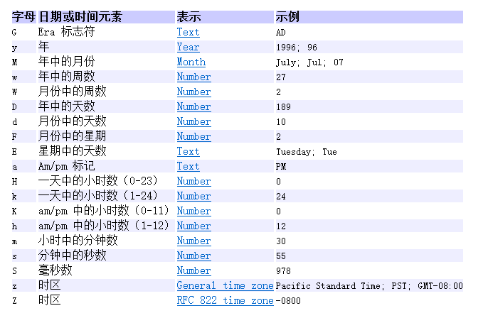
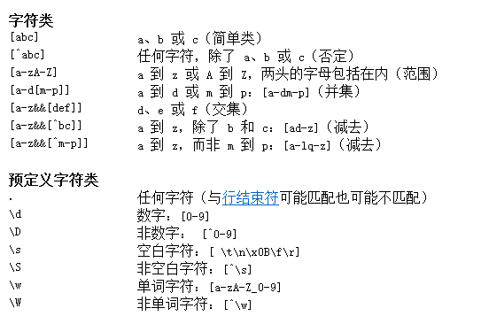
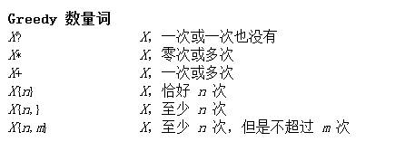

### 一，Math

> Math是lang包中的一个包含了用于执行基本数学运算方法的类，如初等指数、对数、平方根和三角函数。 
>
> 注：
>
> 1. Math类是final的
> 2. Math类的构造函数是private的
> 3. Math类的成员都是static的
>
> 静态常量：
>
> 1. E：自然对数的底数
> 2. PI：圆周率
>
> 常用方法：
>
> 1. pow(a,b)			a的b次方
> 2. sqrt(n)：			开平方根
> 3. max(a,b)			返回a和b的较大值
> 4. min(a,b)             返回a和b的较小值
> 5. abs(n)                 返回绝对值
> 6. random()            返回[0,1)的浮点小数
> 7. rint(n)                  五舍六入
> 8. round(n)             四舍五入
> 9. toRadians(n)      角度转弧度值
> 10. toDegrees(n)

### 二，Random

调用这个Math.Random()函数能够返回带正号的double值，该值大于等于0.0且小于1.0，即取值范围是[0.0,1.0)的左闭右开区间，返回值是一个伪随机选择的数，在该范围内（近似）均匀分布。例子如下：

##### 第一种：java.lang.Math.Random;

```java
package com.zoo.lion.util;
public class RandomCoder {
    public static void main(String[] args) {
        random();
    }
 
    private static void random() {
        double random = Math.random();//产生一个[0，1)之间的随机数
        System.out.println(random);
    }
}
```


##### 第二种：java.util.Random

> 此类的实例用于生成伪随机数流。
>
> 常用方法：
>
> 1. nextInt()  
>
> 2. nextInt(bound)
>
>    随机[n，m]，公式：r.nextInt(m-n+1)+n
>
> 3. nextDouble()   用于从此随机值生成器生成介于0.0和1.0之间的下一个伪随机双精度值

### 三，Scanner

> 一个可以解析基本类型和字符串的文本扫描器
>
> 常用方法：
>
> 1. next()         /*它会自动地消除有效字符之前的空格，只返回输入的字符，不会得到带空格的字符串。也就是说如果输入了一串字符，到了有空格的时候就					  会停止录入，只录入空格前面的东西，空格后面的东西（包括分隔的空格都会保留在缓存区域）
>
>    ​				​	   除了空格以外，Tab键和Enter键都被视为分隔符（结束符）。*/
>
> 2. nextLine()     //只有enter结束录入
>
> 3. nextInt()
>
> 4. nextInt(n)：表示输入指定进制的数据，返回对应的十进制数，例如，n为2时，表示输入的数据是二进制数，返回对应的十进制
>
> 5. nextDouble()    用于从此随机值生成器生成介于0.0和1.0之间的下一个伪随机双精度值
>
> 注：输入类型与接收类型不匹配时，会发生`InputMismatchException`输入不匹配异常

### 四，Arrays

> 此类包含用来操作数组的各种方法。
>
> 注：
>
> 1. Arrays类中的方法都是static的
> 2. Arrays类中的构造函数是private的
>
> 常用方法：
>
> 1. toString()
>
> 2. binarySearch()
>
>    1. binarySearch(数组,要查找的元素)
>    2. binarySearch(Object[] a,int fromIndex,int toIndex,Object key);    //在指定范围内查找某一元素
>
>    注：使用binarySearch的前提必须保证数组是升序的，并且元素值是唯一的
>
> 3. sort()：对数组元素进行排序
>
>    对数组中的对象属性进行排序
>
>    方式一：
>
>    使用sort(Object[] o)的步骤：
>
>    （1）使自定义类实现Comarable接口
>
>    （2）重写compareTo()方法
>
>    ​		升序：`this.属性 - 参数.属性`
>
>    ​		降序：`参数.属性 - this.属性 ` 
>
>    方式二：
>
>    使用sort(Object[] o，Comparator c)的步骤：
>
>    （1）创建自定义类实现Comparator接口
>
>    （2）重写compare()方法
>
>    ​		升序：`o1.属性 - o2.属性`
>
>     		降序：`o2.属性 - o1.属性`
>
>    （3）创建实现类对象，作为参数传入sort()方法中
>
>    ```java
>    Arrays.sort(emps,new Comparator<Emp>(){
>        @Override
>        public int compare(Emp o1, Emp o2) {
>            // 按工资升序，工资相同时，按年龄升序
>            return o1.salary != o2.salary ? (int)(o1.salary * 100 - o2.salary * 100) :  o1.age - o2.age;
>        }
>    });
>    ```
>
> 4. fill()
>
> 5. equals()
>
> 6. copyOf()

### 五，Date

> 类 Date表示特定的瞬间，精确到毫秒。
>
> ```java
> package Demo1;
> 
> import java.text.SimpleDateFormat;
> import java.util.Date;
> 
> public class work2 {
>     /**
>      * 计算自己已经生存的天数
>      * @param args
>      */
>     public static void main(String[] args) throws Exception{
>         String startTime = "2001-07-06";
>         SimpleDateFormat sdf = new SimpleDateFormat("yyyy-MM-dd");
>         Date date = sdf.parse(startTime);
>         long birthdayTime = date.getTime();
>         long nowBirthday = System.currentTimeMillis();
>         System.out.println((nowBirthday - birthdayTime) / 1000 / 24 / 3600);
>     }
> }
> 
> ```
>
> 功能：
>
> 1. 把日期解释为年、月、日、小时、分钟和秒值。被Calendar取代
> 2. 格式化和解析日期字符串。被DateFormat取代
>
> 构造函数：
>
> 1. Date()    返回1970.1.1 00:00:00到此时经历的毫秒数
> 2. Date(long l)    1970.1.1 00:00:00 + long毫秒数后的 时间
>
> 常用方法：
>
> 1. getTime()：获取1970年1月1日到指定Date对象指向的日期之间经历的毫秒数

### 六，SimepleDateFormat

> SimpleDateFormat是一个以与语言环境有关的方式来格式化和解析日期的具体类
>
> 格式化（日期->文本）：将一个Date对象转换成指定格式的字符串
>
> 解析（文本 -> 日期）：将一个符合指定格式的日期字符串转换成一个Date对象
>
> 格式化：
>
> ```java
> Date d  = new Date();
> // 创建SimpleDateFormat对象，并指定格式
> SimpleDateFormat sdf = new SimpleDateFormat("yyyy年MM月dd日HH时mm分ss秒");
> String time = sdf.format(d);
> ```
>
> ​	解析：
>
> ```java
> SimpleDateFormat sdf = new SimpleDateFormat("yyyy-MM-dd HH:mm:ss");
> Date date = sdf.parse("1986-10-19 17:30:30");
> ```
>
> ​	完整代码：
>
> ```java
> import java.text.SimpleDateFormat;
> import java.util.Date;
> 
> public class Test {
>     public static void main(String[] args) throws Exception {
> //       forMate();
>        parse();
>      }
> 
>     //TODO 解析格式
>     private static void parse() throws Exception{
>         String s = "2023年11月18日";
>         SimpleDateFormat sdf = new SimpleDateFormat("yyyy年MM月dd日");
>         Date d = sdf.parse(s);
>         System.out.println(d);
>     }
> 
>     //TODO 为日期设置格式
>     private static void forMate() {
>         //给 SimpleDateFormat 设置格式
>         SimpleDateFormat sdf = new SimpleDateFormat("yyyy-MM-dd HH:mm:ss");
>         //传入Date对象指定需要设置的时间 否则默认输出 1970-01-01 08:00:00
>         String time = sdf.format(new Date());
>         System.out.println(time);
>     }
> }
> 
> ```
>
> 
>
> eg：一个比较简单的题目为例：计算自己从出生到现在所经历的天数
>
> ```java
> package Demo1;
> 
> import java.text.SimpleDateFormat;
> import java.util.Date;
> 
> public class work2 {
>     /**
>      * 计算自己已经生存的天数
>      * @param a_hao
>      */
>     public static void main(String[] args) throws Exception{
>         String startTime = "2001-07-06";
>         SimpleDateFormat sdf = new SimpleDateFormat("yyyy-MM-dd");
>         Date date = sdf.parse(startTime);
>         long birthdayTime = date.getTime();
>         long nowBirthday = System.currentTimeMillis();
>         System.out.println((nowBirthday - birthdayTime) / 1000 / 24 / 3600);
>     }
> }
> ```
>
> 

### 七，Calendar

> Calendar类是一个抽象类，它为特定瞬间与日历字段之间的转换提供了一些方法。
>
> Calendar提供了一个类方法 `getInstance`，以获得此类型的一个通用的对象，其日历字段已由当前日期和时间初始化
>
> 常用方法：
>
> 1. get(n)：根据指定的日历字段获取字段值							
>
> 2. set(year，month，date，hour，minute，second)
>
> 3. set(field，value)：`为指定的日历字段设置值`
>
> 4. getTimeInMillis()：获取1970年1月1日到指定Calendar对象指向的日期之间经历的毫秒数
>
> 5. getTime()：获取Calendar对象的Date对象
>
>    ```java
>    package calendar;
>    
>    import java.text.SimpleDateFormat;
>    import java.util.Calendar;
>    import java.util.Date;
>    
>    public class Demo2 {
>        public static void main(String[] args) throws Exception{
>            //计算从当前时间到目标时间还需经历多少分钟
>            funtionOne();
>            funtionTwo();
>        }
>    
>        private static void funtionTwo() {
>            Calendar calendar = Calendar.getInstance();
>            long nowTime = calendar.getTimeInMillis();
>            //月数从零开始，也就是说没有12月，0即是一月
>            calendar.set(2023 , 10 , 19 , 6 , 0 , 0);
>            long endTime = calendar.getTimeInMillis();
>            System.out.println((endTime - nowTime) / 60 / 1000);
>        }
>    
>        private static void funtionOne() throws Exception{
>            Calendar calendar = Calendar.getInstance();
>            String endTime = "2023-11-19 06:00:00";
>            SimpleDateFormat sdf = new SimpleDateFormat("yyyy-MM-dd HH:mm:ss");
>            System.out.println(sdf.parse(endTime));
>            long time = sdf.parse(endTime).getTime();
>            long nowTime = new Date().getTime();
>            System.out.println((time - nowTime) / 60 / 1000);
>        }
>    }
>    
>    ```
>
>    

### 八，String

> String类代表字符串。Java 程序中的所有字符串字面值（如 "abc" ）都作为此类的实例实现。 
>
> 字符串是常量；它们的值在创建之后不能更改。因为 String 对象是不可变的，所以可以共享。
>
> 注：`==`在连接基本数据类型时，比较的是值，在连接引用数据类型时，比较的是地址
>
> ```java
> package string;
> 
> public class Demo1 {
> 
>     public static void main(String[] args) {
>         String s1 = "abc";
>         String s2 = "abc";
>         String s3 = new String("abc");
>         /*
>             s1和s2的地址值都在字符串常量池中，且调用的是同一个静态常量
>          */
>         System.out.println(s1 == s2);//true
>         System.out.println("s1:  " + s1);
>         System.out.println("s2:  " + s2);
>         System.out.println("s3:  " + s3);
>         /*
>             s3是创建了一个String对象，地址值在堆内存中，
>             即使调用的还是同一个字符串常量池中的静态常量，在" == "的判断中，由于地址的差异结果为false
>          */
>         System.out.println(s1 == s3);//false
>         //字符串.equals()比较的是内容
>         System.out.println(s1.equals(s3));//true
>     }
> }
> 
> ```
>
> 

> 构造函数：
>
> 1. new String()  
>
>    //创建一个内容为空的字符串对象
>
> 2. new String(String s)  
>
>    //创建字符串对象时为其赋值
>
> 3. new String(char[] chs)  
>
>    //将char数组拼接成字符串
>
> 4. new String(char[] chs，int offset，int count)   
>
>    //截取传入char数组,从offset开始，截取count个数值拼接成字符串
>
> 5. new String(byte[] bs)   
>
>    //传入时会自动转回成ASCII码表对应的十进制数值
>
> 6. new String(byte[] bs，int offset，int length)  
>
>     //截取传入byte数组,从offset开始，截取length个数值拼接成字符串

> 常用方法：
>
> 1. length()
>
>    返回字符串长度
>
> 2. charAt(int index)
>
>    返回指定索引处的 char 值。
>
> 3. indexOf(String s，int fromIndex)
>
>    返回指定子字符串在此字符串中第一次出现处的索引,如果它不作为一个子字符串出现，则返回 -1。
>
> 4. indexOf(String)
>
>    返回指定子字符串在此字符串中第一次出现处的索引，从指定的索引开始,如果它不作为一个子字符串出现，则返回 -1。
>
> 5. lastIndexOf(String s，int fromIndex)
>
>    返回此字符串中已规定的下标索引从右往左的第一个需要查找元素的下标。如果它不作为一个子字符串出现，则返回 -1。
>
> 6. lastIndexOf(String)
>
>    如果字符串参数作为一个子字符串在此对象中出现一次或多次，则返回最后一个这种子字符串的第一个字符。如果它不作为一个子字符串出现，则返回 -1。
>
> 7. equals(String s)
>
>    将此字符串与指定的对象比较。当且仅当该参数不为 null，并且是与此对象表示相同字符序列的 String 对象时，结果才为 true
>
> 8. equalsIgnoreCase(String s)
>
>    将此 String 与另一个 String 比较，不考虑大小写。如果两个字符串的长度相同，并且其中的相应字符都相等（忽略大小写），则认为这两个字符串是相等的。
>
> 9. concat(String s)
>
>    将指定字符串连接到此字符串的结尾。
>
> 10. startsWith(String s)
>
>     如果参数表示的字符序列是此字符串表示的字符序列的前缀，则返回 true；否则返回 false。
>     还要注意，如果参数是空字符串，或者等于此 String 对象（用 equals(Object) 方法确定），则返回 true。
>
> 11. endsWith(String s)
>
>     如果参数表示的字符序列是此字符串表示的字符序列的后缀，则返回 true；否则返回 false。
>
> 12. contains(String s)
>
>     如果此字符串包含 指定字符串，则返回 true，否则返回 false
>
> 13. toLowerCase()
>
>     使用默认语言环境的规则将此 String 中的所有字符都转换为小写。
>
> 14. toUpperCase()
>
>     使用默认语言环境的规则将此 String 中的所有字符都转换为大写。
>
> 15. trim()
>
>     返回字符串的副本，忽略前导空白和尾部空白。
>
> 16. isEmpty()
>
>     当且仅当 length() 为 0 时返回 true。
>
> 17. subString(int fromIndex）
>
>     返回一个新的字符串，它是此字符串的一个子字符串。该子字符串从指定索引处的字符开始，直到此字符串末尾。
>
> 18. subString(int fromIndex，int toIndex)
>
>     返回一个新字符串，它是此字符串的一个子字符串。该子字符串从指定的 beginIndex 处开始，直到索引 endIndex - 1 处的字符。`含头不含尾`
>
> 19. getBytes()
>
>     使用平台的默认字符集将此 String 编码为 byte 序列，并将结果存储到一个新的 byte 数组中。
>
> 20. toCharArray(）
>
>     将此字符串转换为一个新的Char[]字符数组。
>
> 21. compareTo(String s)
>
>     如果参数字符串等于此字符串，则返回值 0；如果此字符串按字典顺序小于字符串参数，则返回一个小于 0 的值；如果此字符串按字典顺序大于字符串参数，则返回一个大于 0 的值。
>
> 22. replace(char a, char b)
>
>     将字符串中一个或多个a字符替换成b字符
>
>     replace(CharSequence 1 , CharSequence 2)需要传入两个CharSequence接口，String是CharSequence的实现类，参数也可以传递两个String参数

> 正则表达式：用于对其他字符串进行匹配、切割、替换、查找的字符串
>
> 1. 匹配：`字符串.matches(正则表达式)`，判断字符串是否符合指定的规则，返回布尔值
>
>    ```java
>    // 判断邮箱，@之前，2~4位大小写字母开头，其余可以是字母也可以是数字共6位，@后小写字母或数字2~7位，.com结尾
>    public static void checkEmail(){
>        String email = "ABxZnihaoa@qq.com";
>        String reg = "[a-zA-Z]{2,4}[0-9a-zA-Z]{6}@[a-z0-9]{2,7}[.]com";
>        System.out.println(email.matches(reg));
>    }
>    
>    // 判断手机号，1开头，第二位除了012的数字，其余纯数字，11位
>    public static void checkTel(){
>        String tel = "15121001484";
>        String reg = "1[3-9][0-9]{9}";
>        System.out.println(tel.matches(reg));
>    }
>    
>    // 判断QQ号，1~9开头，纯数字，5~10位
>    public static void checkQQ(){
>        String qq = "1000000000";
>        String reg = "[1-9][0-9]{4,9}";
>        System.out.println(qq.matches(reg));
>    }
>    ```
>
> 2. 切割：`字符串.split(正则表达式)`，以正则表达式切割字符串，返回切割后的字符串数组
>
>    ```java
>    // 获取ip地址中的每一段
>    public static void splitIp1(){
>        String ip = "10.11.52.80";
>        String reg = "[.]";
>        String[] strs = ip.split(reg);
>        System.out.println(Arrays.toString(strs));
>    }
>    
>    // 获取ip地址中的每一段
>    public static void splitIp2(){
>        String ip = "111++++++101+++++++++52+++++130+8++++++28";
>        String reg = "[+]+";
>        String[] strs = ip.split(reg);
>        System.out.println(Arrays.toString(strs));
>    }
>    
>    // 获取诗中的每一句话
>    public static void splitPoem(){
>        String ip = "床前明月光，疑似地上霜。举头望明月，低头思故乡。";
>        String reg = "[，。]";
>        String[] strs = ip.split(reg);
>        System.out.println(Arrays.toString(strs));
>        System.out.println(strs.length);
>    }
>    ```
>
> 3. 替换：`字符串.replaceAll(正则表达式,新值)`：将字符串中符合正则表达式规则的子串用新值替换
>
>    ```java
>    // 将连续出现的若干个a替换成一个a
>    public static void f1(){
>        String s = "aaaabaaaacaaaaaaadaeaaaaaa";
>        String reg = "a+";
>        System.out.println(s.replaceAll(reg,"a"));
>    }
>    
>    // 屏蔽粗话（狗，猪）
>    public static void f2(){
>        String s = "这种东西，狗都不喝，喝了，猪都不如。";
>        String reg = "[狗猪]";
>        System.out.println(s.replaceAll(reg,"*"));
>    }
>    ```
>
> 4. 查找
>
>    ```java
>    // 找出语句中3个字母的单词
>    public static void f1(){
>        String s = "tomorrow is a fine day, let's go out and play";
>        Pattern p = Pattern.compile("\\b[a-z]{4}\\b");
>        Matcher m = p.matcher(s);
>        while(m.find()){
>            System.out.println(m.group());
>        }
>    }
>    ```
>
>    
>
>    
>    
>    1.`[abc]`：表示a或者b或者c
>    
>    2.`[a-zA-Z0-9]`：表示数字、大小写字母中的任意一个
>    
>    3.`x{9}`：表示x出现9次
>    
>    4.`x{n,m}`：表示x出现至少n次，不超过m次
>    
>    5.`x{n,}`：表示x出现至少n次，没有最多的限制
>    
>    6.`.`：它的通配符，能匹配任意字符，如果要表示一个具体的`.`字符，需要进行转义：`[.]`或者`\\.`
>    
>    7.`x+`：表示x出现1次或多次，它等价于`x{1,}`

### 九，StringBuilder和StringBuffer

> StringBuilder和StringBuffer称为字符串缓冲区
>
> StringBuilder和StringBuffer有相同的API
>
> StringBuilder和StringBuffer的区别：
>
> 1. StringBuilder不保证线程同步、StringBuffer保证线程同步
> 2. StringBuilder的效率高于StringBuffer
>
> 构造函数：
>
> 1. new StringBuilder() / new StringBuffer()
> 2. new StringBuilder(String s) / new StringBuffer(String s)
>
> 常用方法：
>
> 1. append(Object o)	**字符串连接**
> 2. **insert(int offset, String str)/insert(int offset, Char c)：在指定位置之前插入字符(串)**
> 3. deleteCharAt(int index) **删除指定索引位置的值**
> 4. delete(int start，int end)    **删除起始位置（含）到结尾位置（不含）之间的字符串**
> 5. setCharAt(int index，char c)    **将第 i 个代码单元设置为 c（可以理解为替换）**
> 6. replace(int start，int end，String s) **含头不含尾从start下标开始截取（end - start）个值并替换成s**
> 7. reverse()  **字符串翻转**
>
> 注：在StringBuilder和StringBuffer中，那些返回结果是`this`的方法，可以采用链式写法，继续调用其他方法，并且这些方法在执行完毕后，保存的字符串也会发生变化
>
> StringBuilder和StringBuffer、String的选用：
>
> 1. 属性使用String
> 2. 单线程中使用StringBuilder
> 3. 多线程中使用StringBuffer
>
> StringBuilder和StringBuffer、String的转换：
>
> 1. StringBuilder和StringBuffer -> String
>
>    ```java
>    // 1.调用StringBuilder和StringBuffer的toString()
>    StringBuilder sb1 = new StringBuilder("abc");
>    StringBuffer sb2 = new StringBuffer("QWER");
>    String s1 = sb1.toString();
>    String s2 = sb2.toString();
>    // 2.使用字符串的拼接
>    StringBuilder sb1 = new StringBuilder("abc");
>    StringBuffer sb2 = new StringBuffer("QWER");
>    String s1 = sb1+"";
>    String s2 = sb2+"";
>    // 3.使用String的构造函数
>    StringBuilder sb1 = new StringBuilder("abc");
>    StringBuffer sb2 = new StringBuffer("QWER");
>    String s3 = new String(sb1);
>    String s4 = new String(sb2);
>    System.out.println(s3);
>    System.out.println(s4);
>    ```
>
> 2. String -> StringBuilder和StringBuffer
>
>    ```java
>    // 使用StringBuilder和StringBuffer的构造函数
>    String str = "qwer1234";
>    StringBuffer sbb1 = new StringBuffer(str);
>    StringBuilder sbb2 = new StringBuilder(str);
>    ```

### 十，包装类

> 使用引用数据类型的变量可以进行属性和方法的调用，但是基本数据类型的变量无法调用属性和方法，因为针对每一种基本数据类型封装了它们对应的引用数据类型，这些引用数据类型就称为包装类。
>
> | 基本数据类型 | 引用数据类型（包装类） |
> | ------------ | ---------------------- |
> | byte         | Byte                   |
> | short        | Short                  |
> | int          | Integer                |
> | long         | Long                   |
> | float        | Float                  |
> | double       | Double                 |
> | char         | Character              |
> | boolean      | Boolean                |
>
> 构造函数
>
> 1. new Integer(int i)
> 2. new Integer(String s)
>
> 注：如果参数类型不匹配，会发生`NumberFormatException`数字格式异常
>
> 静态常量：
>
> 1. Integer.MIN_VALUE
> 2. Integer.MAX_VALUE
>
> 静态方法：
>
> 1. toBinaryString(int i)
> 2. toOctalString(int i)
> 3. toHexString(int i)
> 4. compare(int x，int y)
> 5. max(int x，int y)
> 6. min(int x，int y)
>
> 成员方法：
>
> 1. compareTo(int i)

> 装箱和拆箱：
>
> 1. 装箱：将一个基本数据类型转换成对应的包装类
> 2. 拆箱：将一个包装类转换成对应的基本数据类型
>
> ```java
> // 装箱：基本->引用
> int m = 3;
> Integer n = new Integer(m);
> 
> int n = 3;
> Integer m = Integer.valueOf(n);
> // 拆箱：引用->基本
> Integer i = new Integer(33);
> int j = i.intValue();
> ```
>
> 在JDK1.5之前，装箱和拆箱必须手动实现，从JDK1.5开始出现了自动装拆箱。从JDK1.9开始包装类中的构造函数都变成了过期函数
>
> ```java
> // 自动装箱
> int m2 = 3;
> Integer n2 = m2;
> // 自动拆箱
> Integer i2 = new Integer(33);
> int j2 = i2;
> ```

> 包装类和String的转换：
>
> 1. 包装类 -> String
>
>    ```java
>    // 拼接字符串
>    Integer i = 3;
>    String s1 = i + "";
>    // 使用包装类的静态方法toString()
>    Integer i = 3;
>    String s2 = Integer.toString(i);
>    // 使用包装类的成员方法toString()
>    Integer i = 3;
>    String s3 = i.toString();
>    // 使用String的静态方法valueOf()
>    Integer i = 3;
>    String s4 = String.valueOf(i);
>    ```
>
> 2. String -> 包装类
>
>    ```java
>    // 使用包装类的构造函数
>    Integer j = new Integer("345");
>    // 使用包装类的静态方法valueOf()
>    Integer m = Integer.valueOf("678");
>    // 使用包装类的静态方法parseXxx()
>    Integer n = Integer.parseInt("1234");
>    ```

> 对象属性建议使用包装类，因为包装类的引用数据类型，在值为空时，获得的都是`null`，可以很好的区分，没有赋值和赋的值是默认值的情况
>
> java5开始可以实现自动装拆箱
>
> 从java9开始，包装类中的**构造函数**都变成了过期函数


### 十一，Object

> 类 Object 是类层次结构的根类。每个类都使用 Object  作为超类。所有对象（包括数组）都实现这个类的方法。  
>
> 常用方法：
>
> 1. toString()
>
>    注：在打印对象时，输出的是对象在内存中的地址，因为本质上打印对象时默认调用了 object 类中的 toString()
>
>    ```java
>    // Object类中的toString()
>    public String toString() {
>        return s.getClass().getName() + "@" + Integer.toHexString(s.hashCode());
>    }
>    
>    // 子类类中重写的toString()
>    @Override
>    public String toString() {
>        return "Emp{" +
>            "name='" + name + '\'' +
>            ", age=" + age +
>            ", salary=" + salary +
>            '}';
>    }
>    ```
>
> 2. equals()
>
>    注：object 类中的 equals() 方法比较的是两个对象的地址值是否相同，我们可以进行重写来比较当前类中的两个对象的所有属性值是否都相同
>
>    ```java
>    // Object类中的equals()
>    public boolean equals(Object obj) {
>        return (this == obj);
>    }
>    
>    // 子类类中重写的equals()
>    public boolean equals(Object obj){
>            if(this == obj){
>                return true;
>            }
>            if(!(obj instanceof Teacher)){
>                return false;
>            }
>            Teacher t = (Teacher)obj;
>            if(this.age != t.age){
>                return false;
>            }
>            if(this.name == null){
>                if(t.name == null){
>                    return true;
>                }else{
>                    return false;
>                }
>            }else{
>                return this.name.equals(t.name);
>            }
>        }
>    ```


